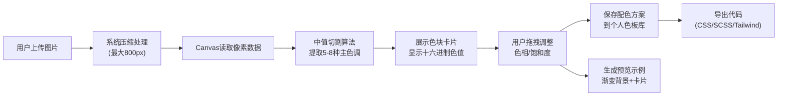

## 1. 产品概述

灵感调色板是一款面向创意工作者的色彩提取与配色方案管理工具。用户可从图片中快速提取主色调，微调后生成专业的色彩搭配报告，并支持多种格式导出。

- 核心价值：帮助设计师、开发者等创意人员快速从参考图片中获取配色灵感，提升工作效率
- 目标用户：UI设计师、前端开发者、插画师、品牌设计师等创意工作者
- 市场定位：轻量级、高效的在线色彩工具，无需复杂操作即可获得专业级配色方案

## 2. 核心功能

### 2.1 用户角色

| 角色 | 注册方式 | 核心权限 |
|------|----------|----------|
| 普通用户 | 自动会话识别 | 上传图片提取色彩、微调配色、保存色板、导出代码 |

### 2.2 功能模块

1. **图片上传与色彩提取**：支持JPG/PNG图片上传，Canvas像素读取，中值切割算法提取5-8种主色调
2. **色块展示与微调**：色块卡片展示色值，支持拖拽调整色相/饱和度
3. **色板库管理**：保存配色方案到个人账号，按创建时间排序列表展示
4. **代码导出**：支持CSS变量、SCSS变量、Tailwind配置三种格式导出
5. **预览示例**：自动生成渐变背景和卡片样式的配色预览页面

### 2.3 页面详情

| 页面名称 | 模块名称 | 功能描述 |
|-----------|-------------|---------------------|
| 主页面 | 上传区域 | 拖拽或点击上传图片，支持JPG/PNG格式，5MB限制自动压缩 |
| 主页面 | 色板展示区 | 展示提取的色块卡片，显示十六进制色值，悬停放大效果 |
| 主页面 | 微调控制区 | 色相/饱和度滑块，实时调整色块颜色 |
| 主页面 | 导出区域 | CSS/SCSS/Tailwind代码导出按钮，点击复制动画 |
| 主页面 | 预览区域 | 渐变背景平滑循环切换，卡片样式预览 |
| 主页面 | 色板库列表 | 按时间排序展示已保存的配色方案，支持删除 |

## 3. 核心流程

用户上传图片 → 系统压缩处理 → Canvas读取像素 → 中值切割算法提取主色调 → 展示色块面板 → 用户微调配色 → 保存到个人色板库 → 导出代码/查看预览

## 4. 用户界面设计

### 4.1 设计风格

- **极简主义**：纯白色背景，大量留白，突出色彩本身
- **主色调**：无固定品牌色，界面以中性色（#FFFFFF、#F5F5F5、#333333）为主，让用户提取的色彩成为视觉焦点
- **卡片风格**：圆角16px，悬浮阴影（box-shadow: 0 4px 20px rgba(0,0,0,0.08)），鼠标悬停时放大1.05倍并添加光晕效果
- **按钮风格**：圆角8px，极简线条，hover状态有细微颜色变化
- **字体**：使用现代无衬线字体，标题加粗，正文轻盈
- **动效**：所有交互都有平滑过渡（0.3s cubic-bezier(0.4, 0, 0.2, 1)），色块悬停光晕脉动，渐变背景循环切换

### 4.2 页面设计概述

| 页面名称 | 模块名称 | UI元素 |
|-----------|-------------|-------------|
| 主页面 | 上传区域 | 虚线边框上传框，图标+文字提示，拖拽态高亮 |
| 主页面 | 色块卡片 | 圆角16px，悬浮阴影，hover放大+光晕，点击复制色值 |
| 主页面 | 滑块控件 | 自定义样式滑块，实时预览调整效果 |
| 主页面 | 导出按钮 | 简洁按钮，点击后check图标弹出动画 |
| 主页面 | 预览区 | 全屏渐变背景，卡片示例居中展示 |
| 主页面 | 色板列表 | 水平滚动卡片列表，缩略色板展示 |

### 4.3 响应式设计

- **设计原则**：桌面端优先，移动端自适应
- **断点**：768px以下切换为单列布局
- **平板/手机**：所有模块垂直排列，色块卡片自适应宽度，滑块区域全屏宽度
- **触摸优化**：按钮最小高度44px，滑块触摸区域扩大

### 4.4 性能要求

- 从上传图片到显示色板时间控制在1秒以内
- 图片自动压缩到最大800px宽度，文件大小限制5MB
- 所有动效使用CSS transition/animation，确保60fps流畅度
