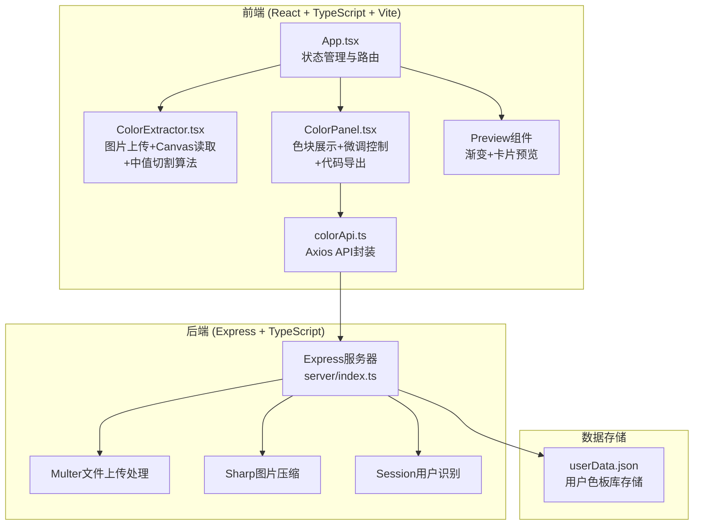

## 1. 架构设计



## 2. 技术描述

### 2.1 前端技术栈
- **框架**: React 18 + TypeScript
- **构建工具**: Vite 5.x
- **路由**: react-router-dom 6.x
- **HTTP客户端**: Axios 1.x
- **UI样式**: 原生CSS（CSS变量 + CSS Modules）
- **色彩处理**: color-thief-react（备选方案，主要使用自研中值切割算法）
- **图标**: lucide-react

### 2.2 后端技术栈
- **框架**: Express 4.x
- **TypeScript运行时**: tsx / ts-node
- **文件上传**: Multer 1.x
- **图片处理**: Sharp 0.33.x
- **会话管理**: express-session 1.x
- **唯一ID**: uuid 9.x
- **数据存储**: JSON文件（userData.json）

### 2.3 开发工具
- **包管理器**: npm
- **并行脚本**: concurrently
- **代码检查**: TypeScript严格模式

## 3. 项目结构

```
├── .trae/documents/
│   ├── PRD.md
│   └── TECHNICAL_ARCHITECTURE.md
├── src/
│   ├── components/
│   │   ├── ColorExtractor.tsx    # 图片上传、Canvas读取、中值切割
│   │   └── ColorPanel.tsx        # 色块展示、微调、导出
│   ├── api/
│   │   └── colorApi.ts           # Axios API封装
│   ├── App.tsx                   # 主应用组件
│   ├── main.tsx                  # 入口文件
│   └── index.css                 # 全局样式
├── server/
│   ├── index.ts                  # Express服务器
│   └── userData.json             # 用户数据存储（初始空对象）
├── public/
│   └── (静态资源)
├── index.html                    # HTML入口
├── vite.config.ts                # Vite配置
├── tsconfig.json                 # TypeScript配置
└── package.json                  # 项目依赖
```

## 4. 路由定义

| 路由 | 组件 | 功能 |
|-------|------|------|
| `/` | App.tsx | 主页面，包含所有功能模块 |

## 5. API 定义

### 5.1 TypeScript 类型定义

```typescript
// 配色方案类型
interface ColorPalette {
  id: string;
  colors: string[];      // 十六进制色值数组
  name?: string;         // 色板名称
  createdAt: number;     // 时间戳
  imageUrl?: string;     // 原始图片URL（可选）
}

// 用户数据类型
interface UserData {
  [sessionId: string]: ColorPalette[];
}

// API响应类型
interface ApiResponse<T> {
  success: boolean;
  data?: T;
  error?: string;
}
```

### 5.2 API 端点

| 方法 | 路径 | 功能 | 请求参数 | 响应数据 |
|------|------|------|----------|----------|
| POST | `/api/upload` | 上传并压缩图片 | `multipart/form-data` 包含 `image` 字段 | `{ success: boolean, imageUrl: string }` |
| POST | `/api/palettes` | 保存配色方案 | `{ colors: string[], name?: string }` | `{ success: boolean, palette: ColorPalette }` |
| GET | `/api/palettes` | 获取用户色板列表 | - | `{ success: boolean, palettes: ColorPalette[] }` |
| DELETE | `/api/palettes/:id` | 删除配色方案 | URL参数: `id` | `{ success: boolean }` |

## 6. 核心算法实现

### 6.1 中值切割算法 (Median Cut)

```typescript
// 算法步骤：
// 1. 将图片像素数据转换为RGB三维点集合
// 2. 递归切割颜色空间，每次选择范围最大的颜色通道进行切割
// 3. 在切割点处将颜色集合分为两部分
// 4. 重复直到得到所需数量的颜色桶
// 5. 对每个桶取平均色值作为代表色
// 6. 对结果进行排序和去重处理
```

### 6.2 HSL 调整算法

```typescript
// 支持色相(Hue)和饱和度(Saturation)的实时调整
// 转换流程：Hex → RGB → HSL → 调整参数 → RGB → Hex
```

## 7. 前端核心组件说明

### 7.1 ColorExtractor 组件
- **Props**: `onColorsExtracted: (colors: string[]) => void`
- **状态**: `imageFile`, `isProcessing`, `error`
- **核心方法**: 
  - `handleFileUpload(file: File)`
  - `compressImage(file: File)` - 前端可选压缩
  - `extractColorsWithMedianCut(imageData: ImageData)`

### 7.2 ColorPanel 组件
- **Props**: `colors: string[]`, `onColorsChange: (colors: string[]) => void`
- **状态**: `selectedColorIndex`, `hueAdjustment`, `saturationAdjustment`, `copiedFormat`
- **核心方法**:
  - `adjustColorHSL(index, hueDelta, satDelta)`
  - `generateCSSVariables()`
  - `generateSCSSVariables()`
  - `generateTailwindConfig()`
  - `copyToClipboard(text, format)`

### 7.3 App 组件
- **状态**: `extractedColors`, `savedPalettes`, `currentPalette`, `isLoading`
- **核心方法**:
  - `handleColorsExtracted(colors)`
  - `saveCurrentPalette()`
  - `loadSavedPalettes()`
  - `deletePalette(id)`
  - `loadPalette(palette)`

## 8. 性能优化策略

1. **图片压缩**: 上传前使用Sharp压缩到最大800px宽度
2. **Canvas处理**: 使用OffscreenCanvas（如支持）避免阻塞主线程
3. **算法优化**: 中值切割算法使用TypedArray和迭代实现
4. **防抖处理**: 滑块调整使用requestAnimationFrame批处理
5. **懒加载**: 色板列表使用虚拟滚动（如数量较多）
6. **缓存策略**: API响应添加适当的缓存头

## 9. 构建与部署

### 9.1 脚本命令
```json
{
  "dev": "concurrently \"npm run dev:server\" \"npm run dev:client\"",
  "dev:client": "vite --port 3000",
  "dev:server": "tsx watch server/index.ts",
  "build": "tsc && vite build",
  "start": "tsx server/index.ts"
}
```

### 9.2 Vite 配置要点
- 代理 `/api` 到后端服务器（默认端口3001）
- 端口3000
- 启用HMR

### 9.3 TypeScript 配置
- 严格模式 (`strict: true`)
- ES2020 模块
- JSX: react-jsx
- 路径别名支持
