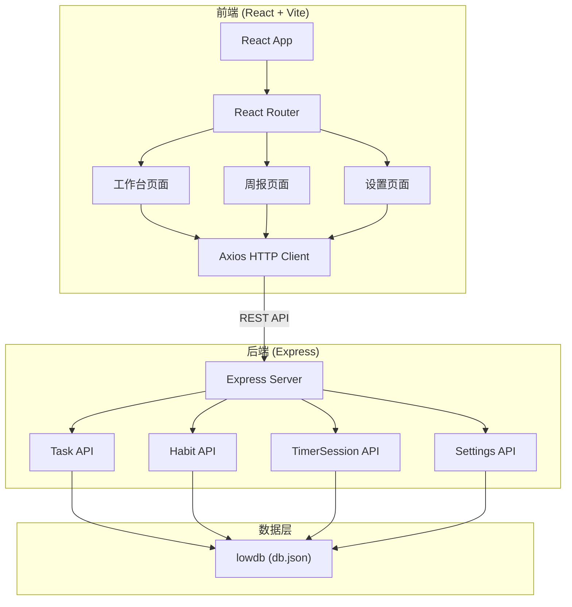
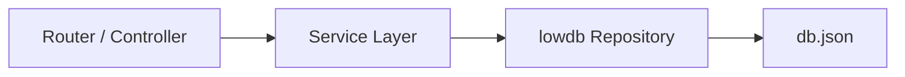
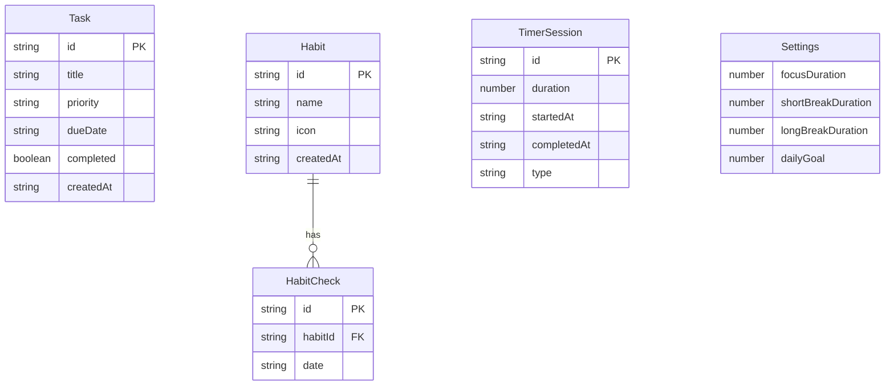

## 1. 架构设计



## 2. 技术说明

- 前端：React@18 + TypeScript + Vite + TailwindCSS + Zustand
- 初始化工具：vite-init（react-express-ts 模板）
- 后端：Express@4 + TypeScript
- 数据库：lowdb（JSON文件持久化）
- HTTP客户端：axios
- 状态管理：zustand
- 路由：react-router-dom
- 图标：lucide-react

## 3. 路由定义

| 路由 | 用途 |
|------|------|
| / | 工作台主页（待办清单+番茄钟+习惯打卡） |
| /weekly | 周报页面（数据可视化汇总） |
| /settings | 设置页面（番茄钟参数配置） |

## 4. API定义

### 4.1 任务 (Tasks)

```
GET    /api/tasks           - 获取所有任务
POST   /api/tasks           - 创建新任务
PUT    /api/tasks/:id       - 更新任务（标题、优先级、截止日期、完成状态）
DELETE /api/tasks/:id       - 删除任务
```

**Task 类型定义：**
```typescript
interface Task {
  id: string;
  title: string;
  priority: 'high' | 'medium' | 'low';
  dueDate: string;
  completed: boolean;
  createdAt: string;
}
```

### 4.2 习惯 (Habits)

```
GET    /api/habits           - 获取所有习惯
POST   /api/habits           - 创建新习惯
PUT    /api/habits/:id       - 更新习惯
DELETE /api/habits/:id       - 删除习惯
POST   /api/habits/:id/check - 打卡（记录当天完成）
```

**Habit 类型定义：**
```typescript
interface Habit {
  id: string;
  name: string;
  icon: string;
  completedDates: string[];
  createdAt: string;
}
```

### 4.3 番茄钟会话 (Timer Sessions)

```
GET    /api/timer-sessions           - 获取所有计时会话
POST   /api/timer-sessions           - 创建新计时会话
GET    /api/timer-sessions/range     - 获取日期范围内的会话
```

**TimerSession 类型定义：**
```typescript
interface TimerSession {
  id: string;
  duration: number;
  startedAt: string;
  completedAt: string;
  type: 'focus' | 'shortBreak' | 'longBreak';
}
```

### 4.4 设置 (Settings)

```
GET    /api/settings         - 获取设置
PUT    /api/settings         - 更新设置
```

**Settings 类型定义：**
```typescript
interface Settings {
  focusDuration: number;
  shortBreakDuration: number;
  longBreakDuration: number;
  dailyGoal: number;
}
```

## 5. 服务器架构图



## 6. 数据模型

### 6.1 数据模型定义



### 6.2 数据定义

lowdb 数据库结构 (db.json)：
```json
{
  "tasks": [],
  "habits": [],
  "habitChecks": [],
  "timerSessions": [],
  "settings": {
    "focusDuration": 25,
    "shortBreakDuration": 5,
    "longBreakDuration": 15,
    "dailyGoal": 8
  }
}
```
