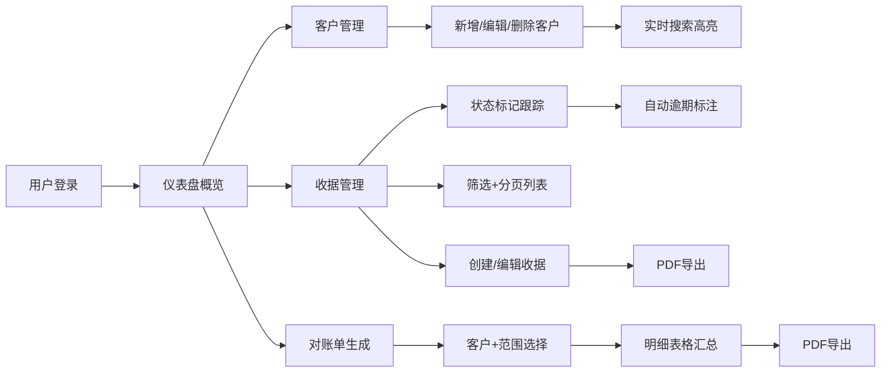

## 1. 产品概述

在线交易收据与对账管理应用，为小企业和自由职业者提供轻量级的电子收据管理、客户档案维护及对账单生成工具，帮助用户高效追踪收款状态。

- **核心价值**：简化收款管理流程，提供专业电子收据，自动提醒逾期款项，生成规范对账单
- **目标用户**：中小企业主、自由职业者、独立承包商

---

## 2. 核心功能

### 2.1 用户角色

| 角色 | 注册方式 | 核心权限 |
|------|----------|----------|
| 普通用户 | 无需注册（本地数据） | 客户管理、收据创建、对账单生成、状态跟踪、PDF导出 |

### 2.2 功能模块

1. **仪表盘**：收款概览统计卡片、近期收据列表、逾期提醒
2. **客户管理**：客户卡片列表、实时搜索高亮、新增/编辑/删除客户
3. **收据管理**：收据列表（分页/筛选）、创建/编辑收据、状态标记、PDF导出
4. **对账单**：客户+时间范围选择、明细表格、统计汇总、PDF导出

### 2.3 页面详情

| 页面名称 | 模块名称 | 功能描述 |
|-----------|-------------|---------------------|
| 仪表盘 | 统计卡片 | 本月待收款、已收款、逾期金额、客户总数（渐变背景+数字滚动动画） |
| 仪表盘 | 近期收据 | 最近5条收据列表，含客户、金额、状态、快捷操作 |
| 客户管理 | 搜索栏 | 实时模糊搜索，匹配字段高亮显示 |
| 客户管理 | 客户卡片 | 展示客户基本信息，支持编辑、删除操作 |
| 客户管理 | 新增/编辑弹窗 | 表单录入客户：姓名、公司、邮箱、电话、地址 |
| 收据管理 | 筛选栏 | 按客户、付款状态、日期范围筛选 |
| 收据管理 | 收据列表 | 分页（每页10条），按日期降序，悬停动画效果 |
| 收据管理 | 创建/编辑表单 | 客户选择、交易类型、金额、税率、日期、备注、自动编号 |
| 收据详情 | 状态管理 | 标记待支付/已支付/逾期/部分付款，记录付款日期和方式 |
| 对账单 | 参数选择 | 选择客户+时间范围（月度/季度/自定义） |
| 对账单 | 明细表格 | 收据编号、日期、金额、税率、税额、总金额、付款状态 |
| 对账单 | 导出 | PDF格式导出对账单 |

---

## 3. 核心流程

用户进入仪表盘查看收款概览 → 管理客户档案（新增/编辑客户）→ 为客户创建收据（自动生成唯一编号）→ 跟踪收据付款状态（手动标记/系统自动逾期）→ 选择客户和时间范围生成对账单 → 导出收据或对账单为PDF

---

## 4. 用户界面设计

### 4.1 设计风格

- **主色调**：深蓝 `#1A365D`（品牌色），银灰 `#E2E8F0`（背景辅助）
- **卡片色**：白色背景 + 圆角 + 柔和阴影 `box-shadow: 0 2px 8px rgba(0,0,0,0.08)`
- **统计卡渐变色**：待收款橙、已收款绿、逾期红（逾期卡带脉冲动画）
- **悬停效果**：列表项悬停背景变浅蓝 `#EBF8FF` + 小幅左移动画
- **按钮交互**：点击时 0.2s 缩放反馈动画
- **PDF按钮**：下载图标旋转动画
- **数字动画**：统计数字从上到下滚动效果

### 4.2 页面设计概述

| 页面名称 | 模块名称 | UI元素 |
|-----------|-------------|-------------|
| 全局布局 | 侧边栏+主内容 | 左侧280px固定侧边栏导航，右侧主内容区，移动端汉堡菜单 |
| 仪表盘 | 统计卡片 | 4个渐变卡片横向排列，数值大号字体+滚动动画 |
| 仪表盘 | 近期收据 | 白色卡片，列表项悬停动效，状态标签色块标识 |
| 客户管理 | 搜索+卡片网格 | 顶部搜索框，下方响应式卡片网格 |
| 客户管理 | 客户卡片 | 头像占位+客户信息行，底部操作按钮 |
| 收据管理 | 筛选+表格 | 顶部筛选行，表格行悬停动效，分页器 |
| 收据表单 | 表单布局 | 双列栅格表单，客户下拉选择，金额实时计算 |
| 对账单 | 生成器 | 参数选择面板 + 结果表格 + 导出按钮 |

### 4.3 响应式设计

- **桌面优先**：≥1024px 侧边栏固定展示
- **平板适配**：768px-1024px 缩小间距，统计卡2列
- **移动适配**：<768px 侧边栏折叠为顶部汉堡菜单，主内容全宽，统计卡单列

### 4.4 性能指标

- 收据列表分页切换无闪烁
- 客户搜索响应 ≤ 150ms
- 100笔交易对账单生成 ≤ 3秒
