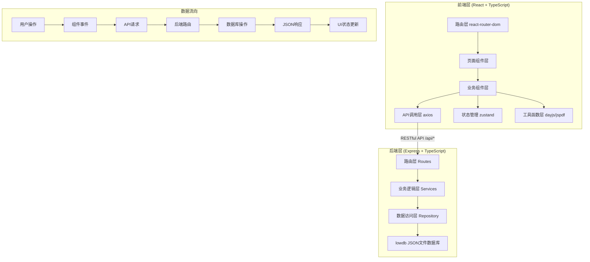
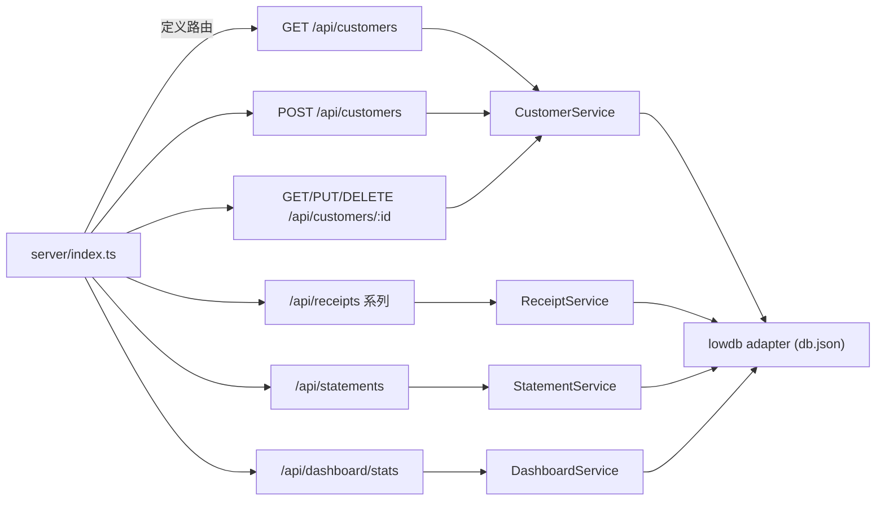
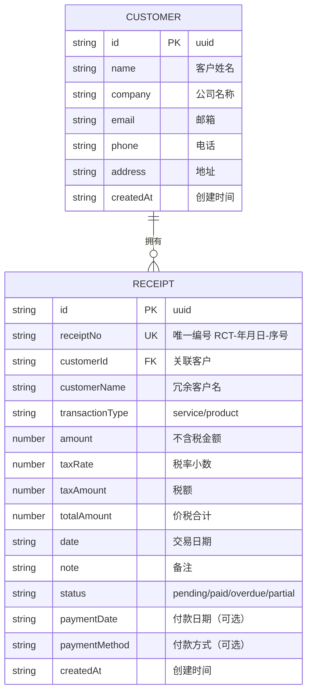

## 1. 架构设计



## 2. 技术栈说明

- **前端框架**: React 18 + TypeScript (严格模式)
- **构建工具**: Vite 5
- **路由**: react-router-dom 6
- **HTTP客户端**: axios
- **状态管理**: zustand
- **样式方案**: 原生CSS + CSS变量 (非Tailwind，用户指定颜色和动画)
- **图标库**: lucide-react
- **PDF生成**: jspdf
- **日期处理**: dayjs

- **后端框架**: Express 4
- **数据库**: lowdb (本地JSON文件持久化)
- **唯一ID**: uuid
- **跨域支持**: cors
- **服务启动**: concurrently + vite 前后端同启

## 3. 路由定义

| 前端路由 | 页面组件 | 用途 |
|----------|----------|------|
| `/` | Dashboard | 仪表盘首页，收款概览+近期收据 |
| `/customers` | CustomersPage | 客户管理页面 |
| `/receipts` | ReceiptsPage | 收据列表页面 |
| `/receipts/new` | ReceiptForm | 创建新收据 |
| `/receipts/:id/edit` | ReceiptForm | 编辑收据 |
| `/receipts/:id` | ReceiptDetail | 收据详情+状态管理 |
| `/statements` | StatementsPage | 对账单生成页面 |

## 4. API 接口定义

### 4.1 客户接口

```typescript
// 客户数据模型
interface Customer {
  id: string;
  name: string;
  company: string;
  email: string;
  phone: string;
  address: string;
  createdAt: string;
}

// GET    /api/customers           -> Customer[]        获取客户列表（支持 ?search= 模糊搜索）
// POST   /api/customers           -> Customer          新增客户
// GET    /api/customers/:id       -> Customer          获取单个客户
// PUT    /api/customers/:id       -> Customer          更新客户
// DELETE /api/customers/:id       -> { success: true } 删除客户
```

### 4.2 收据接口

```typescript
type ReceiptStatus = 'pending' | 'paid' | 'overdue' | 'partial';
type TransactionType = 'service' | 'product';

interface PaymentInfo {
  date?: string;
  method?: string;
  amount?: number;
}

interface Receipt {
  id: string;
  receiptNo: string;          // RCT-YYYYMMDD-NNNN
  customerId: string;
  customerName: string;       // 冗余存储，便于列表展示
  transactionType: TransactionType;
  amount: number;             // 不含税金额
  taxRate: number;            // 税率 如 0.13
  taxAmount: number;          // 税额
  totalAmount: number;        // 价税合计
  date: string;               // 生成日期
  note: string;
  status: ReceiptStatus;
  paymentInfo?: PaymentInfo;
  createdAt: string;
}

// GET    /api/receipts            -> Receipt[]       列表（支持筛选 customerId/status/startDate/endDate/page/pageSize）
// POST   /api/receipts            -> Receipt         创建收据（后端自动生成 receiptNo）
// GET    /api/receipts/:id        -> Receipt         单条详情
// PUT    /api/receipts/:id        -> Receipt         更新收据
// PATCH  /api/receipts/:id/status -> Receipt         仅更新付款状态
// DELETE /api/receipts/:id        -> {success:true}  删除收据
```

### 4.3 对账单接口

```typescript
interface StatementRequest {
  customerId: string;
  startDate: string;
  endDate: string;
}

interface StatementItem {
  receiptNo: string;
  date: string;
  amount: number;
  taxRate: number;
  taxAmount: number;
  totalAmount: number;
  status: ReceiptStatus;
}

interface Statement {
  customer: Customer;
  startDate: string;
  endDate: string;
  items: StatementItem[];
  summary: {
    count: number;
    totalAmount: number;
    totalTax: number;
    grandTotal: number;
    paidTotal: number;
    pendingTotal: number;
    overdueTotal: number;
  };
  generatedAt: string;
}

// POST /api/statements -> Statement  生成对账单
```

### 4.4 仪表盘统计接口

```typescript
interface DashboardStats {
  monthPending: number;     // 本月待收款
  monthPaid: number;        // 本月已收款
  overdueTotal: number;     // 逾期总金额
  customerCount: number;    // 客户总数
  recentReceipts: Receipt[];// 最近5条
}

// GET /api/dashboard/stats -> DashboardStats
```

## 5. 服务端架构图



## 6. 数据模型

### 6.1 ER 关系图



### 6.2 lowdb 数据结构 (db.json)

```json
{
  "customers": [
    {
      "id": "uuid-string",
      "name": "张三",
      "company": "ABC科技有限公司",
      "email": "zhangsan@abc.com",
      "phone": "13800138000",
      "address": "北京市朝阳区xxx路xxx号",
      "createdAt": "2026-01-15T10:00:00.000Z"
    }
  ],
  "receipts": [
    {
      "id": "uuid-string",
      "receiptNo": "RCT-20260115-0001",
      "customerId": "uuid-string",
      "customerName": "张三",
      "transactionType": "service",
      "amount": 10000,
      "taxRate": 0.13,
      "taxAmount": 1300,
      "totalAmount": 11300,
      "date": "2026-01-15",
      "note": "2026年1月咨询服务费",
      "status": "pending",
      "paymentInfo": null,
      "createdAt": "2026-01-15T10:00:00.000Z"
    }
  ],
  "receiptCounter": {
    "20260115": 1
  }
}
```

### 6.3 文件结构说明

```
auto92/
├── package.json                 # 前后端共用依赖+启动脚本
├── vite.config.ts               # Vite配置+API代理(/api -> http://localhost:3001)
├── tsconfig.json                # TS严格模式配置
├── index.html                   # 入口HTML
│
├── server/                      # 后端 Express
│   └── index.ts                 # Express入口+所有路由+lowdb初始化
│
├── src/                         # 前端 React
│   ├── main.tsx                 # React入口 挂载App
│   ├── index.css                # 全局样式+CSS变量+动画
│   │
│   ├── components/              # 组件
│   │   ├── App.tsx              # 主应用：路由+全局布局(侧边栏+主内容)
│   │   ├── Sidebar.tsx          # 侧边栏导航组件
│   │   ├── Dashboard.tsx        # 仪表盘：统计卡+近期收据
│   │   ├── StatCard.tsx         # 统计卡片子组件（数字滚动动画）
│   │   ├── CustomersPage.tsx    # 客户管理页
│   │   ├── CustomerCard.tsx     # 客户卡片子组件
│   │   ├── CustomerForm.tsx     # 客户新增/编辑弹窗
│   │   ├── ReceiptsPage.tsx     # 收据列表页（筛选+分页）
│   │   ├── ReceiptForm.tsx      # 收据创建/编辑表单
│   │   ├── ReceiptDetail.tsx    # 收据详情+状态管理
│   │   ├── StatementsPage.tsx   # 对账单生成页
│   │   ├── Highlight.tsx        # 搜索高亮文本组件
│   │   └── Modal.tsx            # 通用弹窗组件
│   │
│   ├── api/                     # API调用层
│   │   └── index.ts             # axios封装 + 各接口函数
│   │
│   ├── types/                   # 类型定义
│   │   └── index.ts             # Customer/Receipt/Statement 等TS类型
│   │
│   ├── utils/                   # 工具函数
│   │   ├── pdf.ts               # jspdf封装：收据/对账单PDF导出
│   │   └── format.ts            # 日期/金额格式化函数
│   │
│   └── store/                   # zustand状态
│       └── useAppStore.ts       # 全局UI状态（通知等）
```

### 6.4 模块调用关系

```
App.tsx (路由+布局)
├─── Sidebar.tsx (导航菜单)
├─── Dashboard.tsx
│    ├── StatCard.tsx ×4
│    └── 近期收据列表
│         └── ReceiptDetail / ReceiptForm（路由跳转）
├─── CustomersPage.tsx
│    ├── Highlight.tsx（搜索高亮）
│    ├── CustomerCard.tsx ×N
│    └── Modal.tsx → CustomerForm.tsx
├─── ReceiptsPage.tsx
│    ├── 筛选栏
│    ├── 分页表格
│    └── 跳转 → ReceiptForm.tsx / ReceiptDetail.tsx
├─── ReceiptForm.tsx
│    └── 调用 api/createReceipt → pdf预览
├─── ReceiptDetail.tsx
│    └── 状态标记 + api/exportPdf
└─── StatementsPage.tsx
     ├── 参数选择 → api/statements
     ├── 明细表格
     └── pdf.ts → jspdf 导出

api/index.ts → axios → vite代理 → server/index.ts
                                    ├── lowdb读写 db.json
                                    └── 返回JSON
```
