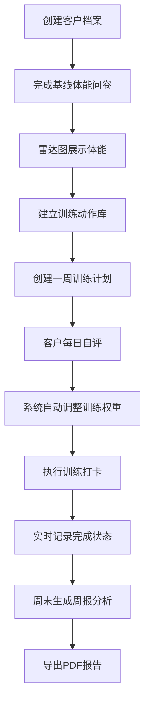

## 1. 产品概述
智能个性化健身训练管理系统，帮助健身教练和运动爱好者为客户动态生成训练计划并跟踪执行效果。
- 解决传统Excel或纸质计划难以根据客户实时体能数据自动调整训练内容的问题
- 面向健身教练、个人训练工作室及运动爱好者的SaaS级训练管理工具

## 2. 核心功能

### 2.1 用户角色
| 角色 | 权限说明 |
|------|----------|
| 教练端 | 创建客户档案、管理动作库、制定训练计划、查看周报、导出PDF |
| 客户端 | 查看每日训练、完成训练打卡、填写自评、查看周报 |

### 2.2 功能模块
1. **客户档案管理**：创建客户档案、基线体能问卷、雷达图展示、手动调整评分
2. **训练动作库**：动作列表、详情展开、肌群筛选、模糊搜索、高亮匹配
3. **训练计划管理**：一周计划创建、自动生成动作组合、拖拽排序、训练量估算
4. **训练执行跟踪**：动作完成打卡、倒计时动画、当日训练摘要
5. **每日自评系统**：睡眠质量/肌肉酸痛/精力自评、训练权重自动调整
6. **周报分析报告**：完成率统计、进步曲线、自评趋势对比、PDF导出

### 2.3 页面详情
| 页面名称 | 模块名称 | 功能描述 |
|----------|----------|----------|
| 仪表盘 | 概览卡片 | 客户数量、今日训练、完成率统计概览 |
| 客户列表 | 客户档案卡片 | 展示所有客户，快速进入详情页 |
| 客户详情 | 基线体能问卷 | 10题体能评估、五边形雷达图展示、手动调整评分 |
| 动作库 | 动作管理 | 列表展示、肌群筛选、模糊搜索、详情展开动画 |
| 训练计划 | 周计划面板 | 拖拽排序、训练量估算、调整颜色提示 |
| 训练执行 | 当日会话 | 完成按钮动画、倒计时圆环、训练摘要卡片 |
| 自评输入 | 每日准备 | 星级跳跃动画、部位点选、滑块、调整提示 |
| 周报页面 | 报告展示 | 折线图/雷达图/柱状图、对比叠加、PDF导出 |

## 3. 核心流程
教练创建客户档案→完成基线体能问卷→建立动作库→制定一周训练计划→客户每日自评调整→执行训练打卡→周末生成周报。

## 4. 用户界面设计
### 4.1 设计风格
- 主色调：活力橙红色（#FF6B35）搭配清爽蓝灰色（#2F4858）
- 背景色：白色（#FFFFFF）+ 浅灰色（#F0F4F8）
- 按钮：主色渐变（#FF6B35 → #FF8C42），悬停亮度变化，点击微缩动画
- 卡片：圆角8-12px，微弱阴影，悬停上浮加深阴影（0.3s过渡）
- 输入框：聚焦边框变色+轻微缩放
- 图表：平滑曲线+柔和过渡动画，主色圆点标记
- 字体：选择现代活力的无衬线字体组合，标题用Poppins，正文用Noto Sans SC

### 4.2 页面设计概览
| 页面名称 | 模块 | UI元素 |
|----------|------|--------|
| 仪表盘 | 概览 | 渐变统计卡片、图表动画、错落排列 |
| 客户列表 | 档案 | 头像卡片、悬停上浮、状态标签 |
| 客户详情 | 问卷 | 雷达图弹性动画、滑动评分条 |
| 动作库 | 列表 | 平滑展开高度、搜索高亮、渐入列表 |
| 训练计划 | 拖拽 | 半透明残影、原位置淡出、总训练量实时计算 |
| 训练执行 | 打卡 | 绿色勾号放大动画、倒计时圆环、音频提示 |
| 自评输入 | 表单 | 星星跳跃动画、滑块轨道渐变、颜色提示条 |
| 周报 | 图表 | 折线划过动画、雷达叠加对比、卡片错落进入 |

### 4.3 响应式设计
- **桌面端（>1024px）**：左侧固定导航栏（240px）+ 右侧主内容区，多列网格布局
- **平板端（768-1024px）**：顶部汉堡菜单，展开时从右侧滑入，双列网格
- **移动端（<768px）**：卡片堆叠排列，底部Tab导航，全屏训练会话页面
- 所有交互优化触控操作，按钮最小44px点击区域

### 4.4 动画与交互
- 页面加载：卡片错落渐入（staggered animation-delay）
- 拖拽：半透明ghost跟随，原位置淡出+位移过渡
- 完成按钮：绿色对勾从中心放大pop效果
- 倒计时：SVG圆环stroke-dashoffset动画
- 星星评分：点击单个星星y轴跳跃+缩放
- 雷达图：每个顶点scale弹性动画（spring timing）
- 颜色提示：训练量增加→绿色渐亮，减少→红色渐淡
