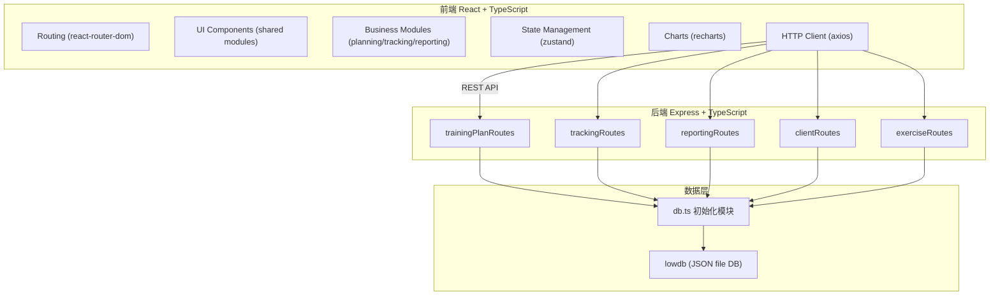
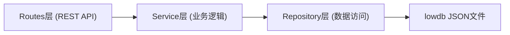
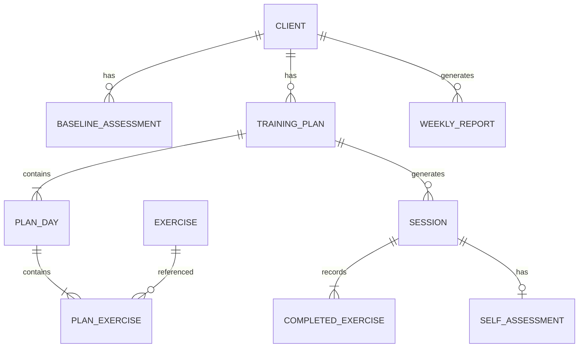

## 1. 架构设计



## 2. 技术说明
- **前端构建**：Vite 5 + React 18 + TypeScript 5（严格模式）
- **状态管理**：zustand（轻量级）
- **路由**：react-router-dom v6
- **HTTP请求**：axios（带拦截器、超时控制）
- **图表可视化**：recharts（折线图、雷达图、柱状图、饼图）
- **样式方案**：Tailwind CSS 3 + CSS Modules（scoped样式）
- **拖拽实现**：@dnd-kit/core（高性能，60fps保证）
- **图标库**：lucide-react
- **后端框架**：Express 4 + TypeScript
- **数据库**：lowdb（本地JSON文件持久化）
- **工具库**：uuid（唯一ID）、bcryptjs（密码加密）、jsonwebtoken（认证）
- **PDF导出**：jspdf + html2canvas

## 3. 路由定义
| 路由路径 | 页面用途 |
|----------|----------|
| / | 仪表盘概览页 |
| /clients | 客户列表页 |
| /clients/:id | 客户详情（基线体能问卷） |
| /exercises | 训练动作库 |
| /training-plans | 训练计划列表 |
| /training-plans/:id | 单周训练计划详情（拖拽排序） |
| /daily-session | 当日训练会话（移动端优先） |
| /self-assessment | 每日自评输入页 |
| /reports/:clientId/:week | 周报分析报告页 |
| /login | 登录页 |

## 4. API接口定义
```typescript
// 客户相关
interface Client { id: string; name: string; age: number; goal: 'muscle' | 'fat-loss' | 'maintain'; location: 'home' | 'gym'; baselineScores: Record<string, number>; createdAt: Date; }
POST /api/clients - 创建客户
GET /api/clients - 获取客户列表
GET /api/clients/:id - 获取客户详情
PUT /api/clients/:id/baseline - 更新基线评分

// 动作库相关
interface Exercise { id: string; name: string; muscleGroup: string; mediaUrl?: string; difficulty: 1|2|3|4|5; description: string; }
POST /api/exercises - 创建动作
GET /api/exercises?muscleGroup=&search= - 动作列表搜索
PUT /api/exercises/:id - 更新动作

// 训练计划相关
interface TrainingPlan { id: string; clientId: string; weekStart: Date; days: PlanDay[]; }
interface PlanDay { dayIndex: number; duration: number; focusAreas: string[]; exercises: PlanExercise[]; }
interface PlanExercise { exerciseId: string; sets: number; reps: string; restSeconds: number; }
POST /api/trainingPlans - 创建计划
GET /api/trainingPlans/:clientId - 获取客户计划
PUT /api/trainingPlans/:planId - 更新动作顺序
PUT /api/trainingPlans/:planId/adjust - 根据自评调整

// 训练跟踪相关
interface Session { id: string; planId: string; date: Date; completedExercises: CompletedExercise[]; selfAssessment: SelfAssessment; }
interface SelfAssessment { sleepQuality: 1-5; soreAreas: string[]; energyLevel: 1-10; }
POST /api/sessions - 记录完成数据
POST /api/sessions/self-assessment - 提交自评
GET /api/sessions/:sessionId - 获取会话状态

// 报告相关
interface WeeklyReport { clientId: string; weekKey: string; completionRate: number; avgDuration: number; progressCurves: Record<string, number[]>; assessmentTrend: any[]; suggestions: string[]; }
GET /api/reports/:clientId/:week - 获取周报
GET /api/reports/:clientId/:week/export - 导出PDF
```

## 5. 服务端架构



## 6. 数据模型

### 6.1 ER图



### 6.2 数据库初始化数据（lowdb schema）

```typescript
interface DatabaseSchema {
  clients: Client[];
  exercises: Exercise[];
  trainingPlans: TrainingPlan[];
  sessions: Session[];
  weeklyReports: WeeklyReport[];
}

// 预置动作数据：覆盖主要肌群的20+标准训练动作
// 预置客户数据：2-3个示例客户展示不同目标
// 预置训练计划数据：1-2个完整周计划示例
```

## 7. 性能保障
- 搜索防抖（debounce 150ms）+ 模糊匹配索引 → <200ms响应
- 拖拽使用transform复合层 + GPU加速 → 60fps稳定
- 周报数据后端预聚合 + 缓存（同周不重复计算）→ <2s生成
- 图表组件懒加载 + 动画requestAnimationFrame优化
- 图片资源懒加载 + WebP格式优先
