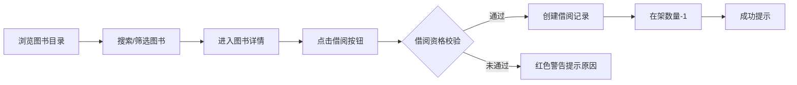

## 1. 产品概述

社区图书馆自助借阅与读者管理系统，旨在为小型社区图书馆提供数字化管理升级方案，解决管理员手工操作效率低下、易出错的问题。读者可通过自助终端完成图书借还，管理员可在后台管理藏书、读者信息、借阅记录，并自动生成逾期通知与借阅统计报表。

- 核心目标：提升图书馆运营效率，减少人工操作错误，提升读者借阅体验
- 目标用户：社区图书馆管理员、社区读者
- 市场价值：低成本、易部署的社区图书馆数字化解决方案

## 2. 核心功能

### 2.1 用户角色

| 角色 | 注册方式 | 核心权限 |
|------|----------|----------|
| 读者 | 邮箱注册 | 浏览藏书、借阅图书、归还图书、查看借阅历史、接收逾期通知 |
| 管理员 | 后台预设账号 | 管理藏书、管理读者、查看借阅记录、生成统计报表、配置逾期规则、管理通知 |

### 2.2 功能模块

1. **图书目录页**：藏书列表展示、搜索筛选、图书详情
2. **读者仪表盘**：当前借阅、借阅历史、借还操作
3. **借还模块**：扫码/手动输入借书、还书操作
4. **管理员面板**：藏书管理、读者管理、借阅记录管理、统计报表
5. **逾期通知模块**：自动逾期检查、邮件通知、通知列表
6. **用户认证模块**：注册、登录、JWT 鉴权

### 2.3 页面详情

| 页面名称 | 模块名称 | 功能描述 |
|----------|----------|----------|
| 图书目录页 | BookCatalogue | 网格布局展示藏书、按书名/作者/分类/在架状态筛选、实时模糊搜索、图书卡片悬停动效 |
| 图书详情页 | BookDetail | 图书封面、简介、馆藏/在架数量、借阅历史、预约队列、借阅按钮 |
| 读者仪表盘 | ReaderDashboard | 已借阅图书列表、应还日期、借阅历史、还书操作入口 |
| 借还操作页 | BorrowReturn | 扫码/手动输入ISBN借书、还书操作、加载状态提示 |
| 管理员面板 | AdminPanel | 藏书增删改、拖拽上传封面、读者管理、借阅记录、逾期费用、柱状图统计报表 |
| 逾期通知 | OverdueNotifier | 最近7天通知列表、未读小红点、无限滚动加载、催还日志 |
| 登录页 | Login | 邮箱密码登录、JWT token存储 |
| 注册页 | Register | 姓名邮箱密码注册、bcrypt加密、自动登录跳转 |

## 3. 核心流程

### 3.1 读者借书流程

读者进入首页浏览藏书 → 通过搜索/筛选找到目标图书 → 点击图书卡片进入详情页 → 点击"借阅此书"按钮 → 系统校验借阅资格（无逾期、未超5本）→ 创建借阅记录、在架数量减1 → 返回成功提示

### 3.2 读者还书流程

读者进入仪表盘 → 查看当前借阅列表 → 点击目标图书"还书"按钮 → 确认还书 → 图书在架数量+1 → 借阅记录更新为已归还

### 3.3 逾期通知流程

系统每天凌晨定时任务 → 检查所有逾期记录 → 向读者邮箱发送催还邮件 → 记录通知日志 → 前端展示通知列表

## 4. 用户界面设计

### 4.1 设计风格

- **主色调**：温暖木质色调，主色 #D2A679（暖木棕）、辅助色 #F5E6D0（米白）、强调色 #A0522D（赭石棕）
- **背景**：浅米色微纹理，模拟纸张质感
- **按钮风格**：圆角矩形，点击时 scale 缩小再恢复的微动效
- **字体**：标题使用具有人文感的衬线字体，正文使用清晰易读的无衬线字体
- **布局风格**：卡片式布局，顶部固定导航栏
- **图标风格**：线性简约图标，使用 lucide-react

### 4.2 页面设计概览

| 页面名称 | 模块名称 | UI 元素 |
|----------|----------|---------|
| 图书目录页 | BookCatalogue | 顶部搜索筛选栏、CSS Grid 响应式图书卡片网格、在架状态标签、封面渐入动画、卡片悬停上浮阴影 |
| 图书详情页 | BookDetail | 大尺寸图书封面、图书信息区、借阅历史列表、预约队列、借阅按钮（带动效） |
| 读者仪表盘 | ReaderDashboard | 个人信息区、当前借阅卡片列表、应还日期高亮、借阅历史时间线、还书按钮 |
| 管理员面板 | AdminPanel | 侧边导航、藏书管理表格、读者管理表格、统计柱状图、逾期规则配置 |
| 逾期通知页 | OverdueNotifier | 通知列表、未读小红点、无限滚动加载、通知详情展开 |
| 登录/注册页 | Auth | 居中卡片表单、木质纹理背景、输入框动效、提交按钮 |

### 4.3 响应式设计

- 桌面端（>1024px）：图书卡片 4 列布局
- 平板端（768px-1024px）：图书卡片 3 列布局
- 移动端（<768px）：图书卡片 2 列布局
- 触控区域不小于 44px
- 顶部导航栏在移动端转为汉堡菜单

### 4.4 动效设计

- 页面切换：淡入上滑过渡，300ms
- 图书卡片：悬停上浮 + 阴影加深
- 按钮点击：scale 缩小再恢复
- 封面加载：渐入动画
- 列表刷新：平滑过渡
- 骨架屏：脉冲动画占位
- 成功提示：绿色上浮动画
- 错误提示：红色警告抖动
