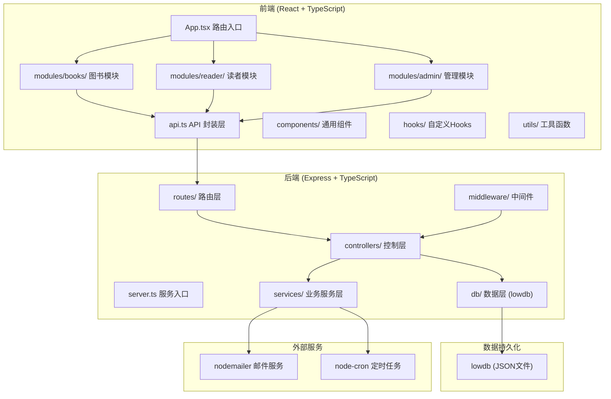
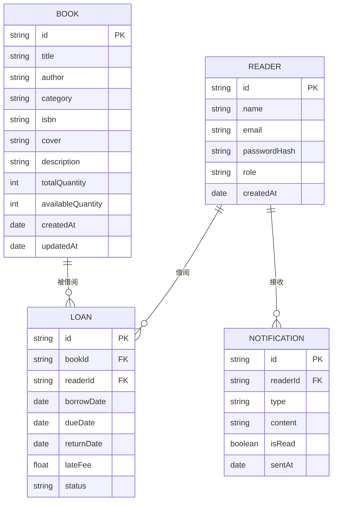
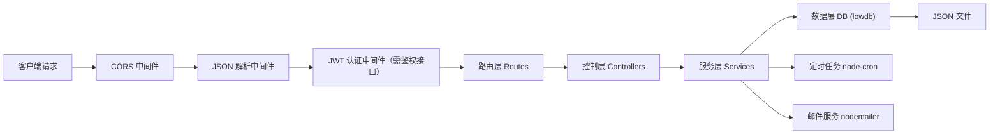

## 1. 架构设计



## 2. 技术栈说明

- **前端框架**：React 18 + TypeScript
- **构建工具**：Vite 5
- **路由管理**：react-router-dom 6
- **HTTP 客户端**：axios
- **状态管理**：React Hooks + Context
- **样式方案**：CSS Modules / 原生 CSS（自定义设计系统）
- **图标库**：lucide-react
- **图表库**：recharts（柱状图统计报表）

- **后端框架**：Express 4 + TypeScript
- **数据库**：lowdb（轻量级 JSON 数据库）
- **身份认证**：jsonwebtoken (JWT)
- **密码加密**：bcryptjs
- **跨域处理**：cors
- **唯一标识**：uuid
- **定时任务**：node-cron
- **邮件服务**：nodemailer

## 3. 路由定义

### 3.1 前端路由

| 路由路径 | 页面组件 | 说明 |
|----------|----------|------|
| `/` | BookCatalogue | 图书目录首页 |
| `/books/:id` | BookDetail | 图书详情页 |
| `/login` | Login | 登录页 |
| `/register` | Register | 注册页 |
| `/dashboard` | ReaderDashboard | 读者仪表盘（需登录） |
| `/borrow-return` | BorrowReturn | 借还操作页（需登录） |
| `/admin` | AdminPanel | 管理员面板（需管理员权限） |
| `/admin/notifications` | OverdueNotifier | 逾期通知管理（需管理员权限） |

### 3.2 后端 API 路由

| 方法 | 路径 | 说明 | 权限 |
|------|------|------|------|
| POST | `/api/auth/register` | 读者注册 | 公开 |
| POST | `/api/auth/login` | 用户登录 | 公开 |
| GET | `/api/books` | 获取图书列表（支持筛选） | 公开 |
| GET | `/api/books/:id` | 获取图书详情 | 公开 |
| POST | `/api/books` | 添加图书 | 管理员 |
| PUT | `/api/books/:id` | 更新图书信息 | 管理员 |
| DELETE | `/api/books/:id` | 删除图书 | 管理员 |
| GET | `/api/readers/:id/loans` | 获取读者当前借阅 | 读者/管理员 |
| GET | `/api/readers/:id/history` | 获取读者借阅历史 | 读者/管理员 |
| POST | `/api/loans` | 创建借阅记录 | 读者 |
| POST | `/api/loans/return` | 归还图书 | 读者/管理员 |
| GET | `/api/admin/reports` | 获取统计报表 | 管理员 |
| GET | `/api/admin/notifications` | 获取通知列表 | 管理员 |
| PUT | `/api/admin/notifications/:id/read` | 标记通知已读 | 管理员 |

## 4. 数据模型

### 4.1 ER 图



### 4.2 lowdb 数据结构

```json
{
  "books": [
    {
      "id": "uuid",
      "title": "书名",
      "author": "作者",
      "category": "文学",
      "isbn": "978-xxxx-xxxx-x",
      "cover": "图片URL",
      "description": "图书简介",
      "totalQuantity": 5,
      "availableQuantity": 3,
      "createdAt": "2024-01-01T00:00:00.000Z",
      "updatedAt": "2024-01-01T00:00:00.000Z"
    }
  ],
  "readers": [
    {
      "id": "uuid",
      "name": "姓名",
      "email": "email@example.com",
      "passwordHash": "bcrypt哈希值",
      "role": "reader",
      "createdAt": "2024-01-01T00:00:00.000Z"
    }
  ],
  "loans": [
    {
      "id": "uuid",
      "bookId": "图书ID",
      "readerId": "读者ID",
      "borrowDate": "2024-01-01T00:00:00.000Z",
      "dueDate": "2024-01-15T00:00:00.000Z",
      "returnDate": null,
      "lateFee": 0,
      "status": "borrowed"
    }
  ],
  "notifications": [
    {
      "id": "uuid",
      "readerId": "读者ID",
      "type": "overdue",
      "content": "通知内容",
      "isRead": false,
      "sentAt": "2024-01-01T00:00:00.000Z"
    }
  ],
  "config": {
    "maxBorrowCount": 5,
    "loanDays": 14,
    "lateFeePerDay": 0.5
  }
}
```

## 5. 后端架构



## 6. 性能约束

- 借还操作响应时间：≤ 800ms
- 图书列表搜索筛选响应：≤ 300ms
- 首次页面加载：≤ 3秒
- 前端使用组件懒加载、图片懒加载优化
- 后端使用内存缓存优化查询性能

## 7. 项目目录结构

```
auto95/
├── src/                          # 前端源码
│   ├── modules/
│   │   ├── books/               # 图书模块
│   │   │   ├── BookCatalogue.tsx
│   │   │   └── BookDetail.tsx
│   │   ├── reader/              # 读者模块
│   │   │   ├── ReaderDashboard.tsx
│   │   │   └── BorrowReturn.tsx
│   │   └── admin/               # 管理模块
│   │       ├── AdminPanel.tsx
│   │       └── OverdueNotifier.tsx
│   ├── components/              # 通用组件
│   ├── hooks/                   # 自定义 Hooks
│   ├── utils/                   # 工具函数
│   ├── api.ts                   # API 调用封装
│   ├── app.tsx                  # 主应用组件
│   └── main.tsx                 # 入口文件
├── server/                       # 后端源码
│   ├── routes/                  # 路由
│   ├── controllers/             # 控制器
│   ├── middleware/              # 中间件
│   ├── services/                # 服务层
│   ├── db/                      # 数据库
│   ├── types/                   # 类型定义
│   └── server.ts                # 服务入口
├── public/                       # 静态资源
├── index.html                    # HTML 入口
├── vite.config.ts               # Vite 配置
├── tsconfig.json                # TypeScript 配置
├── package.json                 # 项目依赖
└── data/                        # lowdb 数据文件目录
    └── db.json
```
