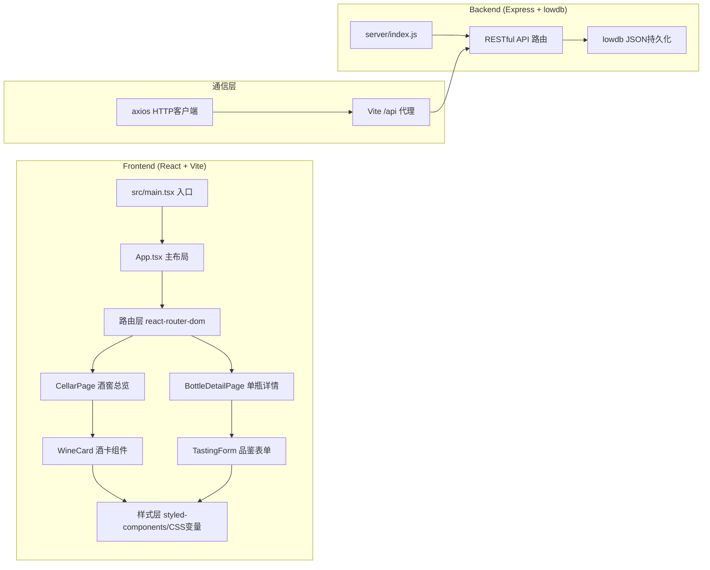
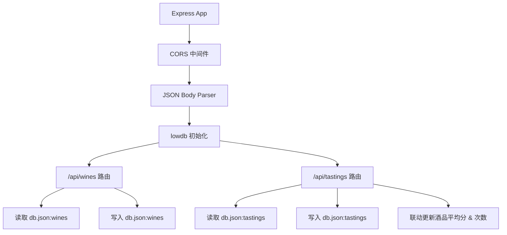
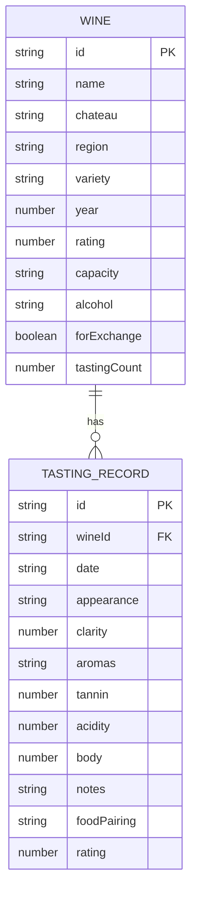

## 1. 架构设计



## 2. 技术栈说明

- **前端框架**：React 18 + TypeScript（严格模式）
- **构建工具**：Vite 5.x（配置 `/api` 代理到 Express 后端）
- **路由**：React Router DOM 6.x
- **HTTP客户端**：Axios
- **图标库**：Lucide React
- **后端框架**：Express 4.x（CommonJS / ESM 兼容）
- **数据持久化**：lowdb 3.x（本地 JSON 文件）
- **ID生成**：uuid
- **文件上传**：multer（预留扩展）
- **跨域**：cors
- **状态管理**：React useState + Context（轻量级，无需 zustand）
- **样式方案**：原生 CSS + CSS Variables + 少量 keyframes 动画
- **启动脚本**：`npm run dev` 同时启动 Vite(5173) + Express(3001)，使用 concurrently

## 3. 路由定义

| 前端路由 | 页面组件 | 说明 |
|---------|---------|------|
| `/` | CellarPage | 酒窖总览（首页） |
| `/bottle/:id` | BottleDetailPage | 单瓶详情页 |

## 4. API 定义

```typescript
// ===== 数据类型 =====
interface Wine {
  id: string;
  name: string;
  chateau: string;           // 酒庄
  region: 'bordeaux' | 'napa' | 'tuscany' | 'burgundy' | 'other';
  regionLabel: string;       // 产区展示名
  variety: string;           // 葡萄品种
  year: number;              // 年份
  rating: number;            // 1-5 总体评分
  capacity: string;          // 容量，如 "750ml"
  alcohol: string;           // 酒精度，如 "13.5%"
  logoColor: string;         // Logo占位渐变色
  forExchange: boolean;      // 是否可交换
  exchangeCondition?: string;// 交换条件
  desiredWines?: string[];   // 期望换得酒款
  tastingCount: number;      // 品鉴次数
}

interface TastingRecord {
  id: string;
  wineId: string;
  date: string;              // ISO date
  appearance: string;        // 外观描述
  clarity: number;           // 清澈度 1-5
  aromas: string[];          // 香气标签（果香/橡木/香料/花卉/矿物）
  tannin: number;            // 单宁 1-10
  acidity: number;           // 酸度 1-10
  body: number;              // 酒体 1-10
  notes: string;             // 感受笔记
  foodPairing: string;       // 搭配食物
  rating: number;            // 本次评分 1-5
}
```

| 方法 | 路径 | 请求体 | 响应 | 说明 |
|------|------|-------|-----|------|
| GET | `/api/wines` | - | Wine[] | 获取所有酒品列表 |
| GET | `/api/wines/:id` | - | Wine | 获取单瓶详情 |
| POST | `/api/wines` | Partial<Wine> | Wine | 新增酒品 |
| PUT | `/api/wines/:id` | Partial<Wine> | Wine | 更新酒品信息 |
| DELETE | `/api/wines/:id` | - | `{success: true}` | 删除酒品 |
| GET | `/api/wines/:id/tastings` | - | TastingRecord[] | 获取某酒品鉴记录 |
| POST | `/api/tastings` | Omit<TastingRecord, 'id'> | TastingRecord | 新增品鉴记录（同时更新wine.rating & tastingCount） |

## 5. 服务端架构图



## 6. 数据模型

### 6.1 ER图


### 6.2 lowdb 初始数据结构
`server/db.json` 预置20+瓶样例酒数据 + 若干品鉴记录，覆盖波尔多、纳帕谷、托斯卡纳、勃艮第等产区，用于首页渲染演示。
