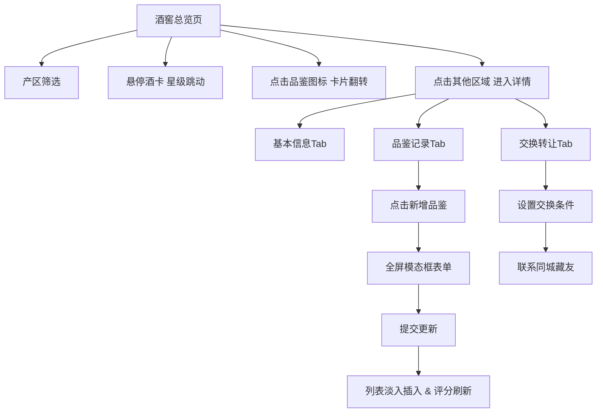

## 1. 产品概述

个人藏酒管理与品鉴记录平台，面向红酒爱好者，提供藏酒信息管理、品鉴笔记记录、偏好分析以及同城藏友交换转让功能。

- 目标用户：葡萄酒收藏爱好者、品酒师
- 核心价值：系统化管理个人酒窖，记录每一次品鉴体验，挖掘个人偏好，促进藏酒流通

## 2. 核心功能

### 2.1 用户角色
| 角色 | 注册方式 | 核心权限 |
|------|---------|---------|
| 普通用户 | 无需注册（单机版） | 管理藏酒、记录品鉴、设置交换信息 |

### 2.2 功能模块
1. **酒窖总览页**：产区筛选、网格布局酒卡、评分星级、卡片翻转动画
2. **单瓶详情页**：基本信息Tab、品鉴记录Tab（含新增表单）、交换转让Tab
3. **品鉴记录系统**：外观/香气/口感多维度评分、滑块评估
4. **酒卡组件**：3D翻转动画、星级评分跳动、产区标签配色

### 2.3 页面详情
| 页面名称 | 模块名称 | 功能描述 |
|---------|---------|---------|
| 酒窖总览页 | 顶部导航 | Logo展示、搜索框入口、用户入口 |
| 酒窖总览页 | 产区筛选栏 | 按产区标签过滤（全部/波尔多/纳帕谷/托斯卡纳等） |
| 酒窖总览页 | 酒卡网格 | 响应式网格（2/3/4列），支持悬停星级跳动 |
| 酒窖总览页 | 底部导航 | 移动端Tab切换（酒窖/品鉴/交换） |
| 单瓶详情页 | 酒瓶大图展示 | 顶部大图区域，无图显示Logo占位 |
| 单瓶详情页 | 基本信息Tab | 酒庄/产区/品种/年份等垂直列表（滑动渐入动画） |
| 单瓶详情页 | 品鉴记录Tab | 时间倒序列表 + 新增品鉴全屏模态框 |
| 单瓶详情页 | 交换转让Tab | 交换条件 + 联系同城藏友按钮 |
| 品鉴表单 | 全屏模态框 | 流式表单布局 + 左侧提示图标 + 滑块评分组件 |

## 3. 核心流程

用户进入酒窖总览 → 浏览/筛选酒卡 → 点击品鉴图标翻转卡片查看摘要 → 点击卡片进入详情 → 在详情页查看基本信息/品鉴记录/交换设置 → 新增品鉴记录提交 → 列表自动更新 & 总体评分刷新 → 可设置闲置酒的交换条件 → 联系同城藏友

## 4. 用户界面设计

### 4.1 设计风格
- **主色调**：深酒红 `#4A0E1C`，暖金色 `#C9A962`
- **背景**：仿橡木桶纹理深棕色微纹 `#2A1810`，叠加噪点纹理
- **卡片色**：软木塞米色 `#F5E6D3`，圆角16px
- **产区标签配色**：波尔多深红`#722F37`、纳帕谷暖橙`#E67E22`、托斯卡纳墨绿`#2D5016`
- **字体**：标题使用 Playfair Display（优雅衬线），正文使用 Cormorant Garamond
- **按钮**：金色渐变边框 + 悬停微上浮动画，圆角8px
- **图标**：Lucide React 图标库，统一线宽

### 4.2 页面设计概览
| 页面名称 | 模块名称 | UI元素 |
|---------|---------|---------|
| 酒窖总览页 | 背景层 | 橡木桶纹理 + 深酒红渐变光晕 + 噪点叠加 |
| 酒窖总览页 | 酒卡 | 软木塞色卡片、灰色渐变Logo占位、金色渐变星星、悬停轻微上浮 |
| 酒窖总览页 | 星级动画 | 悬停时星星逐帧微跳动（transform: translateY 波动） |
| 单瓶详情页 | Tab切换 | 金色下划线滑动 + 内容横向滑动过渡动画 |
| 单瓶详情页 | 基本信息 | 每项左侧金色圆点分隔 + 内容延迟渐入（animation-delay） |
| 品鉴表单 | 滑块 | 金色渐变滑轨 + 自定义圆形拇指 + 实时数值反馈 |
| 品鉴表单 | 香气标签 | 可多选圆角标签 + 选中态金色描边填充 |

### 4.3 响应式设计
- **桌面端（≥1280px）**：顶部侧边双导航，酒卡4列网格
- **平板端（768-1279px）**：仅顶部导航，酒卡3列网格
- **移动端（≤767px）**：底部Tab导航，酒卡2列网格，表单全屏模态
- **触控优化**：触摸目标≥44px，滑动手势支持Tab切换

### 4.4 动画性能
- 首页渲染100瓶≤3s（CSS硬件加速 transform/opacity）
- 品鉴列表更新响应≤200ms（React状态局部更新 + CSS transition）
- 卡片翻转：`transform-style: preserve-3d` + `backface-visibility`
