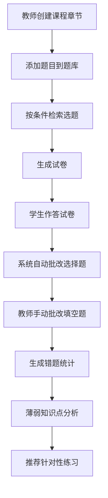

## 1. 产品概述

本产品是面向线上教学机构的智能练习系统，帮助教师高效创建个性化课后练习卷并实现自动化批改。通过题库管理、智能组卷、自动评分和错题分析四大核心功能，解决教师手动选题耗时、客观题批改效率低、学生薄弱点难以精准定位的三大痛点。

- **目标用户**：K12及职业教育线上机构的教师、学生
- **核心价值**：提升教师工作效率80%以上，实现学生个性化精准练习

## 2. 核心功能

### 2.1 用户角色

| 角色 | 核心权限 |
|------|----------|
| 教师 | 创建课程章节、管理题库、生成试卷、批改填空题、查看学情分析 |
| 学生 | 作答试卷、查看批改结果、查看薄弱知识点分析、完成推荐练习 |

### 2.2 功能模块

1. **课程管理页面**：课程和章节的增删改查，树形结构展示
2. **题库管理页面**：题目的增删改查，支持单选/多选/填空三种题型，LaTeX公式实时预览
3. **组卷页面**：按题型和难度检索题目，手动选题后自动生成试卷，A4纸比例预览
4. **学生作答页面**：学生完成试卷作答，支持选择卡片动画和填空题输入动画
5. **批改页面**：系统自动批改选择题，教师手动批改填空题，竖排展示试卷
6. **错题分析页面**：环形饼图展示知识点错误占比，智能推荐同类练习题

### 2.3 页面详情

| 页面名称 | 模块名称 | 功能描述 |
|-----------|-------------|---------------------|
| 课程管理 | 课程树 | 树形展示课程和章节，支持展开折叠、增删改操作 |
| 课程管理 | 章节表单 | 弹窗表单创建/编辑课程和章节 |
| 题库管理 | 题目列表 | 按章节和题型展示题目，支持编辑删除 |
| 题库管理 | 题目编辑 | 左右分屏编辑器，左侧编辑右侧实时预览，支持LaTeX公式 |
| 题库管理 | 预览区域 | 浅色背景、蓝色等宽字体，平滑分割线拖拽 |
| 组卷页面 | 题目检索 | 按题型单选/多选/填空、难度基础/中等/困难筛选 |
| 组卷页面 | 题目选择 | 列表多选题目，显示已选数量和总分 |
| 组卷页面 | 试卷预览 | A4纸比例、浅灰色网格背景、模拟打印阴影、彩色题型分隔线 |
| 学生作答 | 选择题卡片 | 悬停放大动画、选中边框渐变填充 |
| 学生作答 | 填空题输入 | 获得焦点时下划线左滑入动画 |
| 批改页面 | 试卷列表 | 竖排展示每位学生试卷，显示总分和批改状态 |
| 批改页面 | 错题详情 | 错题标红，显示正确答案，弹性动画展开解析 |
| 批改页面 | 填空题批改 | 教师输入得分和评语 |
| 错题分析 | 知识点饼图 | 环形饼图展示各知识点错误占比，渐变切块颜色，悬停提示框 |
| 错题分析 | 推荐练习 | 从题库筛选同类薄弱知识点题目，支持一键生成练习卷 |

## 3. 核心流程

### 3.1 教师组卷批改流程
教师登录 → 进入课程管理创建课程章节 → 在题库管理添加题目（支持LaTeX公式实时预览）→ 进入组卷页面按题型和难度检索题目 → 勾选题目生成试卷 → 学生作答 → 系统自动批改选择题 → 教师手动批改填空题 → 查看错题分析和知识点薄弱情况 → 生成针对性推荐练习

### 3.2 学生学习流程
学生登录 → 查看待作答试卷列表 → 完成试卷作答（选择卡片动画、填空题输入动画）→ 提交试卷 → 查看批改结果和错题解析 → 查看个人知识点薄弱分析 → 完成推荐练习题

## 4. 用户界面设计

### 4.1 设计风格

- **主色调**：清爽蓝色系 (#369CFF, #1E7FD9) 和绿色系 (#4CAF7E, #2E8B57)
- **背景色**：极浅灰白色 (#FAFBFC)
- **标题字体**：深蓝色 (#0D3B66) 加粗
- **按钮样式**：蓝色渐变背景，圆角8px，悬停颜色加深+轻微上浮动画 (translateY(-2px), box-shadow增强)
- **卡片面板**：圆角12px，浅灰色边框 (#E5E7EB)，悬停时浅蓝背景 (rgba(54, 156, 255, 0.08))
- **内容布局**：最大宽度1200px居中对齐
- **字体选择**：标题使用 Noto Sans SC Bold，正文使用 Noto Sans SC Regular，代码/公式区使用 JetBrains Mono 等宽字体

### 4.2 页面设计概述

| 页面名称 | 模块名称 | UI元素 |
|-----------|-------------|-------------|
| 导航栏 | 顶部菜单 | 深蓝背景、白色文字、当前页蓝色下划线指示、页面切换标题滑入动画 (ease-out 0.4s) |
| 题库管理 | 分屏编辑器 | 左侧编辑区白底、右侧预览区浅蓝背景(#F0F7FF)+蓝色等宽字体、中间可拖动分割线(平滑过渡) |
| 组卷页面 | 试卷预览 | A4纸比例(210:297)、浅灰色网格背景、盒阴影模拟纸张效果、单选蓝线(#369CFF)/多选绿线(#4CAF7E)/填空橙线(#FF9F43)分隔 |
| 学生作答 | 选项卡片 | 白底圆角卡片、悬停scale(1.02)过渡0.2s、选中后渐变边框+浅蓝色填充 |
| 学生作答 | 填空输入 | 无边框样式、底部1px灰色下划线、focus时2px蓝色下划线从左滑入(width从0到100%过渡0.3s) |
| 批改页面 | 错题展示 | 红色错误标记、绿色正确答案、解析区域弹性展开动画(cubic-bezier(0.68, -0.55, 0.265, 1.55)) |
| 错题分析 | 环形饼图 | 渐变色彩块、悬停时切块轻微外扩(scale 1.05)、Tooltip显示知识点名称+错误次数 |

### 4.3 响应式

- **设计方式**：桌面端优先 (Desktop-first)，响应式断点768px
- **移动端适配**：单列布局、卡片全宽、字体适当缩小、触摸区域扩大到44px
- **触控优化**：按钮和可点击元素最小尺寸44x44px，避免过小点击区域

### 4.4 动效设计

- **页面切换**：页面标题从上方滑入 (translateY(-20px) → translateY(0))，ease-out 0.4s
- **列表悬停**：行背景色从透明过渡到 rgba(54, 156, 255, 0.08)，0.2s ease
- **按钮悬停**：背景色加深，translateY(-2px) 上浮，阴影增强，0.2s ease
- **错题展开**：max-height + opacity 配合弹性缓动函数，0.5s cubic-bezier
- **选项卡片**：悬停 scale(1.02)，选中渐变边框填充
- **分割线拖拽**：平滑宽度变化，transition 0.1s linear
