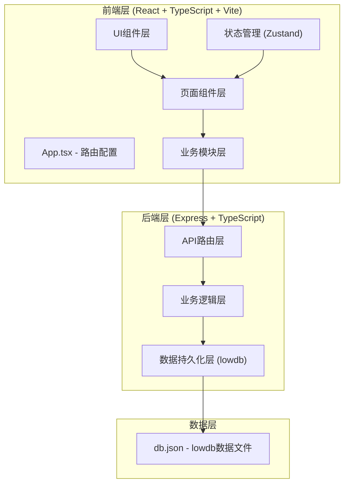
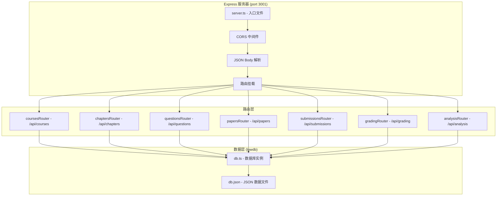
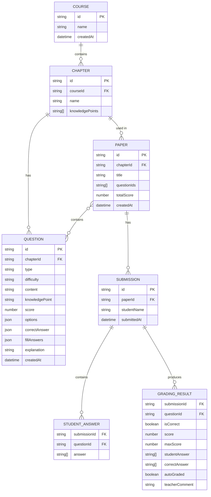

## 1. 架构设计



## 2. 技术描述

- **前端框架**：React@18 + TypeScript@5 + Vite@5
- **前端路由**：react-router-dom@6
- **状态管理**：Zustand@4
- **样式方案**：TailwindCSS@3 + 自定义CSS动画
- **HTTP客户端**：axios@1
- **数学公式渲染**：katex + react-katex
- **图表库**：chart.js + react-chartjs-2
- **后端框架**：Express@4 + TypeScript
- **数据持久化**：lowdb@7 (JSON文件数据库)
- **身份认证**：jsonwebtoken + bcryptjs
- **CORS处理**：cors包
- **ID生成**：uuid
- **构建工具**：Vite (前端) + ts-node (后端)
- **代码组织**：concurrently 同时运行前后端开发服务器

## 3. 路由定义

| 路由路径 | 页面组件 | 功能说明 |
|-----------|----------|----------|
| `/` | 重定向到 `/courses` | 默认首页 |
| `/courses` | CourseManage | 课程和章节管理页面 |
| `/question-bank` | QuestionBank | 题库管理页面（含分屏编辑器） |
| `/paper-generate` | PaperGenerate | 组卷页面 |
| `/student-paper/:paperId` | StudentPaper | 学生作答页面 |
| `/grading` | Grading | 批改页面 |
| `/analysis` | Analysis | 错题分析页面 |

## 4. API 定义

### 4.1 类型定义

```typescript
// 共享类型定义 (shared/types.ts)

type QuestionType = 'single' | 'multiple' | 'fill';
type Difficulty = 'basic' | 'medium' | 'hard';
type MatchMode = 'strict' | 'fuzzy';

interface Course {
  id: string;
  name: string;
  chapters: Chapter[];
  createdAt: string;
}

interface Chapter {
  id: string;
  name: string;
  knowledgePoints: string[];
}

interface QuestionOption {
  key: string;
  content: string;
}

interface Question {
  id: string;
  chapterId: string;
  type: QuestionType;
  difficulty: Difficulty;
  content: string;
  knowledgePoint: string;
  score: number;
  options?: QuestionOption[];
  correctAnswer?: string[];
  fillAnswers?: { answer: string; mode: MatchMode }[];
  explanation: string;
  createdAt: string;
}

interface Paper {
  id: string;
  title: string;
  chapterId: string;
  questionIds: string[];
  totalScore: number;
  createdAt: string;
}

interface StudentAnswer {
  questionId: string;
  answer: string[];
}

interface PaperSubmission {
  id: string;
  paperId: string;
  studentName: string;
  answers: StudentAnswer[];
  submittedAt: string;
}

interface GradingResult {
  submissionId: string;
  questionResults: {
    questionId: string;
    isCorrect: boolean;
    score: number;
    maxScore: number;
    studentAnswer: string[];
    correctAnswer: string[];
    autoGraded: boolean;
    teacherComment?: string;
  }[];
  totalScore: number;
  gradedAt: string;
}

interface KnowledgePointStat {
  name: string;
  errorCount: number;
  totalCount: number;
}
```

### 4.2 API 接口列表

| 方法 | 路径 | 描述 | 请求体 | 响应 |
|------|------|------|--------|------|
| GET | `/api/courses` | 获取所有课程 | - | Course[] |
| POST | `/api/courses` | 创建课程 | { name: string } | Course |
| PUT | `/api/courses/:id` | 更新课程 | { name: string } | Course |
| DELETE | `/api/courses/:id` | 删除课程 | - | { success: boolean } |
| POST | `/api/courses/:courseId/chapters` | 添加章节 | { name: string, knowledgePoints: string[] } | Chapter |
| PUT | `/api/chapters/:id` | 更新章节 | { name: string, knowledgePoints: string[] } | Chapter |
| DELETE | `/api/chapters/:id` | 删除章节 | - | { success: boolean } |
| GET | `/api/questions` | 获取题目列表 | query: { chapterId?, type?, difficulty? } | Question[] |
| POST | `/api/questions` | 创建题目 | Question | Question |
| PUT | `/api/questions/:id` | 更新题目 | Partial<Question> | Question |
| DELETE | `/api/questions/:id` | 删除题目 | - | { success: boolean } |
| POST | `/api/papers` | 创建试卷 | { title, chapterId, questionIds } | Paper |
| GET | `/api/papers` | 获取试卷列表 | - | Paper[] |
| GET | `/api/papers/:id` | 获取试卷详情（含题目） | - | Paper & { questions: Question[] } |
| POST | `/api/submissions` | 提交学生作答 | { paperId, studentName, answers } | PaperSubmission |
| GET | `/api/submissions` | 获取提交列表 | query: { paperId? } | PaperSubmission[] |
| GET | `/api/submissions/:id` | 获取提交详情 | - | PaperSubmission & { paper: Paper, questions: Question[] } |
| POST | `/api/grading/auto-grade` | 自动批改选择题 | { submissionId } | GradingResult |
| POST | `/api/grading/manual-grade` | 教师手动批改填空 | { submissionId, questionId, score, comment? } | GradingResult |
| GET | `/api/analysis/weak-points` | 获取薄弱知识点 | query: { studentName } | KnowledgePointStat[] |
| GET | `/api/analysis/recommend` | 获取推荐练习 | query: { studentName, knowledgePoint? } | Question[] |

## 5. 服务器架构图



## 6. 数据模型

### 6.1 实体关系图



### 6.2 lowdb 数据结构

```json
{
  "courses": [
    {
      "id": "uuid",
      "name": "初中数学",
      "createdAt": "2024-01-01T00:00:00.000Z",
      "chapters": [
        {
          "id": "uuid",
          "name": "一元二次方程",
          "knowledgePoints": ["求根公式", "判别式", "因式分解法"]
        }
      ]
    }
  ],
  "questions": [
    {
      "id": "uuid",
      "chapterId": "uuid",
      "type": "single",
      "difficulty": "basic",
      "content": "方程 $x^2 - 5x + 6 = 0$ 的解是？",
      "knowledgePoint": "因式分解法",
      "score": 5,
      "options": [
        { "key": "A", "content": "$x_1 = 2, x_2 = 3$" },
        { "key": "B", "content": "$x_1 = -2, x_2 = -3$" }
      ],
      "correctAnswer": ["A"],
      "explanation": "使用因式分解：$(x-2)(x-3)=0$，所以 $x=2$ 或 $x=3$",
      "createdAt": "2024-01-01T00:00:00.000Z"
    }
  ],
  "papers": [
    {
      "id": "uuid",
      "title": "一元二次方程基础练习",
      "chapterId": "uuid",
      "questionIds": ["uuid1", "uuid2"],
      "totalScore": 20,
      "createdAt": "2024-01-01T00:00:00.000Z"
    }
  ],
  "submissions": [
    {
      "id": "uuid",
      "paperId": "uuid",
      "studentName": "张三",
      "answers": [
        { "questionId": "uuid1", "answer": ["A"] }
      ],
      "submittedAt": "2024-01-01T00:00:00.000Z"
    }
  ],
  "gradingResults": [
    {
      "submissionId": "uuid",
      "questionResults": [
        {
          "questionId": "uuid",
          "isCorrect": true,
          "score": 5,
          "maxScore": 5,
          "studentAnswer": ["A"],
          "correctAnswer": ["A"],
          "autoGraded": true
        }
      ],
      "totalScore": 5,
      "gradedAt": "2024-01-01T00:00:00.000Z"
    }
  ]
}
```

## 7. 文件结构

```
auto97/
├── package.json
├── index.html
├── vite.config.ts
├── tsconfig.json
├── tailwind.config.js
├── postcss.config.js
├── backend/
│   ├── server.ts
│   ├── db.ts
│   └── routes/
│       ├── courses.ts
│       ├── chapters.ts
│       ├── questions.ts
│       ├── papers.ts
│       ├── submissions.ts
│       ├── grading.ts
│       └── analysis.ts
├── shared/
│   └── types.ts
└── src/
    ├── main.tsx
    ├── App.tsx
    ├── index.css
    ├── pages/
    │   ├── CourseManage.tsx
    │   ├── QuestionBank.tsx
    │   ├── PaperGenerate.tsx
    │   ├── StudentPaper.tsx
    │   ├── Grading.tsx
    │   └── Analysis.tsx
    ├── modules/
    │   ├── questionBank.ts
    │   ├── paper.ts
    │   ├── grading.ts
    │   └── analysis.ts
    ├── components/
    │   ├── Layout.tsx
    │   ├── QuestionEditor.tsx
    │   ├── QuestionPreview.tsx
    │   ├── SplitPane.tsx
    │   ├── PaperPreview.tsx
    │   ├── OptionCard.tsx
    │   ├── FillInput.tsx
    │   ├── KnowledgePieChart.tsx
    │   └── PageHeader.tsx
    ├── hooks/
    │   └── useApi.ts
    ├── store/
    │   └── useStore.ts
    └── utils/
        └── latex.ts
```
