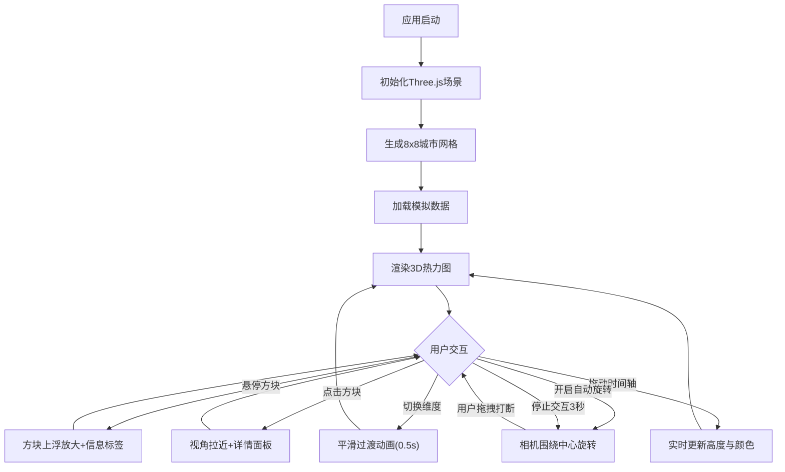

## 1. 产品概述

交互式3D城市热力图可视化应用，用于实时展示城市不同区域的人口密度、交通流量和空气质量指数。面向城市规划师、数据分析师和决策者，通过直观的3D可视化帮助理解城市运行状态。

- 核心价值：将多维度城市数据以3D热力图形式直观呈现，支持时间维度回溯与多指标切换
- 目标用户：城市规划师、交通管理部门、环境监测人员、数据可视化爱好者

## 2. 核心功能

### 2.1 功能模块

1. **3D城市网格视图**：8x8网格区块，方块高度映射人口密度，顶面颜色映射交通流量（绿→红渐变），侧面半透明白色
2. **控制面板**：数据维度切换（人口密度/交通流量/空气质量）、时间轴滑块（0-23时）、颜色主题切换
3. **交互反馈**：鼠标悬停方块上浮放大+信息标签、点击方块拉近视角+详细数据面板
4. **自动旋转**：右下角开关控制相机围绕城市中心旋转，支持打断恢复
5. **帧率监控**：左上角实时FPS计数器

### 2.2 页面详情

| 页面名称 | 模块名称 | 功能描述 |
|----------|----------|----------|
| 主页面 | 3D城市网格 | 8x8网格方块渲染，高度/颜色随数据动态变化，城市天际线效果 |
| 主页面 | 侧边控制面板 | 维度切换滑块、时间轴播放器（0-23时）、颜色主题切换，毛玻璃效果 |
| 主页面 | 悬停信息标签 | CSS2DRenderer渲染，显示区域名称、数值、评级，毛玻璃背景 |
| 主页面 | 点击详情面板 | 三维度折线图（Canvas绘制），TWEEN动画拉近视角 |
| 主页面 | 自动旋转控件 | 右下角开关，可调速度，交互打断后3秒恢复 |
| 主页面 | 帧率计数器 | 左上角实时FPS显示 |

## 3. 核心流程

## 4. 用户界面设计

### 4.1 设计风格

- **主色调**：深蓝黑色(#0a0e1a) → 深紫色(#1a0a2e)径向渐变背景
- **强调色**：青色(#00f0ff)作为科技感点缀，渐变绿(#00ff88)→红(#ff3366)用于数据映射
- **控件风格**：渐变填充滑块和按钮，悬停升起阴影动画
- **字体**：等宽字体(monospace)，白色文字，数值标签清晰
- **布局**：全屏3D场景，右侧毛玻璃控制面板浮动
- **面板风格**：rgba(255,255,255,0.08)背景，1px rgba(255,255,255,0.2)边框，12px圆角

### 4.2 页面设计概览

| 页面名称 | 模块名称 | UI元素 |
|----------|----------|--------|
| 主页面 | 3D场景容器 | 深色径向渐变背景，半透明圆形网格底纹，8x8方块阵列 |
| 主页面 | 控制面板 | 毛玻璃面板，维度选择按钮组，时间轴滑块，主题切换 |
| 主页面 | 悬停标签 | 毛玻璃背景，白色字体，轻微投影，区域名+数值+评级 |
| 主页面 | 详情面板 | 三条折线图(红/绿/蓝)，区域名称标题，关闭按钮 |
| 主页面 | 旋转开关 | 圆形切换按钮，速度滑块 |
| 主页面 | FPS计数器 | 等宽字体数字，半透明背景 |

### 4.3 响应式设计

- 桌面优先设计，3D场景占满视口
- 控制面板在窄屏时可折叠
- 最小支持1280x720分辨率

### 4.4 3D场景指导

- **环境**：深色科技风，无HDRI，使用深色背景色
- **灯光**：环境光+方向光，营造城市夜间科技感
- **相机**：透视相机，45度俯角，距离可缩放
- **构图**：城市网格居中，方块阵列形成天际线
- **交互**：OrbitControls支持旋转缩放，Raycaster检测悬停点击
- **动画**：方块高度/颜色过渡0.5s easeInOut，悬停放大1.2倍，TWEEN视角动画
- **性能**：256方块稳定30FPS+，自动旋转时25FPS+
