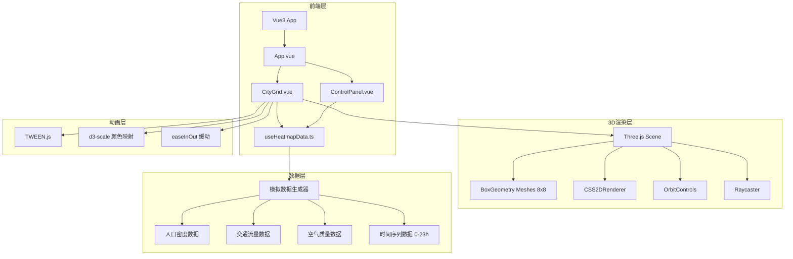
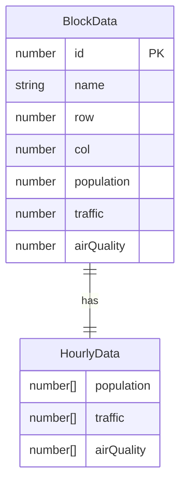

## 1. 架构设计



## 2. 技术说明

- **前端框架**：Vue 3 + TypeScript + Vite
- **初始化工具**：vite-init (vue-ts模板)
- **3D渲染**：Three.js + CSS2DRenderer + OrbitControls
- **动画**：@tweenjs/tween.js
- **数据映射**：d3-scale（颜色插值）
- **调试工具**：dat.gui（开发调试）
- **状态管理**：Pinia
- **路由**：Vue Router
- **后端**：无（纯前端，模拟数据）

## 3. 路由定义

| 路由 | 用途 |
|------|------|
| / | 主页面，3D城市热力图可视化 |

## 4. API定义

无后端API，所有数据由 `useHeatmapData.ts` 组合函数在客户端模拟生成。

### 数据接口定义

```typescript
interface BlockData {
  id: number
  name: string
  row: number
  col: number
  population: number      // 0-100
  traffic: number         // 0-100
  airQuality: number      // 0-100 (0=优, 100=差)
  hourlyData: {
    population: number[]
    traffic: number[]
    airQuality: number[]
  }
}

type DataDimension = 'population' | 'traffic' | 'airQuality'

interface HeatmapState {
  currentDimension: DataDimension
  currentHour: number
  blocks: BlockData[]
}
```

## 5. 数据模型

### 5.1 数据模型定义



### 5.2 文件结构

```
project/
├── index.html
├── package.json
├── vite.config.ts
├── tsconfig.json
├── src/
│   ├── main.ts
│   ├── App.vue
│   ├── components/
│   │   ├── CityGrid.vue
│   │   └── ControlPanel.vue
│   └── composables/
│       └── useHeatmapData.ts
```
