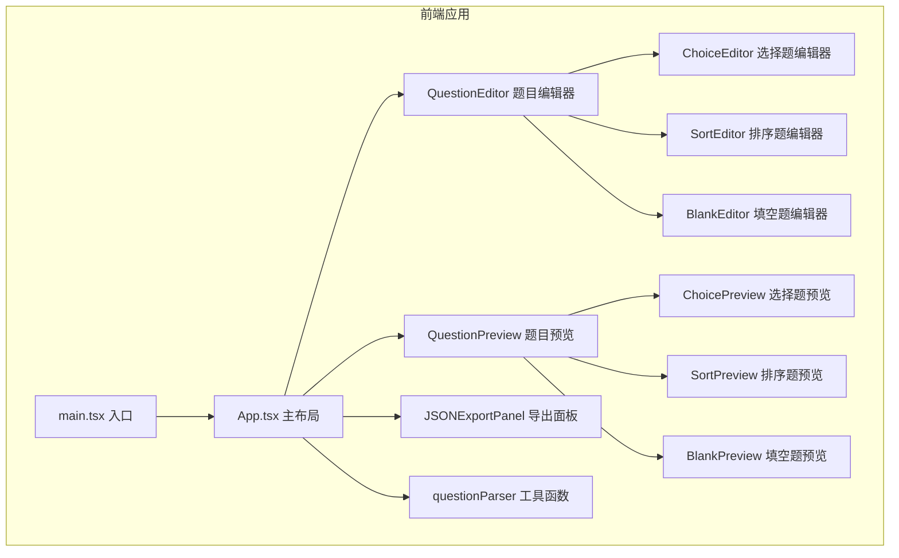

## 1. 架构设计



## 2. 技术描述

- 前端框架：React 18 + TypeScript
- 构建工具：Vite 5
- UI组件库：Ant Design 5
- 图标库：@ant-design/icons
- 状态管理：React useState / useCallback（轻量场景，无需额外状态管理库）
- 拖拽实现：原生HTML5拖拽API + react-beautiful-dnd风格实现
- 富文本：简易加粗/斜体标记解析
- HTTP客户端：axios（预留）
- 唯一ID生成：uuid

## 3. 目录结构

```
src/
├── main.tsx              # 应用入口
├── App.tsx               # 主布局组件
├── components/
│   ├── QuestionEditor.tsx   # 题目编辑器主组件
│   ├── QuestionPreview.tsx  # 题目预览主组件
│   ├── ChoiceEditor.tsx     # 选择题编辑器
│   ├── SortEditor.tsx       # 排序题编辑器
│   ├── BlankEditor.tsx      # 填空题编辑器
│   ├── ChoicePreview.tsx    # 选择题预览
│   ├── SortPreview.tsx      # 排序题预览
│   └── BlankPreview.tsx     # 填空题预览
├── utils/
│   └── questionParser.ts    # 题目解析与导出工具
├── types/
│   └── question.ts          # TypeScript类型定义
└── hooks/
    └── useDebounce.ts       # 防抖自定义Hook
```

## 4. 数据模型

### 4.1 题型枚举

```typescript
enum QuestionType {
  CHOICE = 'choice',
  SORT = 'sort',
  BLANK = 'blank'
}
```

### 4.2 选择题数据结构

```typescript
interface ChoiceQuestion {
  id: string;
  type: QuestionType.CHOICE;
  stem: string;           // 题干
  options: {
    id: string;
    label: string;        // A/B/C/D
    content: string;      // 选项内容，支持**加粗**和*斜体*
  }[];
  correctAnswers: string[]; // 正确答案的label数组
  isMultiple: boolean;    // 是否多选
}
```

### 4.3 拖拽排序题数据结构

```typescript
interface SortQuestion {
  id: string;
  type: QuestionType.SORT;
  stem: string;           // 题干
  items: {
    id: string;
    content: string;
  }[];
  correctOrder: string[]; // 正确排序的id数组
}
```

### 4.4 填空题数据结构

```typescript
interface BlankQuestion {
  id: string;
  type: QuestionType.BLANK;
  stem: string;           // 题干，含{{blank}}标记
  blanks: {
    id: string;
    correctAnswers: string[]; // 正确答案列表（含同义替换）
  }[];
}
```

### 4.5 统一题目类型

```typescript
type Question = ChoiceQuestion | SortQuestion | BlankQuestion;
```

## 5. 数据流向

1. **App.tsx** 作为状态容器，持有当前题目数据和字体大小状态
2. **QuestionEditor** 接收当前题目数据，通过 `onChange` 回调将编辑后的数据传回 App
3. **QuestionPreview** 接收 App 传入的题目数据（经防抖处理），渲染预览效果
4. **questionParser** 工具函数接收题目对象，进行校验后序列化为JSON字符串
5. **JSON导出面板** 展示序列化后的JSON，支持复制

## 6. 性能优化策略

- 使用 `useDebounce` 自定义Hook实现300ms防抖预览刷新
- 使用 `React.memo` 包裹预览组件避免不必要重渲染
- 拖拽排序使用CSS transform实现60fps动画
- JSON导出使用懒计算，仅在展开时序列化

## 7. 运行方式

```bash
npm install
npm run dev
```
