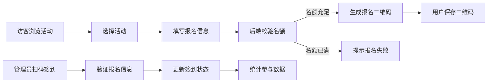

## 1. 产品概述

志愿者管理平台是为小型非营利组织设计的一站式管理系统，旨在解决传统电子表格管理效率低、易出错的问题。

- 主要用途：志愿者招募、活动报名、签到管理、参与统计
- 目标用户：非营利组织管理员、志愿者参与者
- 核心价值：提升管理效率，降低人工错误，提供数据洞察

## 2. 核心功能

### 2.1 用户角色

| 角色 | 注册方式 | 核心权限 |
|------|----------|----------|
| 管理员 | 系统内置 | 创建/编辑/删除活动、签到管理、查看统计 |
| 访客 | 无需注册 | 浏览活动、在线报名 |

### 2.2 功能模块

1. **活动列表页**：活动卡片展示、日期筛选、活动详情入口
2. **活动详情页**：活动信息展示、报名入口、签到入口、统计图表
3. **活动管理**：创建活动、编辑活动、删除活动、二维码生成
4. **报名系统**：报名表单、名额校验、报名二维码返回
5. **签到系统**：扫码签到、手动签到、签到状态更新
6. **统计系统**：签到率计算、柱状图展示

### 2.3 页面详情

| 页面名称 | 模块名称 | 功能描述 |
|----------|----------|----------|
| 活动列表页 | 活动卡片网格 | 展示活动标题、日期、地点、报名人数，支持悬停动画 |
| 活动列表页 | 日期筛选器 | 按日期范围筛选活动 |
| 活动详情页 | 活动信息展示 | 展示完整活动信息和二维码 |
| 活动详情页 | 报名表单 | 弹出模态框，收集姓名和邮箱 |
| 活动详情页 | 签到模块 | 扫码或手动输入邮箱签到 |
| 活动详情页 | 统计图表 | Canvas绘制签到率柱状图 |
| 活动管理页 | 活动表单 | 创建/编辑活动信息 |

## 3. 核心流程

### 用户报名流程

访客浏览活动列表 → 选择感兴趣的活动 → 点击报名 → 填写姓名和邮箱 → 后端校验名额 → 生成报名二维码 → 返回给用户保存

### 签到流程

管理员进入活动详情 → 点击签到 → 扫描用户二维码或输入邮箱 → 后端验证报名信息 → 更新签到状态和时间 → 显示签到结果

### 活动管理流程

管理员登录 → 创建活动 → 填写活动信息 → 后端生成活动二维码 → 发布活动 → 可编辑/删除活动 → 查看报名和签到统计

## 4. 用户界面设计

### 4.1 设计风格

- **主色调**：橙色 #FF6B35（温暖明快，传递活力）
- **背景色**：白色 #FFFFFF
- **辅助背景**：浅灰 #F5F5F5
- **成功色**：绿色 #4CAF50
- **错误色**：红色 #F44336
- **按钮样式**：圆角8px，橙色填充，按压反馈（scale 0.95）
- **字体**：无衬线字体，统一字体风格
- **布局**：卡片式网格布局，圆角阴影，悬停上浮效果
- **图标**：使用 lucide-react 图标库

### 4.2 页面设计概述

| 页面名称 | 模块名称 | UI元素 |
|----------|----------|--------|
| 活动列表页 | 活动卡片 | 橙色强调标题、日期标签、地点图标、报名进度条、悬停上浮动画（translateY -4px + 阴影加深） |
| 活动列表页 | 筛选栏 | 日期选择器、橙色边框、简洁布局 |
| 活动详情页 | 信息区域 | 大标题、详细描述、信息图标列表 |
| 活动详情页 | 报名按钮 | 橙色主按钮、固定底部、悬停效果 |
| 活动详情页 | 模态框 | 淡入淡出过渡、半透明遮罩、圆角表单 |
| 活动详情页 | 统计图表 | Canvas柱状图、橙色柱形、清晰标注 |
| 签到反馈 | 成功提示 | 绿色背景、打勾动画、平滑出现 |
| 签到反馈 | 失败提示 | 红色背景、抖动动画、错误信息 |

### 4.3 响应式设计

- **桌面端**：卡片网格布局（3列），模态框居中显示（宽度500px）
- **平板端**：卡片网格布局（2列）
- **手机端**：卡片单列布局，模态框全屏显示，表格支持水平滚动
- **触摸优化**：按钮最小高度48px，足够的点击区域

### 4.4 动画与交互

- **页面加载**：卡片依次淡入（animation-delay 阶梯式）
- **卡片悬停**：translateY -4px，阴影加深，过渡时间200ms
- **按钮按压**：scale 0.95，过渡时间100ms
- **模态框**：淡入（opacity 0→1）+ 轻微缩放（scale 0.95→1）
- **签到成功**：打勾图标动画（stroke-dashoffset）
- **签到失败**：左右抖动（translateX ±5px，3次循环）
- **底部版本号**：固定在页面底部，浅灰色小字
