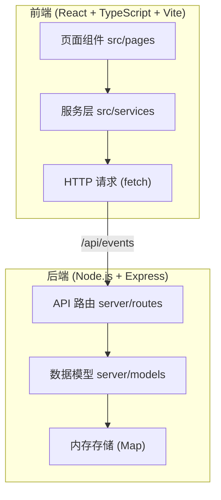
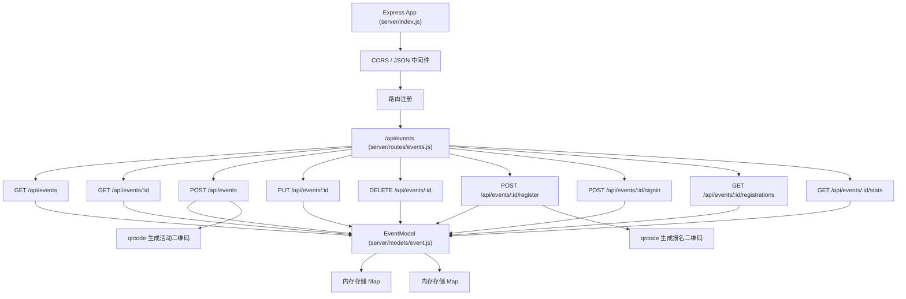
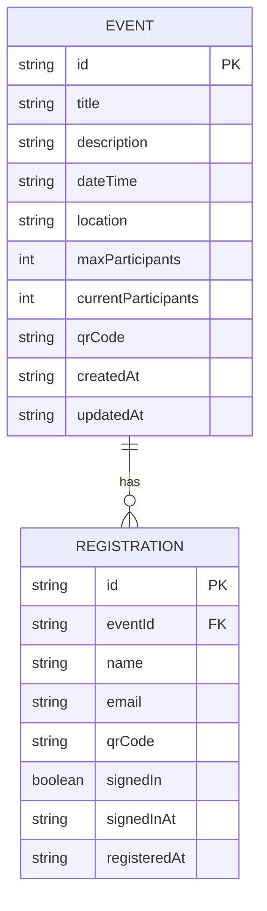

## 1. 架构设计



## 2. 技术描述

- **前端**：React 18 + TypeScript + Vite 5
- **后端**：Node.js + Express 4
- **状态管理**：React Hooks (useState, useEffect)
- **路由**：React Router DOM 6
- **二维码**：qrcode (Node.js端生成)
- **唯一ID**：uuid
- **HTTP客户端**：原生 fetch API
- **图表**：原生 Canvas 2D
- **图标**：lucide-react
- **构建工具**：Vite
- **开发代理**：Vite proxy 到后端 3001 端口

## 3. 目录结构

```
auto10/
├── src/                          # 前端代码
│   ├── pages/                    # 页面组件
│   │   ├── EventList.tsx         # 活动列表页
│   │   ├── EventDetail.tsx       # 活动详情页
│   │   └── EventManage.tsx       # 活动管理页
│   ├── components/               # 可复用组件
│   │   ├── EventCard.tsx         # 活动卡片
│   │   ├── Modal.tsx             # 模态框
│   │   ├── SignInForm.tsx        # 签到表单
│   │   ├── RegisterForm.tsx      # 报名表单
│   │   └── BarChart.tsx          # 柱状图组件
│   ├── services/                 # API服务层
│   │   └── api.ts                # API封装
│   ├── types/                    # TypeScript类型定义
│   │   └── index.ts              # 类型定义
│   ├── App.tsx                   # 主应用组件
│   ├── main.tsx                  # 入口文件
│   └── index.css                 # 全局样式
├── server/                       # 后端代码
│   ├── index.js                  # Express服务器入口
│   ├── routes/                   # API路由
│   │   └── events.js             # 活动相关路由
│   └── models/                   # 数据模型
│       └── event.js              # 活动内存模型
├── package.json                  # 项目依赖
├── vite.config.ts                # Vite配置
├── tsconfig.json                 # TypeScript配置
└── index.html                    # HTML入口
```

## 4. 路由定义

| 路由 | 页面 | 用途 |
|------|------|------|
| / | 活动列表页 | 展示所有活动，支持筛选 |
| /event/:id | 活动详情页 | 查看活动详情、报名、签到、统计 |
| /manage | 活动管理页 | 创建、编辑、删除活动 |
| /manage/edit/:id | 活动管理页 | 编辑指定活动 |

## 5. API 定义

### 5.1 TypeScript 类型定义

```typescript
interface Event {
  id: string;
  title: string;
  description: string;
  dateTime: string;
  location: string;
  maxParticipants: number;
  currentParticipants: number;
  qrCode: string;
  createdAt: string;
  updatedAt: string;
}

interface Registration {
  id: string;
  eventId: string;
  name: string;
  email: string;
  qrCode: string;
  signedIn: boolean;
  signedInAt: string | null;
  registeredAt: string;
}

interface ApiResponse<T> {
  success: boolean;
  data?: T;
  error?: string;
}
```

### 5.2 API 接口列表

| 方法 | 路径 | 描述 | 请求体 | 响应 |
|------|------|------|--------|------|
| GET | /api/events | 获取活动列表 | - | `Event[]` |
| GET | /api/events/:id | 获取活动详情 | - | `Event` |
| POST | /api/events | 创建活动 | `{ title, description, dateTime, location, maxParticipants }` | `Event` |
| PUT | /api/events/:id | 更新活动 | `{ title, description, dateTime, location, maxParticipants }` | `Event` |
| DELETE | /api/events/:id | 删除活动 | - | `{ success: true }` |
| POST | /api/events/:id/register | 活动报名 | `{ name, email }` | `{ registration, qrCode }` |
| POST | /api/events/:id/signin | 活动签到 | `{ email }` 或 `{ registrationId }` | `{ success: true, signedInAt }` |
| GET | /api/events/:id/registrations | 获取报名列表 | - | `Registration[]` |
| GET | /api/events/:id/stats | 获取活动统计 | - | `{ total, signedIn, rate }` |

## 6. 服务器架构



## 7. 数据模型

### 7.1 ER 图



### 7.2 内存存储结构

```javascript
// server/models/event.js
class EventModel {
  constructor() {
    this.events = new Map();      // eventId -> Event
    this.registrations = new Map(); // registrationId -> Registration
    this.eventRegistrations = new Map(); // eventId -> [registrationIds]
  }
}
```

## 8. 性能约束

- **首屏加载**：≤ 2秒（Vite 构建优化，代码分割）
- **列表渲染**：100条数据 FPS ≥ 55（虚拟滚动可选）
- **二维码生成**：≤ 500ms（qrcode 库优化）
- **签到响应**：≤ 300ms（内存操作，无数据库IO）
- **构建优化**：Vite HMR，按需加载，Tree Shaking

## 9. 开发脚本

| 命令 | 用途 |
|------|------|
| `npm run dev:client` | 启动前端开发服务器 (Vite, 端口 5173) |
| `npm run dev:server` | 启动后端开发服务器 (nodemon, 端口 3001) |
| `npm run build` | 构建生产版本 |
| `npm run type-check` | TypeScript 类型检查 |
