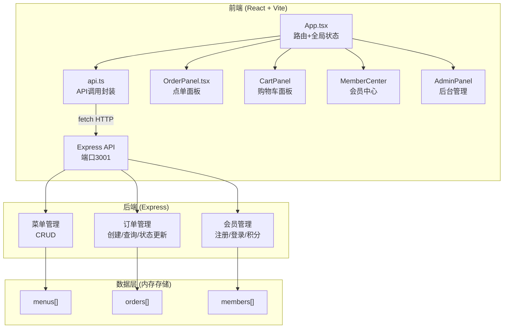
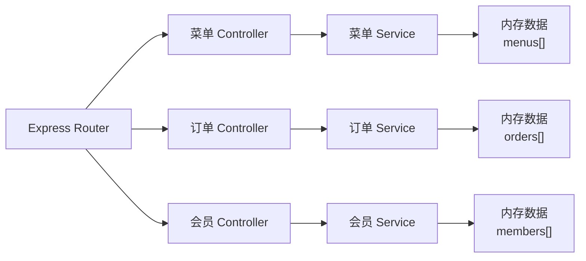
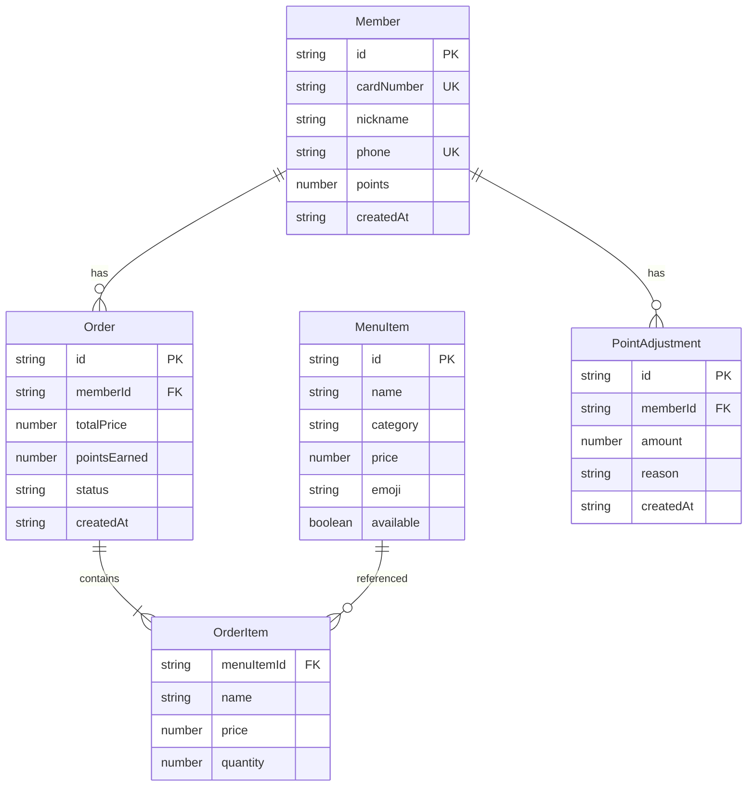

## 1. 架构设计



## 2. 技术说明

- **前端**：React@18 + TypeScript + Vite + TailwindCSS
- **初始化工具**：vite-init (react-express-ts 模板)
- **后端**：Express@4 + TypeScript (ESM格式)
- **数据库**：内存存储（数组对象），适合小型咖啡馆轻量场景
- **状态管理**：zustand
- **路由**：react-router-dom
- **图标**：lucide-react
- **跨域**：cors

## 3. 路由定义

| 路由 | 用途 |
|------|------|
| `/` | 首页（点单页），展示菜单分类和商品列表 |
| `/login` | 会员登录/注册页面 |
| `/member` | 会员中心，显示积分和消费记录 |
| `/admin` | 店主后台管理页面 |

## 4. API 定义

### 4.1 菜单 API

| 方法 | 路径 | 描述 | 请求体 | 响应 |
|------|------|------|--------|------|
| GET | `/api/menu` | 获取所有菜单商品 | - | `MenuItem[]` |
| POST | `/api/menu` | 新增商品 | `Omit<MenuItem, 'id'>` | `MenuItem` |
| PUT | `/api/menu/:id` | 编辑商品 | `Partial<MenuItem>` | `MenuItem` |
| DELETE | `/api/menu/:id` | 下架商品 | - | `{ success: boolean }` |

### 4.2 订单 API

| 方法 | 路径 | 描述 | 请求体 | 响应 |
|------|------|------|--------|------|
| POST | `/api/orders` | 创建订单 | `{ memberId, items[], totalPrice }` | `Order & { pointsEarned }` |
| GET | `/api/orders` | 获取订单列表 | query: `?status=making\|completed` | `Order[]` |
| PUT | `/api/orders/:id/status` | 更新订单状态 | `{ status }` | `Order` |

### 4.3 会员 API

| 方法 | 路径 | 描述 | 请求体 | 响应 |
|------|------|------|--------|------|
| POST | `/api/members/register` | 会员注册 | `{ nickname, phone }` | `Member` |
| POST | `/api/members/login` | 会员登录 | `{ phone }` | `Member` |
| GET | `/api/members/:id` | 获取会员信息 | - | `Member & { orders: Order[] }` |
| PUT | `/api/members/:id/points` | 调整积分 | `{ amount, reason }` | `Member` |

### 4.4 类型定义

```typescript
interface MenuItem {
  id: string;
  name: string;
  category: 'drink' | 'dessert' | 'light_meal';
  price: number;
  emoji: string;
  available: boolean;
}

interface OrderItem {
  menuItemId: string;
  name: string;
  price: number;
  quantity: number;
}

interface Order {
  id: string;
  memberId: string;
  items: OrderItem[];
  totalPrice: number;
  pointsEarned: number;
  status: 'making' | 'completed';
  createdAt: string;
}

interface Member {
  id: string;
  cardNumber: string;
  nickname: string;
  phone: string;
  points: number;
  createdAt: string;
}

interface PointAdjustment {
  id: string;
  memberId: string;
  amount: number;
  reason: string;
  createdAt: string;
}
```

## 5. 服务器架构图



## 6. 数据模型

### 6.1 数据模型定义



### 6.2 初始数据

菜单初始数据包含3个分类各3-4个商品：

**饮品**：☕️美式咖啡(18)、🧋拿铁(22)、🍵抹茶拿铁(25)、🥤冰摩卡(24)
**甜品**：🍰提拉米苏(28)、🧁芝士蛋糕(26)、🍪曲奇饼干(12)
**轻食**：🥐牛角包(15)、🥗凯撒沙拉(32)、🥪三明治(22)
