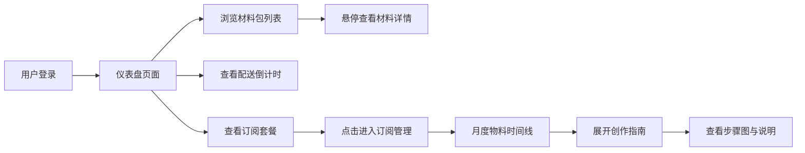

## 1. 产品概述

手工艺人作品订阅与材料包管理平台，为手工爱好者提供按月订阅艺术家材料包套装的服务，用户可在线查看创作指南、确认收货，享受沉浸式手工创作体验。

- 目标用户：手工爱好者、DIY 创作者、手工艺学习者
- 产品价值：降低手工创作门槛，提供 curated 材料包与专业指南，提升创作效率与成就感

## 2. 核心功能

### 2.1 用户角色

| 角色 | 注册方式 | 核心权限 |
|------|----------|----------|
| 普通用户 | 模拟登录（邮箱/用户名） | 浏览订阅计划、查看材料包、管理订阅、查看创作指南 |

### 2.2 功能模块

1. **仪表盘页面**：订阅套餐卡片、配送倒计时、材料包库存列表
2. **订阅管理页面**：月度物料时间线、创作指南预览、订阅状态管理
3. **顶部导航栏**：品牌 Logo、用户状态、毛玻璃效果

### 2.3 页面详情

| 页面名称 | 模块名称 | 功能描述 |
|----------|----------|----------|
| 仪表盘 | 订阅套餐卡片 | 展示基础版（浅绿渐变）和高级版（金色渐变），点击进入订阅管理页 |
| 仪表盘 | 配送倒计时 | 实时更新天数/小时/分钟，3D 数字翻转动画 0.3 秒 |
| 仪表盘 | 材料包库存列表 | 网格布局，小正方形图片，模糊渐入加载，悬停弹出详情窗 |
| 订阅管理 | 月度物料时间线 | 纵向时间线，日期圆点（已订阅亮彩渐变，未订阅灰色） |
| 订阅管理 | 创作指南预览 | 点击展开后 PDF 缩略图弹性展开至 240px，动画 0.5 秒 |
| 通用 | 顶部导航 | 半透明毛玻璃效果，品牌 Logo，用户登录状态 |
| 通用 | 交互反馈 | 卡片悬停上浮 4px，点击心形扩散涟漪 0.4 秒 |

## 3. 核心流程

用户进入平台 → 登录/浏览仪表盘 → 查看当前订阅套餐与配送状态 → 浏览材料包库存 → 点击套餐进入订阅管理页 → 查看月度物料时间线 → 展开创作指南学习 → 确认收货

## 4. 用户界面设计

### 4.1 设计风格

- **主色调**：浅木色（#E8DCC4）与奶油白（#FFF8EE）为主，搭配手工质感底纹
- **强调色**：基础版薄荷绿（#A8E6CF），高级版香槟金（#D4AF37 / #F4D03F）
- **文字色**：深棕色（#5C4033），暖灰色（#8B7355）
- **卡片风格**：微圆角（12-16px），柔和阴影，悬停轻微上浮
- **字体**：标题使用衬线体（Playfair Display），正文使用圆润无衬线（Nunito / Quicksand）
- **动效风格**：缓进缓出（ease-in-out），弹性动效（cubic-bezier），细腻流畅

### 4.2 页面设计概览

| 页面名称 | 模块名称 | UI 元素 |
|----------|----------|---------|
| 仪表盘 | 顶部导航 | 毛玻璃半透明、品牌 Logo、用户头像 |
| 仪表盘 | 套餐卡片 | 渐变背景、微圆角、悬停上浮 4px / 0.2s |
| 仪表盘 | 倒计时 | 3D 翻转数字、0.3s 动画、实时更新 |
| 仪表盘 | 材料网格 | 方形图片、模糊渐入、悬停详情弹窗 0.2s 淡入 |
| 订阅管理 | 时间线 | 纵向排列、日期圆点、渐变状态标识 |
| 订阅管理 | 指南展开 | 0 → 240px 弹性展开、0.5s 动画、步骤图+文字 |
| 全局 | 点击反馈 | 心形扩散涟漪、从点击点向外扩散 0.4s 淡出 |

### 4.3 响应式

桌面端优先，适配平板与移动端，材料网格自适应列数，时间线在移动端保持纵向布局。

### 4.4 性能要求

- 首屏渲染 3 秒内完成
- 时间线滚动流畅，FPS ≥ 30
- 图片懒加载与模糊占位
- CSS 动画优先使用 transform 和 opacity 以保证 GPU 加速
