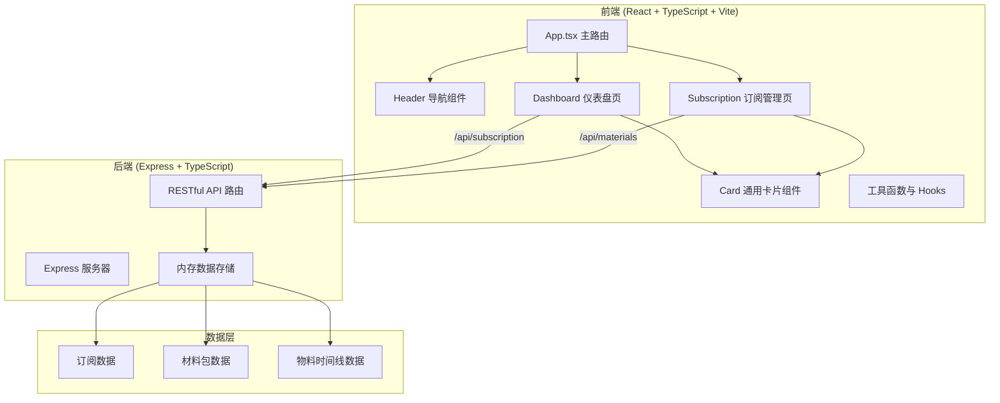
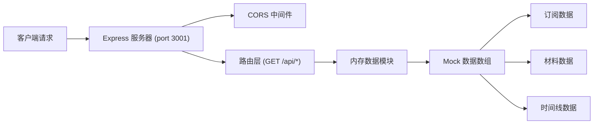
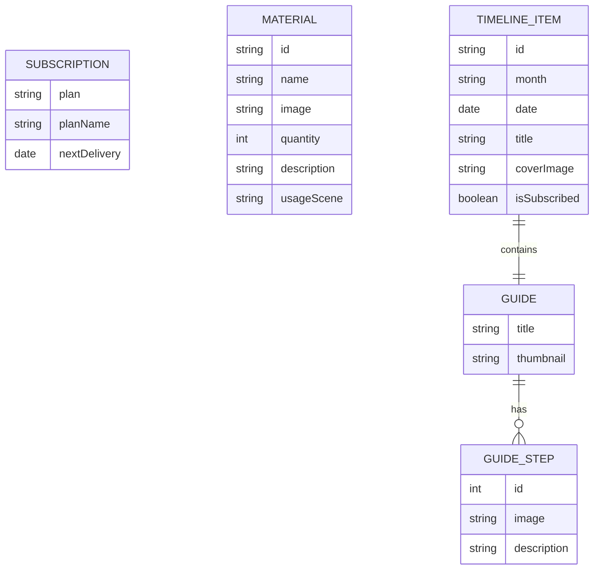

## 1. 架构设计



## 2. 技术说明

- **前端**：React 18 + TypeScript + Vite
- **状态管理**：React useState/useEffect（轻量场景，无需额外状态库）
- **样式方案**：CSS Modules 或全局 CSS + CSS 变量（根据项目规模选择）
- **后端**：Express 4 + TypeScript
- **数据存储**：内存数组（无需数据库）
- **开发工具**：Vite 代理 /api 到后端端口

## 3. 路由定义

| 路由 | 用途 |
|------|------|
| / | 仪表盘页面（Dashboard） |
| /subscription | 订阅管理页面（Subscription） |

## 4. API 定义

### 4.1 GET /api/subscription

获取当前用户订阅信息与材料包列表。

**响应：**
```typescript
interface SubscriptionResponse {
  plan: 'basic' | 'premium';
  planName: string;
  nextDelivery: string; // ISO date string
  materials: Material[];
}

interface Material {
  id: string;
  name: string;
  image: string;
  quantity: number;
  description: string;
  usageScene: string;
}
```

### 4.2 GET /api/materials

获取月度物料时间线数据。

**响应：**
```typescript
interface MaterialsTimelineResponse {
  items: TimelineItem[];
}

interface TimelineItem {
  id: string;
  month: string;
  date: string;
  title: string;
  coverImage: string;
  isSubscribed: boolean;
  guide: Guide;
}

interface Guide {
  title: string;
  thumbnail: string;
  steps: GuideStep[];
}

interface GuideStep {
  id: number;
  image: string;
  description: string;
}
```

## 5. 服务器架构图



## 6. 数据模型

### 6.1 数据模型定义



### 6.2 初始数据

- 订阅数据：默认高级版套餐，下次配送日期为未来 15 天
- 材料数据：8-12 种手工材料（布料、线团、工具、饰品配件等）
- 时间线数据：6 个月的月度物料，包含已订阅和未订阅状态
