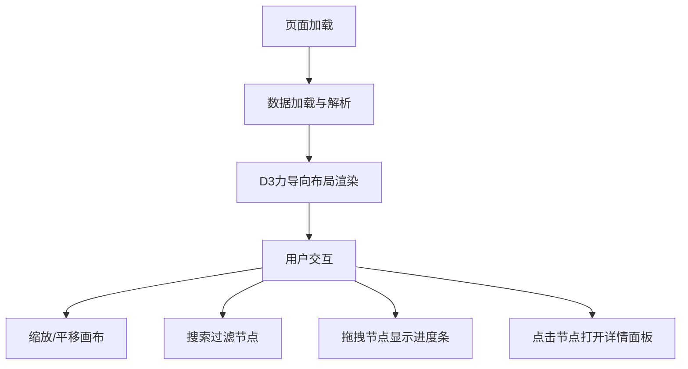

## 1. 产品概述

交互式知识图谱思维导图应用，将复杂知识图谱以可交互的思维导图形式呈现给学习者，解决传统线性笔记难以展示知识点之间多维关联和层级关系的问题。

- **目标用户**：学生、知识工作者、自学者
- **核心价值**：通过可视化的知识图谱帮助用户理解知识点之间的关联，提升学习效率

## 2. 核心功能

### 2.1 功能模块

1. **知识图谱渲染模块**：力导向布局的交互式思维导图，节点大小随关联度动态变化，节点按类型自动着色，连线上显示关系标签
2. **节点交互与详情面板**：拖拽节点时显示掌握度环形进度条，点击节点滑出详情面板，包含描述、练习链接和D3雷达图
3. **搜索与高亮过滤**：顶部搜索栏，支持模糊匹配和下拉建议，匹配节点脉动高亮，不匹配节点变暗
4. **视图缩放与平移控制**：鼠标滚轮缩放、中键拖拽平移，文字标签自适应大小

### 2.2 页面详情

| 页面名称 | 模块名称 | 功能描述 |
|-----------|-------------|---------------------|
| 主页面 | 知识图谱画布 | 力导向布局渲染节点和边，支持拖拽、缩放、平移交互 |
| 主页面 | 顶部搜索栏 | 磨砂玻璃效果搜索框，模糊匹配，下拉建议列表 |
| 主页面 | 详情面板 | 右侧滑出，节点描述、练习链接、五维雷达图 |

## 3. 核心流程

用户加载页面 → 知识图谱数据加载并渲染为SVG → 用户可缩放/平移画布 → 用户搜索关键词过滤节点 → 用户拖拽节点查看掌握度 → 用户点击节点查看详情面板

## 4. 用户界面设计

### 4.1 设计风格

- **主色调**：深蓝灰渐变背景（#1a1a2e到#16213e）
- **节点颜色标签**：
  - 概念：蓝色系
  - 原理：绿色系
  - 案例：橙色系
  - 练习：紫色系
- **搜索栏**：磨砂玻璃效果（backdrop-filter: blur(10px)），圆角12px
- **详情面板**：深灰色半透明背景（rgba(30,30,50,0.9)），卡片式分组
- **字体**：现代无衬线字体，支持中文显示
- **动效**：所有过渡动画流畅，50fps+，响应延迟<50ms

### 4.2 页面设计概览

| 页面名称 | 模块名称 | UI元素 |
|-----------|-------------|-------------|
| 主页面 | 知识图谱画布 | SVG画布、发光节点、带标签连线、缩放平移 |
| 主页面 | 顶部搜索栏 | 搜索图标、输入框、下拉建议列表、高亮动画 |
| 主页面 | 详情面板 | 关闭按钮（旋转动画）、节点标题、描述卡片、练习链接、雷达图 |

### 4.3 响应式设计

- 桌面端优先设计，详情面板固定宽度360px
- 画布自适应窗口大小，支持全屏显示
