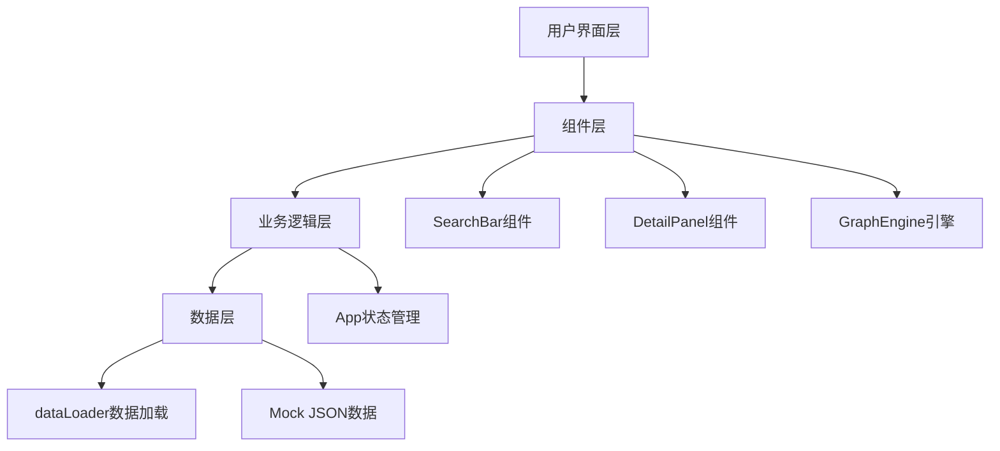
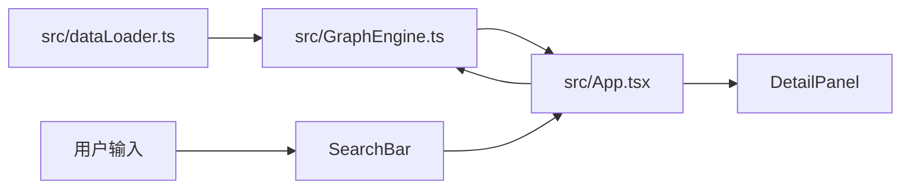
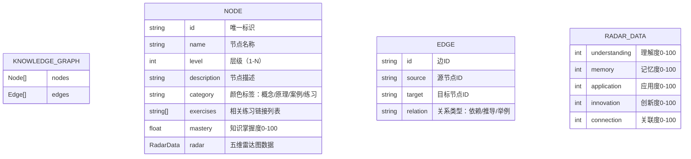

## 1. 架构设计



## 2. 技术说明

- **前端框架**：React@18 + TypeScript
- **构建工具**：Vite@5
- **图形渲染**：D3.js@7（力导向布局）
- **状态管理**：React useState/useRef（轻量级应用）
- **唯一ID**：uuid
- **后端**：无，使用Mock数据模拟API调用

## 3. 文件结构

| 文件路径 | 用途 |
|-------|------|
| `package.json` | 项目依赖和脚本配置 |
| `vite.config.ts` | Vite构建配置 |
| `tsconfig.json` | TypeScript严格模式配置 |
| `index.html` | 入口HTML页面 |
| `src/main.tsx` | React应用入口 |
| `src/App.tsx` | 主应用组件，状态管理中心 |
| `src/dataLoader.ts` | 加载和解析JSON知识图谱数据 |
| `src/GraphEngine.ts` | D3.js力导向布局计算与渲染 |
| `src/components/SearchBar.tsx` | 搜索过滤组件 |
| `src/components/DetailPanel.tsx` | 节点详情面板组件 |
| `src/types.ts` | 全局类型定义 |
| `src/data/knowledgeGraph.json` | Mock知识图谱数据 |

## 4. 数据流



数据流向说明：
1. `dataLoader.ts` 加载并标准化知识图谱数据
2. `GraphEngine.ts` 接收标准化数据，通过D3力导向布局计算并渲染SVG
3. `App.tsx` 作为状态中心，管理选中节点、搜索关键词、过滤状态
4. 用户搜索输入 → `SearchBar` → `App` 筛选数据 → `GraphEngine` 重新渲染
5. 用户点击节点 → `App` 更新选中节点 → `DetailPanel` 渲染详情

## 5. 数据模型

### 5.1 数据模型定义



### 5.2 类型定义

```typescript
type NodeCategory = 'concept' | 'principle' | 'case' | 'exercise';
type RelationType = 'depend' | 'derive' | 'example';

interface RadarData {
  understanding: number;
  memory: number;
  application: number;
  innovation: number;
  connection: number;
}

interface GraphNode {
  id: string;
  name: string;
  level: number;
  description: string;
  category: NodeCategory;
  exercises: string[];
  mastery: number;
  radar: RadarData;
  degree?: number;
  x?: number;
  y?: number;
  fx?: number | null;
  fy?: number | null;
}

interface GraphEdge {
  id: string;
  source: string;
  target: string;
  relation: RelationType;
}

interface KnowledgeGraph {
  nodes: GraphNode[];
  edges: GraphEdge[];
}
```
