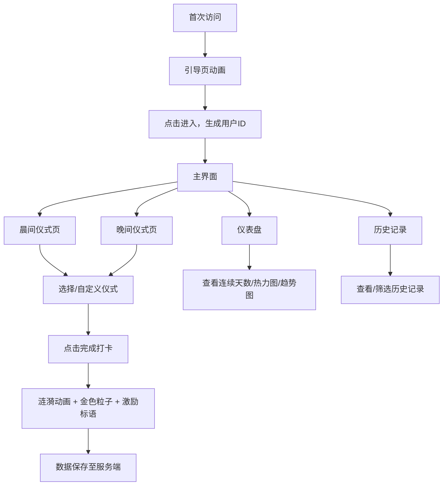

## 1. 产品概述

每日仪式感打卡系统是一款帮助用户建立和追踪晨间与晚间微小习惯的应用。通过仪式化的视觉反馈和连续打卡激励，将日常微小的正念行为转化为具有美感的个人仪式，让每一天的开始和结束都充满意义感。

- 目标用户：希望建立健康作息习惯、追求生活仪式感的都市人群
- 核心价值：用美学化的打卡体验降低习惯养成的心理门槛，通过连续打卡激励和可视化数据提升用户坚持的动力

## 2. 核心功能

### 2.1 用户角色

| 角色 | 注册方式 | 核心权限 |
|------|----------|----------|
| 普通用户 | 首次访问自动生成ID | 查看仪式模板、打卡、查看仪表盘与历史记录 |

### 2.2 功能模块

1. **引导页**：全屏渐变动画引导，生成用户身份
2. **晨间仪式页**：选择晨间仪式模板，完成打卡
3. **晚间仪式页**：选择晚间仪式模板，完成打卡
4. **仪表盘页**：展示连续打卡天数、月度热力图、趋势折线图
5. **历史记录页**：查看打卡历史列表，支持按月筛选

### 2.3 页面详情

| 页面名称 | 模块名称 | 功能描述 |
|----------|----------|----------|
| 引导页 | 沙漏动画 | 全屏渐变背景，沙漏图标缩放旋转动画，文字逐字显示，点击进入主系统 |
| 晨间仪式页 | 仪式选择 | 4个预设仪式圆形图标展示，选中放大+光晕动画，自定义仪式输入 |
| 晨间仪式页 | 打卡表单 | 水波涟漪按钮效果，金色粒子飘落，随机激励标语淡入 |
| 晚间仪式页 | 仪式选择 | 与晨间类似但视觉风格为深蓝靛紫渐变 |
| 晚间仪式页 | 打卡表单 | 同晨间打卡交互 |
| 仪表盘 | 连续打卡 | 大号数字展示连续天数，翻转动画切换 |
| 仪表盘 | 月度热力图 | 日历小圆点，金色渐变=已打卡，深灰=未打卡，当日脉动光晕 |
| 仪表盘 | 趋势折线图 | Canvas绘制本周打卡趋势，悬停提示 |
| 历史记录 | 记录列表 | 日期、仪式名称、打卡时间，滑入动画，按月筛选 |
| 导航栏 | 顶部导航 | 毛玻璃效果，三个导航链接，当前页金色下划线展开动画，移动端汉堡菜单 |

## 3. 核心流程

用户首次访问系统时进入引导页，观看动画后点击进入，系统生成随机用户ID存储至localStorage。之后用户可在晨间和晚间仪式页选择预设或自定义仪式并完成打卡，打卡成功后获得粒子动画和激励标语反馈。用户可随时在仪表盘查看连续打卡天数、月度热力图和趋势图，也可在历史记录页查看和筛选打卡记录。

## 4. 用户界面设计

### 4.1 设计风格

- 主色调：深色背景 `#1a1a2e`，辅以金色强调色 `#f2a900`
- 晨间渐变：淡紫到浅蓝日出渐变
- 晚间渐变：深蓝到靛紫日落渐变
- 按钮：金色填充，圆角8px，水波涟漪效果
- 字体：系统默认无衬线字体，激励标语使用衬线字体
- 布局：卡片式布局，固定顶部导航栏
- 图标：圆形图标展示，选中时放大1.1倍+光晕
- 阴影：柔和多层阴影
- 圆角：统一8px

### 4.2 页面设计概览

| 页面名称 | 模块名称 | UI元素 |
|----------|----------|--------|
| 引导页 | 全屏动画 | 深色渐变背景，沙漏图标缩放旋转0.8s缓出，文字逐字显示，点击区域 |
| 晨间仪式页 | 仪式网格 | 日出渐变背景，4个圆形图标2x2网格，选中态放大+光晕0.3s，自定义按钮 |
| 晚间仪式页 | 仪式网格 | 日落渐变背景，4个圆形图标2x2网格，选中态放大+光晕0.3s，自定义按钮 |
| 打卡表单 | 完成按钮 | 金色按钮涟漪0.4s，3-5片金色粒子飘落0.8s，衬线字体激励标语淡入0.5s |
| 仪表盘 | 数据卡片 | 连续天数大号数字翻转0.3s，月度热力图小圆点网格，Canvas趋势折线图 |
| 历史记录 | 记录列表 | 列表行滑入0.3s，月份筛选下拉，日期/仪式/时间三列 |
| 导航栏 | 顶部固定 | 毛玻璃60px高，三链接，当前页金色下划线展开0.3s，移动端汉堡菜单 |

### 4.3 响应式设计

- 桌面优先设计，最小宽度320px适配
- <768px：导航栏变为汉堡菜单（左侧抽屉0.3s滑出），卡片网格变单列
- 触摸优化：按钮和图标区域最小44x44px触摸目标

### 4.4 页面转场

- 所有页面切换使用从右侧滑入动画（0.4s缓动）
- 帧率要求不低于50fps
