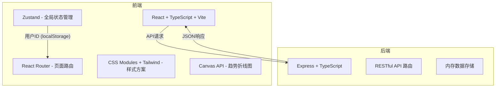
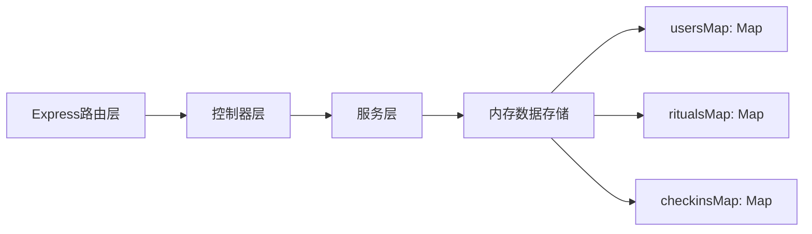
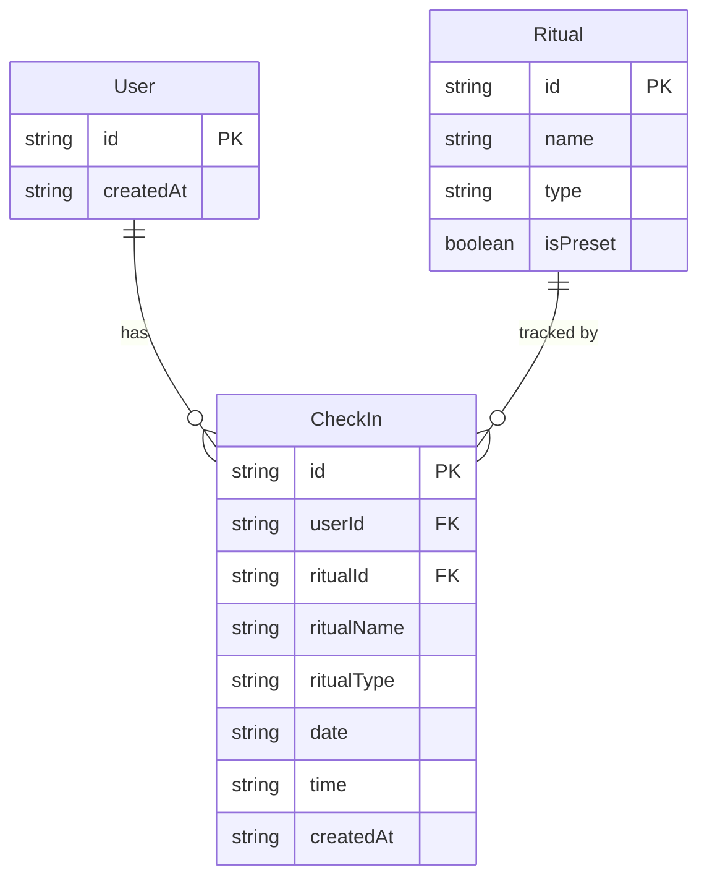

## 1. 架构设计



## 2. 技术说明

- 前端：React@18 + TypeScript + Vite + Tailwind CSS + Zustand
- 初始化工具：vite-init (react-express-ts 模板)
- 后端：Express@4 + TypeScript (ESM格式)
- 数据库：内存存储（Map结构）
- 图标库：lucide-react
- 路由：react-router-dom

## 3. 路由定义

| 路由 | 用途 |
|------|------|
| `/` | 引导页（首次访问） |
| `/morning` | 晨间仪式页 |
| `/evening` | 晚间仪式页 |
| `/dashboard` | 仪表盘页 |
| `/history` | 历史记录页 |

## 4. API定义

### 4.1 TypeScript 类型定义

```typescript
interface Ritual {
  id: string;
  name: string;
  type: 'morning' | 'evening';
  isPreset: boolean;
}

interface CheckIn {
  id: string;
  userId: string;
  ritualId: string;
  ritualName: string;
  ritualType: 'morning' | 'evening';
  date: string;       // YYYY-MM-DD
  time: string;       // HH:mm:ss
  createdAt: string;  // ISO timestamp
}

interface User {
  id: string;
  createdAt: string;
}

interface StreakInfo {
  currentStreak: number;
  longestStreak: number;
}
```

### 4.2 API端点

| 方法 | 路径 | 请求体 | 响应 | 用途 |
|------|------|--------|------|------|
| POST | `/api/users` | - | `{ user }` | 创建用户 |
| GET | `/api/users/:userId` | - | `{ user }` | 获取用户信息 |
| GET | `/api/rituals/:type` | - | `{ rituals }` | 获取仪式模板 |
| POST | `/api/rituals` | `{ name, type }` | `{ ritual }` | 创建自定义仪式 |
| POST | `/api/checkins` | `{ userId, ritualId, ritualName, ritualType }` | `{ checkIn }` | 打卡 |
| GET | `/api/checkins/:userId` | - | `{ checkins }` | 获取用户打卡记录 |
| GET | `/api/checkins/:userId/streak` | - | `{ streakInfo }` | 获取连续打卡信息 |
| GET | `/api/checkins/:userId/calendar/:year/:month` | - | `{ calendar }` | 获取月度日历数据 |
| DELETE | `/api/checkins/:id` | - | `{ success }` | 删除打卡记录 |

## 5. 服务端架构图



## 6. 数据模型

### 6.1 数据模型定义



### 6.2 初始数据

预设晨间仪式：
- 冥想5分钟
- 喝一杯温水
- 晨间日记
- 感恩练习

预设晚间仪式：
- 冥想5分钟
- 写感恩日记
- 回顾今日
- 读书15分钟

激励标语（10条）：
1. 每一个微小的坚持，都是对自己的温柔承诺。
2. 仪式感让平凡的日子闪闪发光。
3. 今天的你，又比昨天更靠近理想的自己。
4. 微小习惯的力量，远超你的想象。
5. 每一次打卡，都是与更好自己的相遇。
6. 坚持不需要完美，只需要真心。
7. 你值得为每一天赋予特别的意义。
8. 从一个小仪式开始，改变整个生活。
9. 此刻的你，正在创造未来的自己。
10. 把日常变成仪式，把生活变成艺术。
