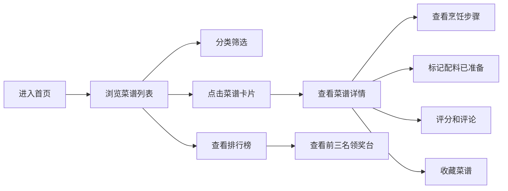

## 1. 产品概述

家庭共享菜谱管理器是一款面向家庭用户的在线菜谱共享平台，让家人们可以一起创建、编辑和管理家庭菜谱库，分享各自的拿手菜，通过评分和评论互动，生成家庭厨神排行榜。

- 核心价值：增强家庭情感联结，传承家庭美食文化，提供有趣的互动体验
- 目标用户：家庭成员，涵盖各年龄段用户

## 2. 核心功能

### 2.1 用户角色

| 角色 | 说明 | 核心权限 |
|------|------|----------|
| 家庭成员 | 所有注册用户 | 添加菜谱、评分评论、收藏菜谱、查看排行榜 |

### 2.2 功能模块

1. **首页（菜谱列表）**：菜谱卡片展示、分类筛选、懒加载
2. **菜谱详情页**：步骤分步展示、配料管理、评分系统、评论区
3. **排行榜页面**：领奖台布局、综合评分排名、动态粒子背景
4. **个人收藏夹**：用户收藏的菜谱列表

### 2.3 页面详情

| 页面名称 | 模块名称 | 功能描述 |
|-----------|-------------|---------------------|
| 首页 | 菜谱列表 | 网格布局展示菜谱卡片，支持分类筛选，懒加载优化性能 |
| 首页 | 导航栏 | 半透明毛玻璃效果，包含首页、排行榜、个人中心入口 |
| 菜谱详情页 | 步骤展示 | 分步展开，淡入淡出过渡动画 |
| 菜谱详情页 | 配料清单 | 点击标记已准备，小圆点变色+脉冲动画 |
| 菜谱详情页 | 评分评论 | 星级评分，评论输入（空提交抖动提示），评论列表倒序排列 |
| 排行榜页 | 领奖台布局 | 前三名卡片位置错落，第一名居中最高，平滑过渡动画 |
| 排行榜页 | 粒子背景 | 微弱金色动态粒子效果，营造氛围 |
| 菜谱卡片组件 | 悬停动画 | 渐变淡入加载，悬停上浮动+阴影加深 |

## 3. 核心流程

### 3.1 主要用户流程

用户打开应用 → 浏览首页菜谱列表 → 点击菜谱查看详情 → 查看步骤/配料 → 评分评论 → 收藏菜谱 → 查看排行榜

## 4. 用户界面设计

### 4.1 设计风格

- **主色调**：暖色调，象牙白（#FFF8F0）+ 浅棕色（#D4A574）
- **强调色**：番茄红（#E74C3C）+ 橄榄绿（#6B8E23）
- **按钮风格**：圆角设计，柔和阴影，悬停微动画
- **字体**：温馨优雅的衬线字体搭配现代无衬线字体
- **布局风格**：卡片式布局，圆角设计，柔和阴影
- **整体氛围**：温馨、家庭感、食欲感

### 4.2 页面设计概述

| 页面名称 | 模块名称 | UI元素 |
|-----------|-------------|-------------|
| 首页 | 菜谱卡片网格 | 圆角卡片、悬停上浮、淡入加载、标签展示 |
| 菜谱详情页 | 步骤区域 | 分步切换、淡入淡出、进度指示 |
| 菜谱详情页 | 配料清单 | 可点击项、状态圆点、脉冲动画 |
| 排行榜页 | 领奖台 | 错落布局、排名标识、平滑过渡 |
| 排行榜页 | 粒子背景 | 金色粒子、缓慢飘动、微弱发光 |

### 4.3 响应式

- 桌面端：多列网格布局
- 平板端：两列布局
- 移动端：单列布局，触摸优化
- 导航栏在移动端转为汉堡菜单

### 4.4 动效设计

- 页面加载：元素渐次出现
- 卡片悬停：上移+阴影加深
- 步骤切换：淡出淡入
- 配料标记：脉冲动画
- 评论空提交：左右抖动
- 排行榜刷新：平滑移动过渡
