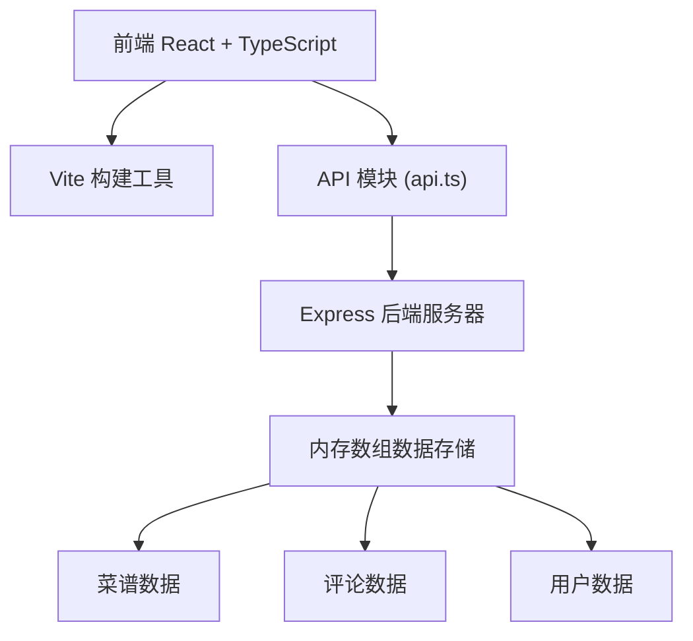
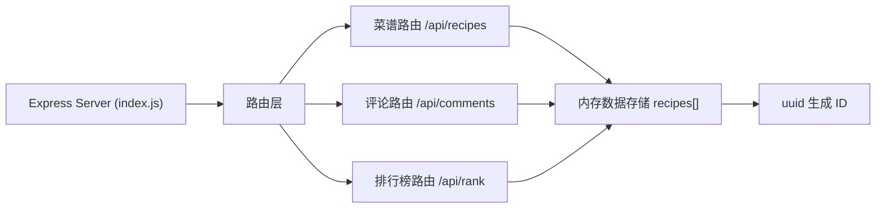
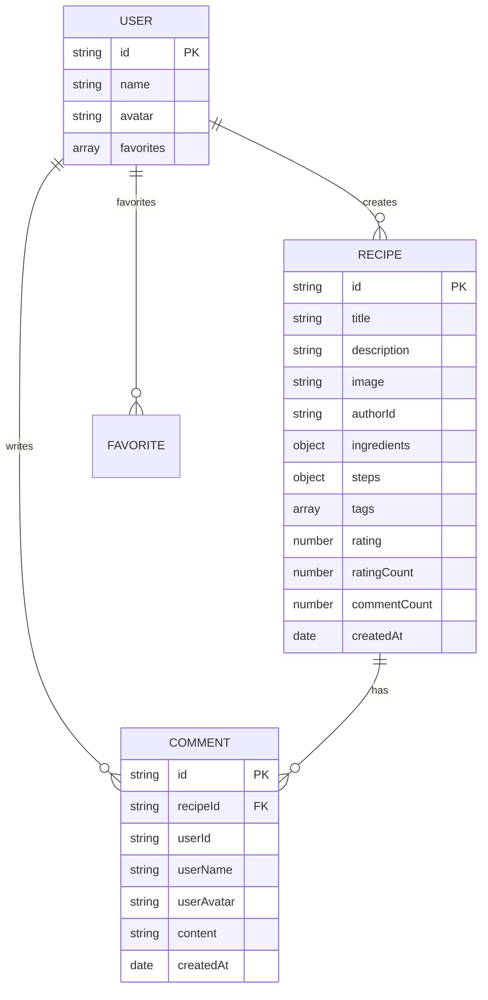

## 1. 架构设计



## 2. 技术描述

- **前端**：React 18 + TypeScript + Vite
- **样式**：CSS Modules / 内联样式（CSS动画）
- **后端**：Node.js + Express 4
- **数据存储**：内存数组模拟（uuid生成ID）
- **跨域**：cors 中间件
- **路由**：React Router（或简单的状态路由）

## 3. 路由定义

| 路由 | 页面 | 用途 |
|-------|------|------|
| / | HomePage | 菜谱列表首页，分类筛选，懒加载 |
| /recipe/:id | RecipePage | 菜谱详情页，步骤、配料、评分、评论 |
| /rank | RankPage | 排行榜页面，领奖台布局 |
| /favorites | （可选） | 个人收藏夹 |

## 4. API 定义

### 4.1 菜谱相关

| 方法 | 路径 | 说明 | 请求体 | 响应 |
|------|------|------|--------|------|
| GET | /api/recipes | 获取菜谱列表（支持分类筛选） | query: category, page, limit | { recipes: Recipe[], total: number } |
| GET | /api/recipes/:id | 获取单个菜谱详情 | - | Recipe |
| POST | /api/recipes | 新增菜谱 | { title, description, ingredients, steps, tags, author, image } | Recipe |
| PUT | /api/recipes/:id/rate | 给菜谱评分 | { rating, userId } | { rating: number, ratingCount: number } |

### 4.2 评论相关

| 方法 | 路径 | 说明 | 请求体 | 响应 |
|------|------|------|--------|------|
| GET | /api/recipes/:id/comments | 获取菜谱评论 | - | Comment[] |
| POST | /api/recipes/:id/comments | 添加评论 | { userId, userName, userAvatar, content } | Comment |

### 4.3 排行榜

| 方法 | 路径 | 说明 | 请求体 | 响应 |
|------|------|------|--------|------|
| GET | /api/rank | 获取排行榜 | query: limit | Recipe[] |

### 4.4 TypeScript 类型定义

```typescript
interface Recipe {
  id: string;
  title: string;
  description: string;
  image: string;
  author: {
    id: string;
    name: string;
    avatar: string;
  };
  ingredients: { name: string; amount: string; prepared: boolean }[];
  steps: { step: number; content: string }[];
  tags: string[];
  rating: number;
  ratingCount: number;
  commentCount: number;
  createdAt: string;
}

interface Comment {
  id: string;
  recipeId: string;
  userId: string;
  userName: string;
  userAvatar: string;
  content: string;
  createdAt: string;
}

interface User {
  id: string;
  name: string;
  avatar: string;
  favorites: string[];
}
```

## 5. 服务器架构图



## 6. 数据模型

### 6.1 数据模型定义



### 6.2 初始数据

- 预置5-8个示例菜谱，包含不同分类（川菜、快手菜、甜品等）
- 预置3-5个家庭用户
- 每个菜谱预置若干评论和评分
