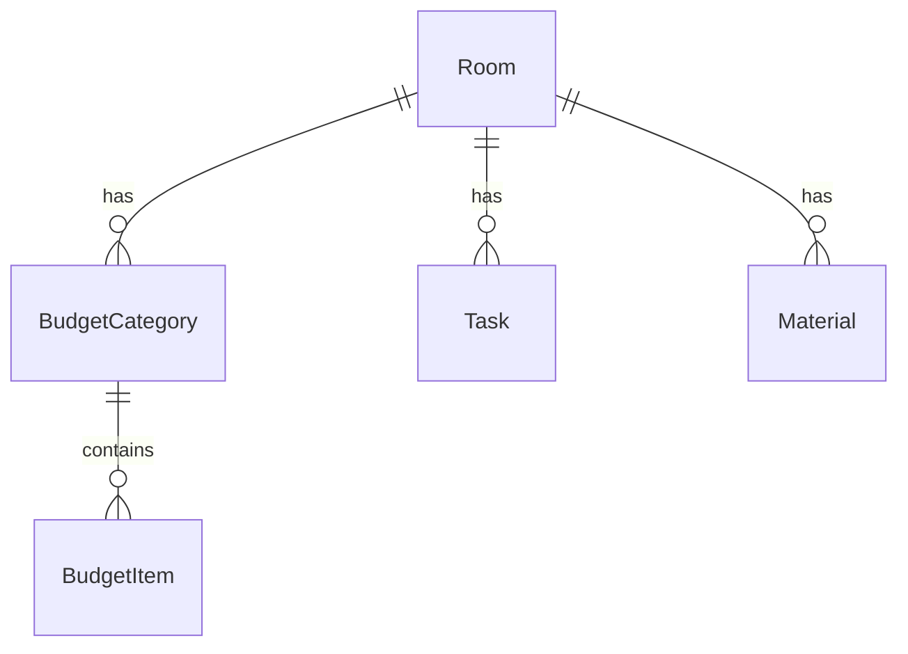

## 1. 架构设计

```mermaid
graph TB
    "前端 React+Vite" --> "API代理 Vite Proxy"
    "API代理 Vite Proxy" --> "后端 Express"
    "后端 Express" --> "内存数据存储"
    "前端 React+Vite" --> "ApiService 统一请求层"
    "前端 React+Vite" --> "GraphService 甘特图算法"
    "前端 React+Vite" --> "Zustand 状态管理"
```

## 2. 技术说明

- **前端**：React@18 + TypeScript + Tailwind CSS@3 + Vite
- **初始化工具**：vite-init (react-express-ts 模板)
- **后端**：Express@4 (CommonJS，按用户要求使用 server/index.js)
- **数据库**：内存对象存储（无需外部数据库）
- **图表库**：Recharts（环形图、分类图表）
- **状态管理**：Zustand
- **路由**：React Router DOM

## 3. 路由定义

| 路由 | 用途 |
|------|------|
| `/` | 房间看板主页面，展示所有房间卡片网格 |
| `/rooms/:id` | 房间详情页面，包含预算看板、甘特图和物料清单 |

## 4. API定义

### 4.1 房间相关

```
GET    /api/rooms              获取所有房间列表
POST   /api/rooms              新增房间
POST   /api/rooms/reorder      更新房间排序
```

**Room类型定义：**
```typescript
interface Room {
  id: string;
  name: string;
  status: 'not_started' | 'in_progress' | 'completed';
  totalBudget: number;
  spent: number;
  thumbnail: string;
  order: number;
  updatedAt: string;
}
```

### 4.2 预算相关

```
GET    /api/rooms/:id/budget          获取房间预算数据
POST   /api/rooms/:id/budget/items    新增预算明细项
PUT    /api/rooms/:id/budget/items/:itemId   编辑预算明细项
DELETE /api/rooms/:id/budget/items/:itemId   删除预算明细项
```

**Budget类型定义：**
```typescript
interface BudgetCategory {
  id: string;
  name: string;
  allocated: number;
  spent: number;
  items: BudgetItem[];
}

interface BudgetItem {
  id: string;
  amount: number;
  date: string;
  note: string;
  receipt: string;
}
```

### 4.3 任务相关

```
GET    /api/rooms/:id/tasks           获取房间任务列表
POST   /api/rooms/:id/tasks           新增任务
PUT    /api/rooms/:id/tasks/:taskId   更新任务（含拖拽时间调整）
```

**Task类型定义：**
```typescript
interface Task {
  id: string;
  name: string;
  assignee: string;
  note: string;
  plannedStart: string;
  plannedEnd: string;
  actualStart: string | null;
  actualEnd: string | null;
  completed: boolean;
}
```

### 4.4 物料相关

```
GET    /api/rooms/:id/materials          获取房间物料列表
POST   /api/rooms/:id/materials          新增物料
PUT    /api/rooms/:id/materials/:matId   更新物料（含购买状态）
```

**Material类型定义：**
```typescript
interface Material {
  id: string;
  name: string;
  quantity: number;
  unitPrice: number;
  link: string;
  purchased: boolean;
  category: string;
  roomId: string;
}
```

## 5. 服务端架构图

```mermaid
graph LR
    "Express Router" --> "RoomController"
    "Express Router" --> "BudgetController"
    "Express Router" --> "TaskController"
    "Express Router" --> "MaterialController"
    "RoomController" --> "内存数据存储"
    "BudgetController" --> "内存数据存储"
    "TaskController" --> "内存数据存储"
    "MaterialController" --> "内存数据存储"
```

## 6. 数据模型

### 6.1 数据模型定义



### 6.2 初始数据

服务器启动时在内存中初始化以下示例数据：
- 4个房间：客厅、厨房、主卧、卫生间
- 每个房间4个预算分类（装修人工、材料、家具、软装），每个分类2-3条明细
- 每个房间4-5个施工任务（拆除、水电、泥瓦、木工、油漆等）
- 每个房间5-8条物料记录

## 7. 文件组织

```
├── package.json
├── vite.config.ts
├── tsconfig.json
├── index.html
├── server/
│   └── index.js          (Express服务，RESTful路由，内存数据)
├── src/
│   ├── main.tsx
│   ├── App.tsx
│   ├── pages/
│   │   ├── RoomBoard.tsx   (房间看板主页面)
│   │   └── RoomDetail.tsx  (房间详情页面)
│   ├── services/
│   │   ├── ApiService.ts   (REST API封装)
│   │   └── GraphService.ts (甘特图算法)
│   ├── components/         (可复用组件)
│   ├── hooks/              (自定义Hooks)
│   ├── store/              (Zustand状态管理)
│   └── utils/              (工具函数)
```
