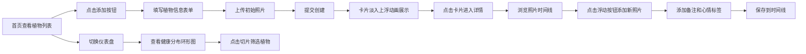

## 1. 产品概述

植物生长观察记录仪是一款面向园艺爱好者的应用，帮助用户记录每种植物的生长过程，通过照片时间线追踪植物变化，并为每个生长阶段添加备注和心情标签。

- **核心价值**：让园艺爱好者能够系统化地记录和回顾植物成长历程，培养种植习惯，提升养护技能
- **目标用户**：家庭园艺爱好者、多肉植物玩家、阳台种菜族、植物收藏者

## 2. 核心功能

### 2.1 用户角色

| 角色 | 注册方式 | 核心权限 |
|------|----------|----------|
| 普通用户 | 无需注册（本地存储） | 添加/编辑/删除植物记录，上传照片，添加备注，查看统计 |

### 2.2 功能模块

1. **首页（植物列表 + 仪表盘）**：植物卡片列表、健康统计仪表盘、排序筛选功能、添加新植物入口
2. **植物详情页**：横向照片时间线、备注气泡展示、添加新照片、生长阶段记录
3. **新植物添加页**：植物信息表单、初始照片上传、提交动画

### 2.3 页面详情

| 页面名称 | 模块名称 | 功能描述 |
|---------|----------|----------|
| 首页 | 顶部导航栏 | 应用标题、仪表盘切换按钮、添加植物按钮 |
| 首页 | 健康仪表盘 | 环形图展示健康分布、点击筛选对应状态植物、右侧滑入动画 |
| 首页 | 植物卡片列表 | 淡入上浮动画展示、显示植物龄和最新照片、支持排序（品种/时长/更新） |
| 首页 | 卡片交互 | 长按/右键菜单（删除、设为收藏）、点击进入详情 |
| 详情页 | 照片时间线 | 横向滚动、50张照片帧率≥50fps、拍摄日期显示 |
| 详情页 | 备注气泡 | 从侧边弹入、轻微抖动效果、显示心情标签 |
| 详情页 | 添加照片 | 浮动按钮、进度指示、完成打勾动画 |
| 添加页 | 表单模块 | 名称、品种、种植日期、初始照片输入 |
| 添加页 | 提交反馈 | 成功动画、自动返回首页 |

## 3. 核心流程

## 4. 用户界面设计

### 4.1 设计风格

- **主色调**：自然绿色（#4CAF50）作为主调，搭配土壤棕（#795548）和天空蓝（#87CEEB）
- **背景**：绿色到蓝色的柔和渐变背景，营造自然氛围
- **卡片样式**：磨砂玻璃效果（backdrop-filter: blur），半透明白色背景
- **按钮样式**：圆角胶囊形状（border-radius: 999px），带有轻微阴影和悬停效果
- **字体**：采用温暖的手写感字体搭配清晰的无衬线字体，营造手账本氛围
- **动效**：页面切换平滑过渡、卡片淡入上浮、备注气泡弹入抖动、照片上传进度动画

### 4.2 页面设计概述

| 页面名称 | 模块名称 | UI 元素 |
|---------|----------|----------|
| 首页 | 植物卡片 | 磨砂玻璃卡片、圆角缩略图、植物龄标签、收藏星标、渐入动画 |
| 首页 | 环形图仪表盘 | 三色环形图（健康/一般/需关注）、悬停高亮、点击筛选、右侧滑入 |
| 详情页 | 照片时间线 | 横向滚动容器、等宽照片卡片、日期标签、备注气泡、弹性滚动 |
| 详情页 | 浮动添加按钮 | 圆形渐变按钮、固定右下角、悬停放大、点击涟漪效果 |
| 添加页 | 表单 | 胶囊输入框、日期选择器、照片预览区、提交按钮渐变色 |

### 4.3 响应式设计

- **设计原则**：桌面端优先，移动端自适应
- **断点设置**：768px（平板）、480px（手机）
- **布局适配**：
  - 桌面端：卡片网格布局（3-4列）、仪表盘侧边展示
  - 平板端：卡片网格（2列）、仪表盘覆盖层
  - 移动端：卡片单列列表、仪表盘全屏模态框
- **触摸优化**：增大点击区域（≥44px）、支持滑动操作、禁用双击缩放

### 4.4 交互细节

- **卡片动画**：新卡片从底部上浮 20px 并淡入，stagger 延迟 100ms
- **备注气泡**：从左侧滑入 + 轻微幅度（3°）左右抖动 2 次
- **照片上传**：进度条渐变填充，完成时显示绿色打勾图标缩放动画
- **仪表盘切换**：从右侧滑入，背景遮罩淡入
- **环形图交互**：悬停时切片轻微放大并显示数值 tooltip
