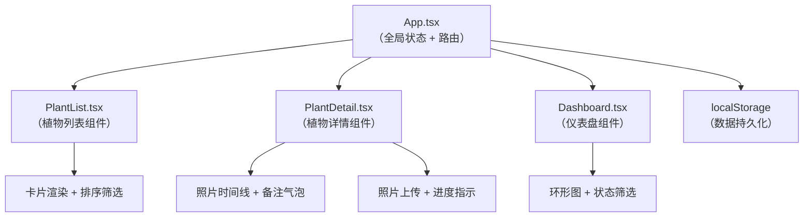
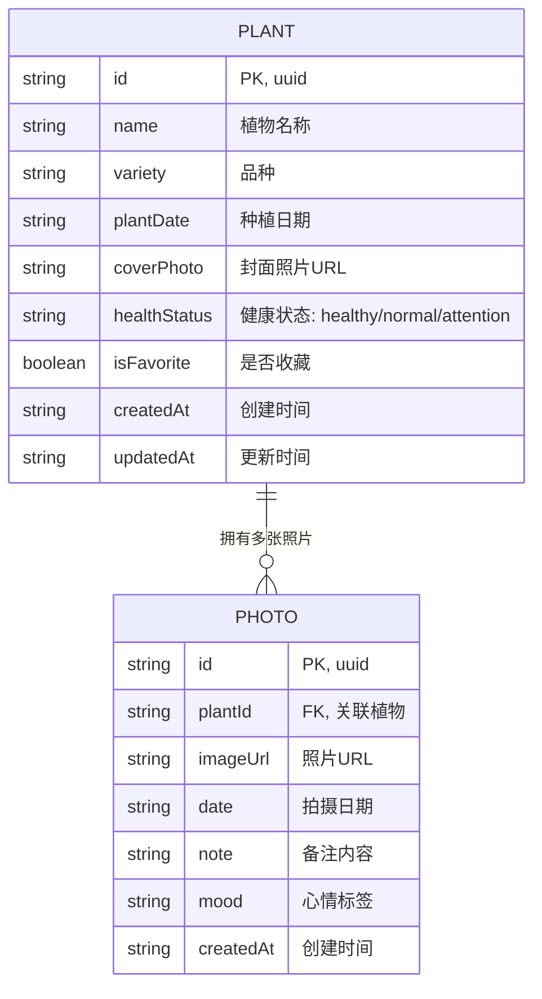

## 1. 架构设计



## 2. 技术描述

- **前端框架**：React 18 + TypeScript
- **构建工具**：Vite 5 + @vitejs/plugin-react
- **路由方案**：React Router 6（hash 路由，无需服务端配置）
- **状态管理**：React useState + useContext（轻量全局状态）
- **ID 生成**：uuid
- **数据存储**：localStorage（本地持久化）
- **样式方案**：CSS Modules + CSS 变量（无需额外 CSS 框架）
- **动画方案**：CSS Animations + Transitions（高性能原生动画）
- **图片处理**：FileReader API + Canvas 压缩（可选）

## 3. 路由定义

| 路由 | 用途 |
|------|------|
| `/` | 首页 - 植物列表 + 仪表盘切换 |
| `/plant/:id` | 植物详情页 - 照片时间线 |
| `/add` | 添加新植物页面 |

## 4. 数据模型

### 4.1 数据模型定义



### 4.2 TypeScript 类型定义

```typescript
type HealthStatus = 'healthy' | 'normal' | 'attention';

interface Plant {
  id: string;
  name: string;
  variety: string;
  plantDate: string;
  coverPhoto: string;
  healthStatus: HealthStatus;
  isFavorite: boolean;
  createdAt: string;
  updatedAt: string;
}

interface Photo {
  id: string;
  plantId: string;
  imageUrl: string;
  date: string;
  note: string;
  mood: string;
  createdAt: string;
}

interface AppState {
  plants: Plant[];
  photos: Photo[];
  sortBy: 'variety' | 'duration' | 'recent';
  filterStatus: HealthStatus | null;
  showDashboard: boolean;
}
```

### 4.3 Mock 初始数据

应用首次加载时，提供 3-5 株示例植物数据，每株植物包含 3-8 张照片记录，确保用户能立即体验完整功能。

## 5. 性能优化策略

### 5.1 照片时间线性能（≥50fps）

- **虚拟滚动**：仅渲染可视区域内的照片卡片（react-window 或自定义实现）
- **图片懒加载**：使用 `loading="lazy"` 和 Intersection Observer
- **图片尺寸优化**：限制缩略图最大宽度，使用合适的压缩质量
- **CSS 优化**：照片卡片使用 `transform: translate3d` 启用 GPU 加速
- **滚动防抖**：滚动事件处理使用 requestAnimationFrame 节流
- **避免重排**：所有动画使用 transform 和 opacity 属性

### 5.2 其他优化

- 照片上传前进行客户端压缩（Canvas 压缩到最大 1200px 宽）
- 使用 localStorage 缓存数据，避免重复读取
- 组件使用 React.memo 避免不必要重渲染
- 列表项使用稳定的 key（uuid）

## 6. 组件结构

```
src/
├── App.tsx              # 根组件，状态管理，路由
├── types.ts             # TypeScript 类型定义
├── utils/
│   ├── storage.ts       # localStorage 操作
│   ├── dateUtils.ts     # 日期计算工具
│   └── imageUtils.ts    # 图片处理工具
├── styles/
│   ├── variables.css    # CSS 变量（颜色、间距）
│   ├── animations.css   # 关键帧动画定义
│   └── reset.css        # 基础样式重置
└── components/
    ├── PlantList.tsx    # 植物列表
    ├── PlantCard.tsx    # 植物卡片
    ├── PlantDetail.tsx  # 详情页
    ├── PhotoTimeline.tsx # 照片时间线
    ├── PhotoCard.tsx    # 照片卡片
    ├── NoteBubble.tsx   # 备注气泡
    ├── Dashboard.tsx    # 仪表盘
    ├── DonutChart.tsx   # 环形图
    ├── AddPlantForm.tsx # 添加植物表单
    └── FloatingButton.tsx # 浮动按钮
```

## 7. 核心实现要点

1. **照片时间线横向滚动**：使用 CSS `scroll-snap-type: x mandatory` 实现对齐效果
2. **磨砂玻璃效果**：`backdrop-filter: blur(10px)` + 半透明背景
3. **环形图**：使用 SVG `<circle>` 和 `stroke-dasharray` 实现，无需图表库
4. **备注气泡抖动**：CSS `@keyframes shake` 动画，rotate ±3°
5. **上传进度动画**：模拟进度条，完成时打勾图标 scale 动画
6. **长按/右键菜单**：使用 `onContextMenu` 和长按计时器实现
