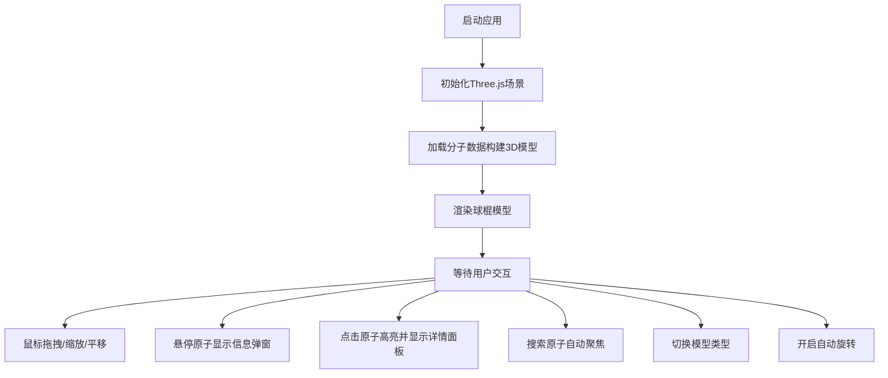

## 1. 产品概述
分子3D可视化应用，帮助用户探索和理解复杂分子结构的三维空间构象和原子间相互作用。
- 目标用户：化学研究人员、学生、科学教育工作者
- 核心价值：将传统静态二维分子图转化为可交互的三维可视化体验，直观展示分子空间结构

## 2. 核心功能

### 2.1 功能模块
1. **3D分子渲染场景**：球棍模型/空间填充模型展示，视角交互（旋转、缩放、平移）
2. **原子信息交互系统**：悬停弹窗、点击高亮、化学键高亮
3. **模型切换与动画**：球棍/空间填充平滑过渡、自动旋转模式
4. **搜索与定位系统**：原子编号/元素符号搜索、脉冲光晕高亮、视角聚焦
5. **左侧信息面板**：原子详情展示、搜索功能、控制面板、可折叠收起

### 2.2 页面详情
| 页面名称 | 模块名称 | 功能描述 |
|-----------|-------------|---------------------|
| 主界面 | 3D渲染区域 | 全屏展示分子3D结构，支持鼠标交互 |
| 主界面 | 左侧信息面板 | 原子详情、搜索框、模型切换、自动旋转开关、折叠按钮 |
| 主界面 | 悬停弹窗 | 鼠标悬停原子时显示元素类型、编号、三维坐标 |
| 主界面 | 控制按钮 | 霓虹渐变风格，带外发光过渡动画 |

## 3. 核心流程
用户打开应用 → 3D场景加载分子结构 → 鼠标拖拽旋转/滚轮缩放探索分子 → 悬停原子查看快速信息 → 点击原子查看详情并高亮化学键 → 使用搜索框定位特定原子 → 切换模型类型或开启自动旋转

## 4. 用户界面设计

### 4.1 设计风格
- 主色调：深灰蓝背景 #1a1a2e，霓虹青色线框 #00d4ff
- 原子颜色：碳 #808080（灰）、氧 #ff0000（红）
- 按钮风格：霓虹渐变 linear-gradient，悬停时 box-shadow 外发光
- 字体：现代科技感无衬线字体
- 布局：左侧固定260px面板 + 右侧全屏3D场景

### 4.2 页面设计概览
| 页面名称 | 模块名称 | UI元素 |
|-----------|-------------|-------------|
| 主界面 | 3D场景 | 深灰蓝背景、发光原子、化学键、鼠标交互光标 |
| 主界面 | 左侧面板 | 毛玻璃半透明背景、搜索框、切换开关、详情卡片、折叠按钮 |
| 主界面 | 悬停弹窗 | backdrop-filter毛玻璃、半透明背景、淡入淡出动画 |
| 主界面 | 控制按钮 | 霓虹渐变、外发光、hover过渡动画 |

### 4.3 响应式设计
- 桌面优先，适配1440px以上屏幕
- 3D场景占据主要可视区域
- 左侧面板固定宽度260px，可收起

### 4.4 3D场景指导
- 环境：深灰蓝 #1a1a2e 纯色背景，配合雾化效果增加空间感
- 光照：环境光 + 方向光 + 点光源，确保原子球体有立体感
- 相机：PerspectiveCamera，初始位置合理观察整个分子
- 交互：OrbitControls 支持拖拽旋转、缩放、平移，带惯性阻尼
- 动画：模型切换平滑插值、自动旋转匀速、搜索高亮脉冲光晕
- 性能：BufferGeometry合并减少draw call，帧率≥55FPS，交互响应<50ms
