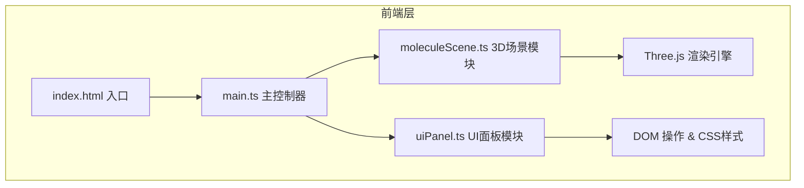

## 1. 架构设计



## 2. 技术说明
- 前端框架：原生 TypeScript + Three.js（无React/Vue框架）
- 构建工具：Vite
- 3D渲染：Three.js @latest + @types/three
- 状态管理：main.ts 中集中管理全局状态
- 样式：内联CSS + <style>标签，无需CSS预处理器

## 3. 项目文件结构
| 文件路径 | 职责说明 |
|----------|----------|
| package.json | 项目依赖配置（three, @types/three, typescript, vite） |
| index.html | 应用入口HTML，挂载Canvas和UI容器 |
| vite.config.ts | Vite构建配置 |
| tsconfig.json | TypeScript严格模式配置 |
| src/main.ts | 初始化场景/相机/渲染器、动画循环、全局状态、事件中转 |
| src/moleculeScene.ts | 核心3D逻辑：原子/化学键构建、模型切换、交互检测、动画 |
| src/uiPanel.ts | 左侧面板DOM管理、搜索、折叠、按钮事件绑定 |

## 4. 数据模型

### 4.1 原子数据结构
```typescript
interface Atom {
  id: number;
  element: string;  // 'C', 'O', 'H', 'N' 等元素符号
  x: number;
  y: number;
  z: number;
}
```

### 4.2 化学键数据结构
```typescript
interface Bond {
  atom1: number;  // 原子编号1
  atom2: number;  // 原子编号2
}
```

### 4.3 全局状态结构
```typescript
interface AppState {
  modelType: 'ball-stick' | 'space-filling';
  autoRotate: boolean;
  selectedAtom: Atom | null;
  hoveredAtom: Atom | null;
  panelCollapsed: boolean;
}
```

## 5. 模块数据流向

### 5.1 moleculeScene.ts
输入：原子数据数组 + 化学键数据数组
输出：
- 原子悬停事件 → main.ts
- 原子点击事件 → main.ts
- 公共API：setModelType(), setAutoRotate(), focusAtom(), highlightAtom()

### 5.2 uiPanel.ts
输入：选中原子信息（来自main.ts）
输出：
- 搜索事件 → main.ts → moleculeScene.ts
- 模型切换事件 → main.ts → moleculeScene.ts
- 自动旋转切换事件 → main.ts → moleculeScene.ts
- 面板折叠事件

### 5.3 main.ts
职责：初始化各模块、中转事件、管理全局状态、启动渲染循环
