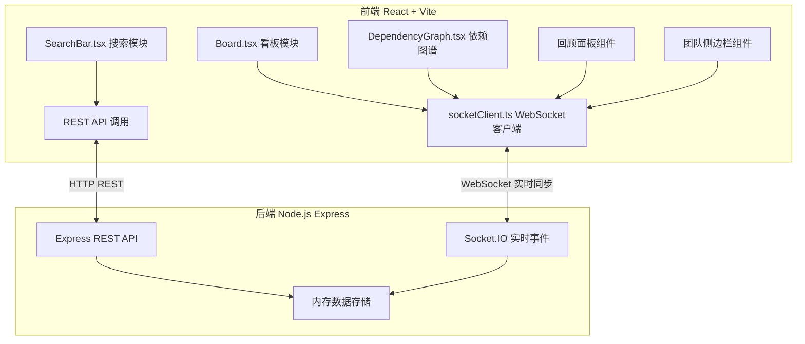
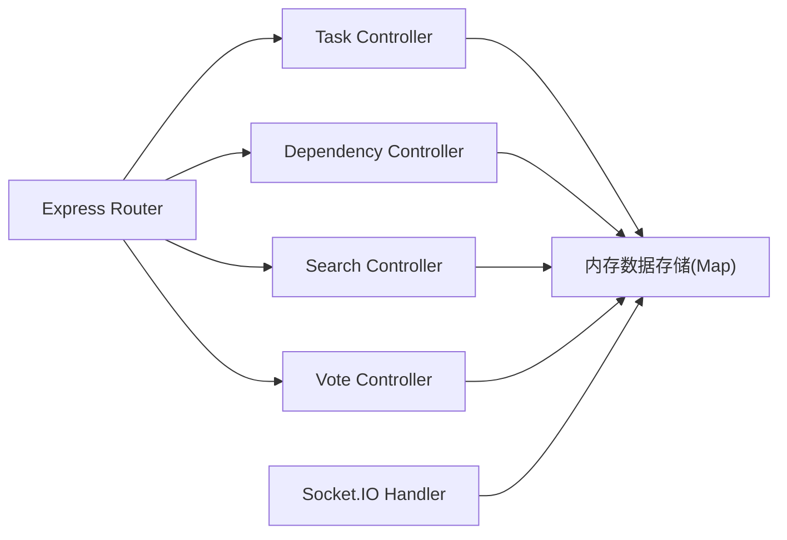
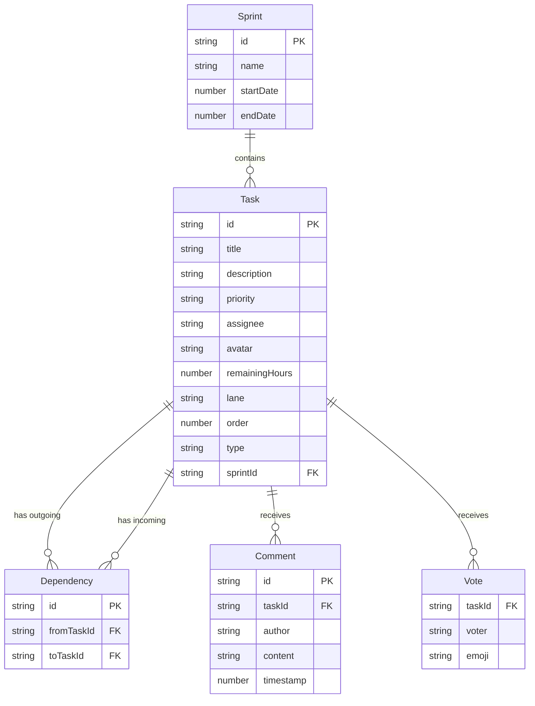

## 1. 架构设计



## 2. 技术说明

- **前端**：React 18 + TypeScript + Vite + TailwindCSS 3
- **状态管理**：Zustand（轻量响应式状态管理）
- **拖拽**：react-beautiful-dnd（看板卡片拖拽排序）
- **图谱**：d3-force（力导向图布局与渲染）
- **图表**：Recharts（回顾投票柱状图 + 工作量饼图）
- **实时通信**：socket.io-client ↔ socket.io（WebSocket双向同步）
- **初始化工具**：vite-init（react-express-ts模板）
- **后端**：Express 4 + Socket.IO + CORS
- **数据库**：内存存储（Map/Object暂存，无需外部数据库）
- **图标**：lucide-react

## 3. 路由定义

| 路由 | 用途 |
|------|------|
| `/` | 主工作区页面，包含看板/图谱/回顾三模块Tab切换 |

## 4. API 定义

### 4.1 REST API

```typescript
interface Task {
  id: string;
  title: string;
  description: string;
  priority: "low" | "medium" | "high" | "urgent";
  assignee: string;
  avatar: string;
  remainingHours: number;
  lane: "todo" | "inProgress" | "done";
  order: number;
  type: "task" | "milestone";
  sprintId: string;
}

interface Dependency {
  id: string;
  fromTaskId: string;
  toTaskId: string;
}

interface Comment {
  id: string;
  taskId: string;
  author: string;
  content: string;
  timestamp: number;
}

interface Vote {
  taskId: string;
  voter: string;
  emoji: "happy" | "neutral" | "sad";
}

// GET /api/tasks?sprintId=xxx - 获取冲刺任务列表
// POST /api/tasks - 创建任务
// PUT /api/tasks/:id - 更新任务（含泳道移动）
// DELETE /api/tasks/:id - 删除任务

// GET /api/dependencies?sprintId=xxx - 获取依赖关系
// POST /api/dependencies - 添加依赖
// DELETE /api/dependencies/:id - 删除依赖

// GET /api/comments?taskId=xxx - 获取任务评论
// POST /api/comments - 添加评论

// POST /api/votes - 提交/更新情绪投票
// GET /api/votes?sprintId=xxx - 获取冲刺投票汇总

// GET /api/search?q=xxx - 全局模糊搜索

// GET /api/team - 获取团队成员及在线状态
```

### 4.2 Socket.IO 事件

```typescript
// 客户端 → 服务端
"task:move"    // 任务拖拽移动（含泳道和排序变更）
"task:create"  // 新建任务
"task:update"  // 更新任务字段
"task:delete"  // 删除任务
"dep:add"      // 添加依赖连线
"dep:remove"   // 删除依赖连线
"member:join"  // 成员加入房间
"member:leave" // 成员离开房间

// 服务端 → 客户端
"task:moved"    // 广播任务移动
"task:created"  // 广播新建任务
"task:updated"  // 广播任务更新
"task:deleted"  // 广播任务删除
"dep:added"     // 广播依赖添加
"dep:removed"   // 广播依赖删除
"member:joined" // 广播成员加入
"member:left"   // 广播成员离开
```

## 5. 服务端架构图



## 6. 数据模型

### 6.1 数据模型定义



### 6.2 数据定义

本项目使用内存存储，无需DDL。数据以JavaScript Map/Object形式在server/index.js中初始化和管理，服务重启后数据清空。
