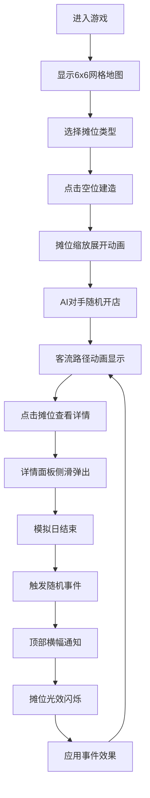

## 1. 产品概述
美食街经营模拟游戏是一款让玩家在虚拟城市中经营一条美食街的策略模拟游戏，解决传统模拟经营游戏缺乏动态竞争和即时反馈的问题。
- 主要目的：提供具有动态竞争机制和即时反馈的沉浸式美食街经营体验
- 目标用户：休闲游戏玩家、模拟经营类游戏爱好者
- 市场价值：填补市场上缺乏动态竞争和即时反馈的美食街经营模拟游戏空白

## 2. 核心 Features

### 2.1 Feature Module
1. **街区经营模拟**：6x6网格地图、摊位建造、缩放展开动画、客流路径连线
2. **客流与竞争机制**：AI对手开店、客流分流、摊位详情面板、实时数据展示
3. **事件驱动反馈**：随机天气/节日事件、顶部通知横幅、光效闪烁反馈

### 2.3 Page Details
| Page Name | Module Name | Feature description |
|-----------|-------------|---------------------|
| 游戏主界面 | 3D网格场景 | 6x6等轴视图网格、摊位建造交互、客流动画 |
| 游戏主界面 | 摊位详情面板 | 实时客流量、满意度星级、营收折线图、侧滑动画 |
| 游戏主界面 | 事件通知系统 | 顶部横幅通知、自动收起、摊位光效反馈 |
| 游戏主界面 | HUD信息栏 | 游戏日期、资金显示、建造菜单 |

## 3. Core Process

### 主要用户流程
1. 玩家进入游戏，看到6x6网格地图和建造菜单
2. 玩家选择摊位类型（汉堡车、奶茶铺、烧烤摊），点击网格空位建造
3. 摊位以缩放动画展开，同时AI对手随机在其他空位开店
4. 客流动画显示顾客沿路径移动，竞争摊位分流客流
5. 玩家点击摊位查看详情面板（客流量、满意度、营收）
6. 每个模拟日结束触发随机事件（天气/节日），显示通知横幅
7. 事件影响摊位属性，对应摊位显示光效闪烁

## 4. User Interface Design

### 4.1 Design Style
- **主色调**：温暖明亮的糖果色（粉红#FFB6C1、柠檬黄#FFFACD、薄荷绿#98FB98搭配）
- **辅助色**：天空蓝#87CEEB、珊瑚橙#FF7F50
- **按钮风格**：圆角16px、微阴影（0 4px 12px rgba(0,0,0,0.1)）、弹性过渡动画
- **字体**：展示字体使用"Baloo 2"，正文字体使用"Noto Sans SC"
- **布局风格**：卡片式布局、圆角设计、充足留白
- **动画风格**：弹性过渡（cubic-bezier(0.34, 1.56, 0.64, 1)）、透明度渐变

### 4.2 Page Design Overview
| Page Name | Module Name | UI Elements |
|-----------|-------------|-------------|
| 游戏主界面 | 3D网格场景 | 等轴视图、6x6网格、街道纹理、摊位3D模型、客流小圆点 |
| 游戏主界面 | 建造菜单 | 底部卡片式菜单、摊位图标、价格标签、悬停放大效果 |
| 游戏主界面 | 详情面板 | 右侧滑入面板、星级评分、折线图、数据卡片、关闭按钮 |
| 游戏主界面 | 事件通知 | 顶部横幅、渐变背景、事件图标、5秒自动收起 |
| 游戏主界面 | HUD | 顶部资金显示、日期显示、速度控制按钮 |

### 4.3 Responsiveness
- 桌面端全屏显示，网格自适应居中
- 使用CSS变量和响应式单位（vh/vw）
- 最小支持分辨率：1280x720

### 4.4 3D Scene Guidance
- **环境**：温暖明亮的日间场景，柔和的环境光
- **光照**：平行光模拟阳光 + 环境光，阴影柔和
- **相机**：正交相机，等轴视角（45度俯视角），可缩放平移
- **构图**：网格居中，周围留有充足空间显示UI
- **交互**：点击网格建造、点击摊位选中、鼠标滚轮缩放
- **动画**：摊位建造缩放动画、顾客沿路径移动动画、事件光效闪烁
- **性能**：控制Draw Call，摊位数量≤20时稳定30FPS以上
