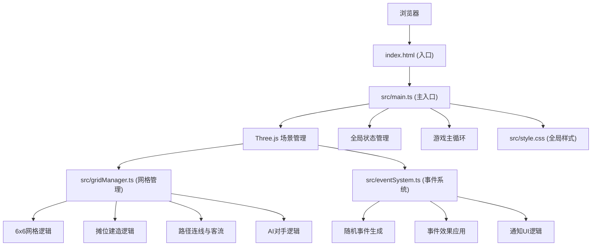

## 1. Architecture Design



## 2. Technology Description
- **前端框架**: TypeScript + Three.js (原生，不使用React/Vue)
- **构建工具**: Vite 5.x
- **3D引擎**: Three.js 0.160.x
- **状态管理**: 原生TypeScript对象（轻量级，无需额外库）
- **动画**: Three.js动画系统 + CSS transitions
- **类型定义**: @types/three
- **工具库**: uuid (用于唯一标识)
- **初始化方式**: npm init vite-init (vanilla-ts模板)

## 3. 项目文件结构
| 文件路径 | 用途 |
|---------|------|
| package.json | 依赖配置、脚本命令 |
| vite.config.ts | Vite基础配置 |
| tsconfig.json | TypeScript严格模式配置 |
| index.html | 全屏入口，id=app的div容器 |
| src/main.ts | Three场景初始化、正交相机、轨道控制器、游戏主循环、全局状态 |
| src/gridManager.ts | 6x6网格管理、摊位建造、状态管理、路径连线、AI对手 |
| src/eventSystem.ts | 随机事件生成、效果应用、通知UI |
| src/style.css | 全局样式、糖果色主题、动画类 |

## 4. 核心数据模型

### 4.1 摊位类型定义
```typescript
type StallType = 'burger' | 'milktea' | 'bbq';

interface StallConfig {
  type: StallType;
  name: string;
  price: number;
  taste: number; // 1-5
  queueCapacity: number;
  color: number; // Three.js颜色值
  icon: string;
}

interface Stall {
  id: string;
  type: StallType;
  gridX: number;
  gridZ: number;
  owner: 'player' | 'ai';
  customers: number;
  satisfaction: number; // 0-1
  revenuePerHour: number[]; // 最近24小时营收
  mesh: THREE.Group;
  isFlashing: boolean;
}
```

### 4.2 事件类型定义
```typescript
type EventType = 'rain' | 'sunny' | 'foodFestival' | 'weekend' | 'holiday';

interface GameEvent {
  id: string;
  type: EventType;
  name: string;
  description: string;
  effects: {
    stallType?: StallType;
    customerModifier: number;
    revenueModifier: number;
  };
  duration: number; // 模拟日数
  color: string;
  icon: string;
}
```

### 4.3 全局状态
```typescript
interface GameState {
  day: number;
  hour: number;
  money: number;
  speed: number; // 1x, 2x, 4x
  selectedStallType: StallType | null;
  selectedStall: Stall | null;
  stalls: Stall[];
  currentEvent: GameEvent | null;
  grid: (Stall | null)[][]; // 6x6
  customers: Customer[];
}
```

## 5. 性能优化策略
1. **Draw Call优化**: 使用InstancedMesh处理重复元素，合并几何体
2. **动画优化**: 客流动画使用对象池，限制最大同时显示顾客数量
3. **渲染优化**: 正交相机减少透视计算，开启frustumCulling
4. **UI优化**: 详情面板折线图使用Canvas 2D绘制，限制数据点数量
5. **内存管理**: 及时清理移除的摊位Mesh，避免内存泄漏
6. **帧率控制**: 游戏逻辑与渲染分离，逻辑固定60tick/s，渲染自适应

## 6. 动画实现方案
1. **摊位建造动画**: Three.js Scale动画 + Elastic easing
2. **客流动画**: 沿贝塞尔曲线路径移动，使用CatmullRomCurve3
3. **详情面板动画**: CSS transform + opacity transition
4. **事件通知动画**: CSS keyframes 滑入滑出
5. **光效闪烁动画**: Three.js 自发光材质强度动画
