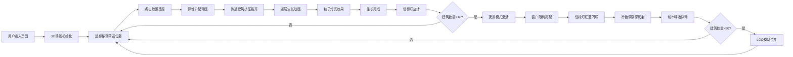

## 1. 产品概述
城市天际线生长模拟器是一款交互式3D可视化应用，用户通过点击放置建筑基座，观察建筑逐层向上生长，最终形成动态的赛博朋克风格城市景观。

## 2. 核心功能

### 2.1 功能模块
1. **主场景**：3D网格平面、建筑放置与生长动画、粒子特效系统
2. **交互系统**：鼠标点击检测、建筑选中高亮、放置指令处理
3. **效果系统**：工地灯光粒子、信标灯旋转、夜景模式切换、窗户灯光、城市呼吸效果
4. **性能优化**：LOD模型合并、帧率监控

### 2.3 页面详情
| 页面名称 | 模块名称 | 功能描述 |
|-----------|-------------|---------------------|
| 主场景 | 3D网格平面 | 可交互的网格地面，显示建筑放置预览 |
| 主场景 | 建筑放置 | 点击网格放置建筑基座，带弹性动画和空间挤压效果 |
| 主场景 | 建筑生长 | 逐层向上叠加生长，每层0.5秒间隔，伴随灯光粒子效果 |
| 主场景 | 夜景模式 | 建筑数量超过10栋时自动触发，窗户随机亮起，信标灯红蓝闪烁 |
| UI界面 | 控制面板 | 放置按钮、统计信息、提示框，霓虹蓝绿色描边风格 |

## 3. 核心流程
用户进入页面 → 3D场景初始化完成 → 鼠标移动显示放置预览 → 点击网格放置建筑基座 → 基座弹性升起 → 附近建筑轻微推开 → 建筑逐层生长（伴随粒子效果）→ 生长完成后信标灯旋转 → 建筑数量超过10栋 → 夜景模式自动激活 → 城市呼吸效果脉动 → 超过50栋时自动合并低细节模型

## 4. 用户界面设计

### 4.1 设计风格
- **主色调**：深紫色背景天空（#0a0a1f），霓虹蓝绿色（#00ffff）UI描边，金属反光边缘
- **辅助色**：暖黄色窗户灯光（#ffcc33），信标灯红色（#ff3366）、蓝色（#3366ff）
- **建筑风格**：现代玻璃幕墙、古典石砌、未来金属风三种随机风格
- **UI元素**：霓虹描边按钮，悬停时发光放大效果，赛博朋克字体风格

### 4.2 页面设计概述
| 页面名称 | 模块名称 | UI元素 |
|-----------|-------------|-------------|
| 主场景 | 3D视口 | 全屏Three.js渲染，深紫色雾效背景，网格平面 |
| 主场景 | 建筑预览 | 半透明霓虹边框立方体，跟随鼠标移动 |
| 主场景 | 生长动画 | 每层渐入动画，工地闪烁灯光粒子 |
| UI界面 | 顶部状态栏 | 建筑数量统计、FPS显示、当前模式（日/夜） |
| UI界面 | 放置按钮 | 霓虹蓝绿色描边，悬停发光放大 |
| UI界面 | 提示框 | 右下角操作提示，半透明霓虹边框 |

### 4.3 响应性
- 桌面端优先，自适应全屏渲染
- 鼠标悬停时UI元素发光放大反馈
- 建筑生长时镜头自动拉近跟随

### 4.4 3D场景指导
- **环境**：深紫色渐变天空（#0a0a1f → #1a0a3f），指数雾效，赛博朋克氛围
- **光照**：环境光 + 方向光 + 点光源组合，夜景模式切换为冷色系
- **相机**：PerspectiveCamera，45度俯视角，可围绕场景旋转
- **动画**：建筑生长弹性动画、信标灯旋转、城市呼吸亮度脉动、粒子系统
- **后期**：轻微Bloom效果增强霓虹发光感，色调映射调整
- **性能**：建筑超过50栋时自动合并低细节模型，保持45+ FPS
