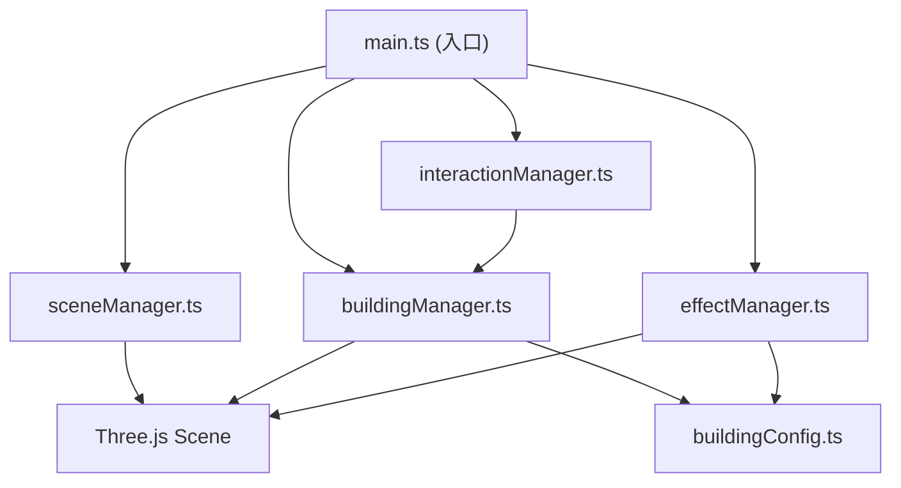

## 1. 架构设计


## 2. 技术描述
- **前端**：TypeScript + Three.js + Vite
- **构建工具**：Vite 5.x
- **依赖库**：three, @types/three
- **无后端**：纯前端3D应用

## 3. 目录结构
```
auto21/
├── src/
│   ├── main.ts                 # 主入口，初始化场景，动画循环
│   ├── models/
│   │   └── buildingConfig.ts   # 建筑配置、接口定义、常量
│   └── modules/
│       ├── sceneManager.ts     # 场景、相机、光照、雾效管理
│       ├── buildingManager.ts  # 建筑放置、生长、模型合并
│       ├── interactionManager.ts # 鼠标交互、Raycaster检测
│       └── effectManager.ts    # 粒子、灯光、夜景效果
├── index.html
├── package.json
├── vite.config.ts
└── tsconfig.json
```

## 4. 模块接口定义

### 4.1 buildingConfig.ts 类型定义
```typescript
// 建筑风格枚举
export enum BuildingStyle {
  MODERN_GLASS = 'modern_glass',
  CLASSICAL_STONE = 'classical_stone',
  FUTURISTIC_METAL = 'futuristic_metal'
}

// 建筑属性接口
export interface IBuilding {
  id: string;
  position: { x: number; z: number };
  targetHeight: number;
  currentHeight: number;
  style: BuildingStyle;
  isGrowing: boolean;
  isComplete: boolean;
  mesh: THREE.Group;
  floors: THREE.Mesh[];
  beaconLight?: THREE.PointLight;
}

// 生长参数常量
export const GROWTH_INTERVAL = 500;
export const FLOOR_HEIGHT = 1.2;
export const GRID_SIZE = 40;
export const CELL_SIZE = 2;
export const MAX_BUILDINGS_BEFORE_MERGE = 50;
export const NIGHT_MODE_THRESHOLD = 10;
```

### 4.2 sceneManager.ts 主要接口
```typescript
class SceneManager {
  scene: THREE.Scene;
  camera: THREE.PerspectiveCamera;
  renderer: THREE.WebGLRenderer;
  gridHelper: THREE.GridHelper;
  
  init(container: HTMLElement): void;
  getScene(): THREE.Scene;
  getCamera(): THREE.PerspectiveCamera;
  getRenderer(): THREE.WebGLRenderer;
  render(): void;
  setNightMode(enabled: boolean): void;
  updateBreathingEffect(intensity: number): void;
}
```

### 4.3 buildingManager.ts 主要接口
```typescript
class BuildingManager {
  buildings: IBuilding[];
  sceneManager: SceneManager;
  
  constructor(sceneManager: SceneManager);
  placeBuilding(gridX: number, gridZ: number): IBuilding | null;
  updateGrowth(deltaTime: number): void;
  checkAndMergeLOD(): void;
  getBuildings(): IBuilding[];
  private pushNearbyBuildings(centerX: number, centerZ: number, excludeId: string): void;
}
```

### 4.4 interactionManager.ts 主要接口
```typescript
class InteractionManager {
  raycaster: THREE.Raycaster;
  mouse: THREE.Vector2;
  
  constructor(container: HTMLElement, buildingManager: BuildingManager, sceneManager: SceneManager);
  updateMousePosition(event: MouseEvent): void;
  handleClick(event: MouseEvent): void;
  getGridPosition(): { x: number; z: number } | null;
}
```

### 4.4 effectManager.ts 主要接口
```typescript
class EffectManager {
  sceneManager: SceneManager;
  buildingManager: BuildingManager;
  particleSystem: THREE.Points;
  
  constructor(sceneManager: SceneManager, buildingManager: BuildingManager);
  update(deltaTime: number): void;
  spawnConstructionParticles(position: THREE.Vector3): void;
  toggleNightMode(enabled: boolean): void;
  updateWindowLights(): void;
  updateBeaconLights(time: number): void;
}
```
