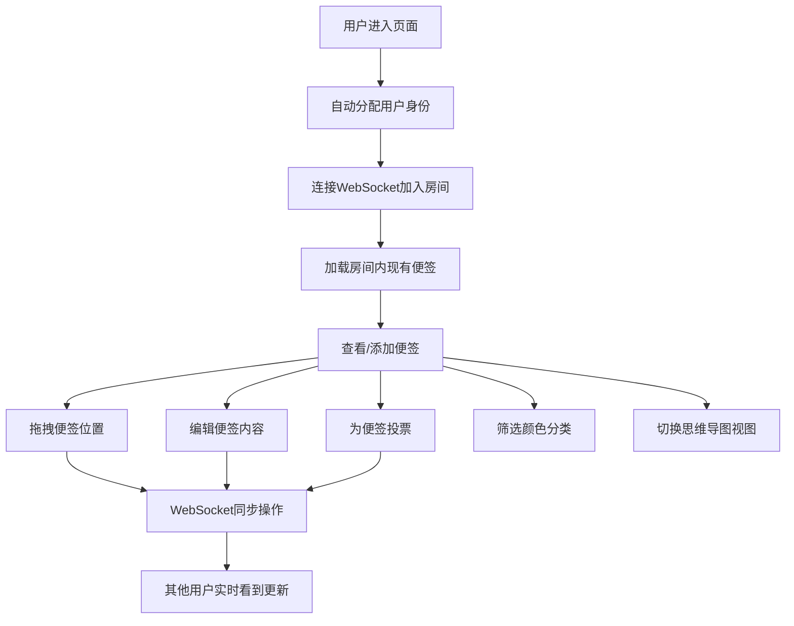

## 1. 产品概述

在线团队头脑风暴白板是一款供远程团队进行实时协作的创意收集工具。团队成员可以在共享的虚拟白板上添加便签、分类想法、进行投票，帮助团队高效地进行头脑风暴会议、需求讨论和方案评审。

- 主要解决远程团队协作中创意收集困难、参与度低、信息不同步的问题
- 目标用户为产品团队、设计团队、开发团队等需要进行创意协作的远程/混合办公团队
- 产品价值在于提供流畅的实时协作体验，让每个团队成员都能平等参与，提升会议效率和创意质量

## 2. 核心功能

### 2.1 用户角色

| 角色 | 注册方式 | 核心权限 |
|------|----------|----------|
| 普通用户 | 自动分配临时身份 | 添加/编辑/删除便签、拖拽便签、投票、切换视图、筛选便签 |

### 2.2 功能模块

1. **白板主页**：实时协作白板、便签展示与交互、分组区域、工具栏
2. **便签卡片**：内容编辑、颜色标记、作者信息展示、投票功能
3. **实时同步**：WebSocket连接管理、操作广播、状态同步
4. **视图切换**：自由布局模式、思维导图模式
5. **筛选功能**：按颜色分类筛选便签

### 2.3 页面详情

| 页面名称 | 模块名称 | 功能描述 |
|----------|----------|----------|
| 白板主页 | 顶部工具栏 | 显示房间号、用户列表、添加便签按钮、颜色筛选按钮、视图切换按钮 |
| 白板主页 | 白板画布 | 支持缩放、平移、显示便签和分组区域 |
| 白板主页 | 分组区域 | 三个虚线边框区域（问题、方案、行动项），支持拖拽便签到区域内 |
| 白板主页 | 便签卡片 | 显示内容、作者头像、颜色标记、投票按钮、支持拖拽和双击编辑 |
| 白板主页 | 移动端列表视图 | 在手机上以列表形式展示便签，简化交互 |

## 3. 核心流程

用户进入页面后自动分配临时身份和头像，加入默认房间。可以添加便签、拖拽便签到不同位置或分组区域、为便签投票、筛选特定颜色的便签、切换思维导图视图。所有操作实时同步给其他在线用户。

## 4. 用户界面设计

### 4.1 设计风格

- **主色调**：柔和米白色背景 (#F8F5F0)，搭配淡红 (#FFE0E0)、淡绿 (#E0F2E9)、淡蓝 (#E0ECF8) 三种便签颜色
- **辅助色**：深灰色文字 (#333333)，中等灰色边框 (#CCCCCC)，悬停高亮色 (#F0E6D8)
- **按钮风格**：圆角矩形按钮，悬停时有轻微放大和阴影效果，点击有弹性反馈
- **字体**：标题使用 "Noto Serif SC" 衬线字体，正文使用 "Noto Sans SC" 无衬线字体，营造优雅的协作氛围
- **布局风格**：卡片式布局，便签采用柔和阴影和圆角，分组区域使用虚线边框
- **图标风格**：使用 lucide-react 线性图标，保持简洁一致

### 4.2 页面设计概述

| 页面名称 | 模块名称 | UI元素 |
|----------|----------|--------|
| 白板主页 | 顶部工具栏 | 半透明背景、毛玻璃效果、按钮组、用户头像列表、平滑过渡动画 |
| 白板主页 | 白板画布 | 米白色背景、细微纹理、便签卡片带阴影、拖拽平滑过渡、缩放流畅动画 |
| 白板主页 | 分组区域 | 虚线边框、淡色背景、便签移入时边框高亮、标题文字居中 |
| 白板主页 | 便签卡片 | 淡色背景、圆角、作者头像右上角、投票按钮底部、双击进入编辑态、弹跳动画 |
| 白板主页 | 移动端列表 | 垂直滚动列表、便签简化展示、底部操作栏 |

### 4.3 响应式设计

- **桌面端（>1024px）**：完整白板功能，支持缩放、平移、拖拽所有交互
- **平板端（768px-1024px）**：保留白板核心功能，调整工具栏布局，优化触摸交互
- **手机端（<768px）**：切换为列表视图，简化操作，便签垂直排列，底部浮动添加按钮

### 4.4 动效设计

- **便签添加**：从工具栏位置淡入并带有轻微缩放效果
- **便签拖拽**：平滑过渡动画，拖拽时有提升阴影效果
- **投票计数**：数字变化时带有弹跳动画
- **筛选隐藏**：非选中颜色便签淡出并缩小
- **视图切换**：便签以飞行动画移动到新位置
- **分组区域高亮**：便签移入时边框从虚线变为实线并带有颜色渐变
