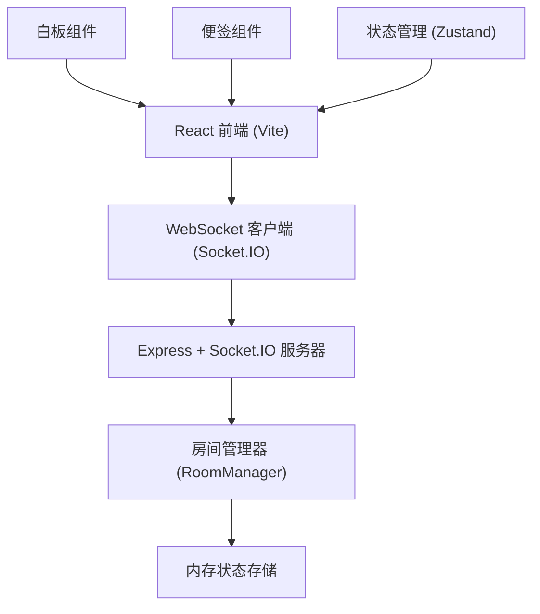
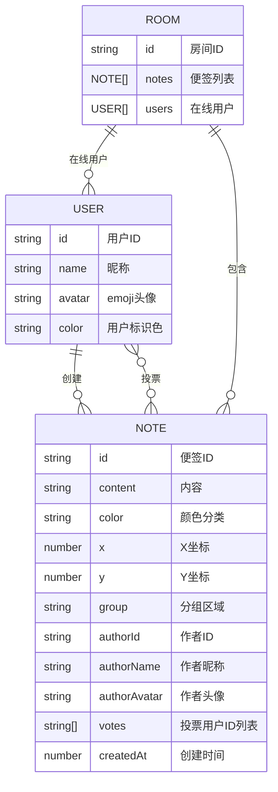

## 1. 架构设计



## 2. 技术描述

- **前端**：React 18 + TypeScript + Vite + TailwindCSS 3 + Zustand + Socket.IO Client + lucide-react
- **后端**：Node.js + Express 4 + Socket.IO + TypeScript
- **构建工具**：Vite 5，配置 React 插件和 API 代理
- **实时通信**：Socket.IO WebSocket 连接，实现低于 200ms 的同步延迟
- **状态管理**：Zustand 管理前端全局状态，包括便签列表、用户信息、筛选条件、视图模式

## 3. 目录结构

```
auto22/
├── src/
│   ├── components/
│   │   ├── BrainstormBoard.tsx    # 核心白板组件
│   │   ├── NoteCard.tsx           # 便签卡片组件
│   │   ├── GroupZone.tsx          # 分组区域组件
│   │   ├── Toolbar.tsx            # 顶部工具栏组件
│   │   └── UserAvatar.tsx         # 用户头像组件
│   ├── hooks/
│   │   ├── useDrag.ts             # 拖拽逻辑Hook
│   │   └── usePanZoom.ts          # 平移缩放Hook
│   ├── store/
│   │   └── useBoardStore.ts       # Zustand状态管理
│   ├── utils/
│   │   ├── socket.ts              # WebSocket连接管理
│   │   └── types.ts               # 类型定义
│   ├── App.tsx                    # 主应用组件
│   ├── main.tsx                   # 入口文件
│   └── index.css                  # 全局样式
├── server/
│   ├── index.ts                   # Express服务器入口
│   └── roomManager.ts             # 房间状态管理器
├── package.json
├── vite.config.ts
├── tsconfig.json
└── index.html
```

## 4. 路由定义

| 路由 | 用途 |
|------|------|
| / | 白板主页，默认房间 |
| /room/:roomId | 指定房间的白板页面 |

## 5. WebSocket 事件定义

### 客户端发送事件

| 事件名 | 参数类型 | 说明 |
|--------|----------|------|
| joinRoom | { roomId: string, user: User } | 加入房间 |
| addNote | { roomId: string, note: Note } | 添加便签 |
| updateNote | { roomId: string, noteId: string, updates: Partial<Note> } | 更新便签 |
| deleteNote | { roomId: string, noteId: string } | 删除便签 |
| moveNote | { roomId: string, noteId: string, x: number, y: number, group?: string } | 移动便签 |
| voteNote | { roomId: string, noteId: string, userId: string } | 投票/取消投票 |

### 服务器发送事件

| 事件名 | 参数类型 | 说明 |
|--------|----------|------|
| roomState | { notes: Note[], users: User[] } | 房间完整状态（初次加入时） |
| noteAdded | { note: Note } | 便签已添加 |
| noteUpdated | { noteId: string, updates: Partial<Note> } | 便签已更新 |
| noteDeleted | { noteId: string } | 便签已删除 |
| noteMoved | { noteId: string, x: number, y: number, group?: string } | 便签已移动 |
| noteVoted | { noteId: string, votes: string[], userId: string } | 投票状态更新 |
| userJoined | { user: User } | 用户加入 |
| userLeft | { userId: string } | 用户离开 |

## 6. 数据模型

### 6.1 数据模型定义



### 6.2 TypeScript 类型定义

```typescript
interface User {
  id: string;
  name: string;
  avatar: string;
  color: string;
}

interface Note {
  id: string;
  content: string;
  color: 'red' | 'green' | 'blue' | 'yellow';
  x: number;
  y: number;
  group?: 'problem' | 'solution' | 'action';
  authorId: string;
  authorName: string;
  authorAvatar: string;
  votes: string[];
  createdAt: number;
}

interface RoomState {
  notes: Note[];
  users: User[];
}

type ViewMode = 'free' | 'mindmap';
type ColorFilter = 'all' | 'red' | 'green' | 'blue' | 'yellow';
```

## 7. 性能优化策略

1. **便签渲染优化**：使用 React.memo 包裹便签组件，避免不必要的重渲染
2. **拖拽性能**：使用 CSS transform 进行位置更新，避免触发重排
3. **WebSocket 节流**：拖拽过程中节流发送位置更新，减少网络请求
4. **动画优化**：所有动画使用 CSS transform 和 opacity，启用 GPU 加速
5. **虚拟滚动**：移动端列表视图使用虚拟滚动，处理大量便签
6. **内存管理**：用户断开连接后及时清理房间状态，避免内存泄漏
