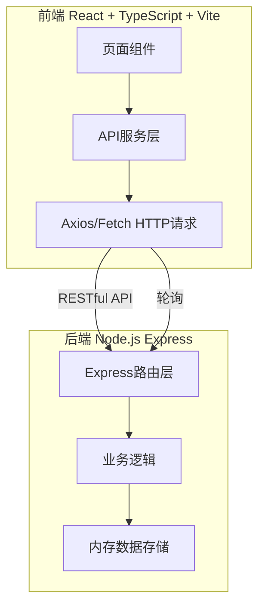
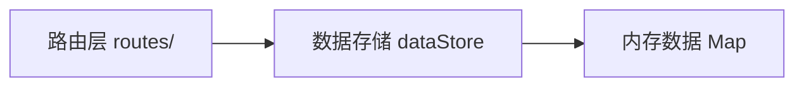
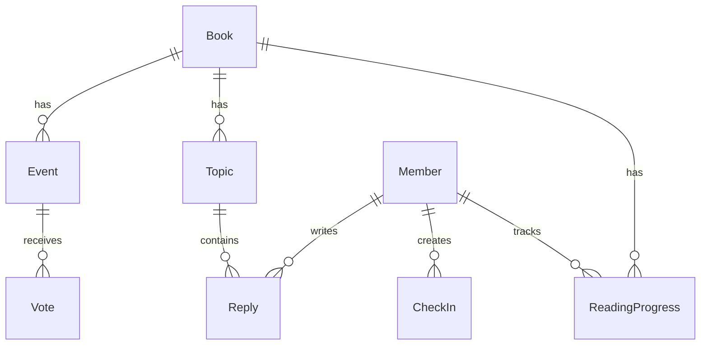

## 1. 架构设计



## 2. 技术说明
- 前端：React@18 + TypeScript + Vite + TailwindCSS + Zustand
- 初始化工具：vite-init (react-express-ts模板)
- 后端：Express@4 + TypeScript
- 数据库：内存存储（dataStore模块），模拟数据

## 3. 路由定义
| 路由 | 用途 |
|------|------|
| / | 书籍管理面板（书库列表） |
| /book/:id | 书籍详情页（进度、讨论、打卡） |
| /book/:id/topic/:topicId | 话题详情页 |
| /events | 活动排期页 |

## 4. API定义

### 书籍相关
| 方法 | 路径 | 说明 |
|------|------|------|
| GET | /api/books | 获取书籍列表 |
| POST | /api/books | 添加书籍 |
| GET | /api/books/:id | 获取书籍详情 |
| PUT | /api/books/:id | 更新书籍 |

### 阅读进度相关
| 方法 | 路径 | 说明 |
|------|------|------|
| GET | /api/books/:id/progress | 获取所有成员进度 |
| POST | /api/books/:id/progress | 更新成员进度（打卡） |

### 讨论话题相关
| 方法 | 路径 | 说明 |
|------|------|------|
| GET | /api/books/:id/topics | 获取话题列表 |
| POST | /api/books/:id/topics | 创建话题 |
| GET | /api/topics/:topicId | 获取话题详情及回复 |
| POST | /api/topics/:topicId/replies | 添加回复 |

### 活动排期相关
| 方法 | 路径 | 说明 |
|------|------|------|
| GET | /api/events | 获取活动列表 |
| POST | /api/events | 创建活动 |
| POST | /api/events/:id/vote | 投票 |
| GET | /api/events/:id/votes | 获取投票结果 |

### TypeScript类型定义
```typescript
interface Book {
  id: string;
  title: string;
  author: string;
  coverUrl: string;
  description: string;
  isbn: string;
  addedAt: string;
  readers: Member[];
}

interface Member {
  id: string;
  name: string;
  avatar: string;
}

interface ReadingProgress {
  memberId: string;
  bookId: string;
  currentChapter: number;
  totalChapters: number;
  status: 'not_started' | 'reading' | 'completed';
  checkIns: CheckIn[];
}

interface CheckIn {
  id: string;
  memberId: string;
  bookId: string;
  chapter: number;
  thought: string;
  createdAt: string;
}

interface Topic {
  id: string;
  bookId: string;
  title: string;
  creatorId: string;
  repliesCount: number;
  lastReplyAt: string;
  replies: Reply[];
}

interface Reply {
  id: string;
  topicId: string;
  memberId: string;
  content: string;
  mentionIds: string[];
  createdAt: string;
}

interface Event {
  id: string;
  bookId: string;
  chapterRange: string;
  suggestedTime: string;
  adjustedTime?: string;
  status: 'suggested' | 'scheduled' | 'completed';
  votes: Vote[];
}

interface Vote {
  memberId: string;
  timeOption: string;
}
```

## 5. 服务器架构图



## 6. 数据模型

### 6.1 数据模型定义



### 6.2 初始模拟数据
- 100条书籍记录（含书名、作者、封面、简介、ISBN）
- 10个模拟成员（含头像、名称）
- 随机生成阅读进度和打卡记录
- 预置讨论话题和回复
