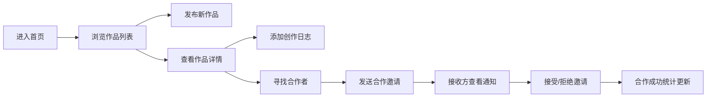

## 1. 产品概述

面向独立音乐人的创作协作平台，提供作品展示、合作匹配与创作日志管理一站式服务。

- 核心目标：帮助独立音乐人展示原创作品，通过智能匹配寻找合作者，完整记录每首歌的创作历程
- 目标用户：独立音乐人、词曲作者、编曲制作人、录音混音师
- 产品价值：建立音乐创作社群化协作，降低创作门槛，激发创作灵感

## 2. 核心功能

### 2.1 用户角色

| 角色 | 注册方式 | 核心权限 |
|------|----------|----------|
| 音乐人 | 模拟用户（预设用户ID） | 发布作品、管理创作日志、发起合作、接收合作邀请 |

### 2.2 功能模块

1. **首页/作品库页面**：作品卡片瀑布流、标签筛选栏、排序切换、作品发布表单
2. **作品详情页面**：封面视差、创作日志时间线、合作推荐网格、合作邀请弹窗
3. **个人中心页面**：统计卡片、作品集网格、作品编辑/删除、通知面板（合作邀请）

### 2.3 页面详情

| 页面名称 | 模块名称 | 功能描述 |
|---------|---------|---------|
| 首页/作品库 | 作品卡片列表 | 淡入上浮动画、玻璃态设计、波形骨架屏、标签筛选+交叉淡入淡出过渡 |
| 首页/作品库 | 作品发布表单 | 标题/封面/标签/灵感描述，提交后插入列表顶部 |
| 作品详情 | 封面区 | 视差滚动效果、标题、作者信息 |
| 作品详情 | 创作日志时间线 | 纵向时间轴、情绪图标、平滑展开、新增高亮闪烁 |
| 作品详情 | 合作匹配 | 最多5位推荐者、头像卡片网格、发送邀请 |
| 个人中心 | 统计卡片 | 总作品数/合作成功数滚动数字 |
| 个人中心 | 作品集 | 2列网格、编辑/删除按钮、删除缩小动画、确认弹窗 |
| 个人中心 | 通知面板 | 右侧滑入+背景遮罩、接受/拒绝操作 |
| 全局导航 | 左侧导航栏/底部标签栏 | 首页、作品库、个人中心图标切换 |

## 3. 核心流程

用户进入平台浏览作品 → 点击作品卡片查看详情 → 查看创作日志时间线 → 发起合作邀请 → 被邀请方在通知面板处理邀请 → 合作达成

## 4. 用户界面设计

### 4.1 设计风格

- **主色调**：背景 `#1a1a2e`（深邃夜空蓝），卡片 `#16213e`（深海蓝），强调色 `#e94560`（霓虹玫红）
- **按钮样式**：圆角 12px，悬停加深投影 + 颜色过渡 300ms ease
- **字体**：标题使用具有现代感的无衬线字体，正文使用易读字体
- **布局风格**：左侧固定导航栏 + 右侧主内容区，卡片式布局
- **图标风格**：Lucide 线性图标，与强调色统一
- **玻璃态设计**：半透明背景（rgba 255,255,255,0.05）+ backdrop-filter blur + 边框光晕

### 4.2 页面设计概览

| 页面名称 | 模块名称 | UI 元素 |
|---------|---------|---------|
| 首页/作品库 | 作品卡片 | 玻璃态卡片、淡入上浮动画、波形渐变骨架屏、悬停投影加深 |
| 作品详情 | 封面区 | 视差滚动、大尺寸封面、作者头像环形边框光晕 |
| 作品详情 | 创作日志 | 纵向时间轴线、情绪彩色圆点、展开内容平滑过渡、新增条目闪烁脉冲 |
| 个人中心 | 统计卡片 | 霓虹数字滚动动画、渐变背景、数据可视化 |
| 个人中心 | 通知面板 | 右侧滑入抽屉、半透明黑色遮罩、操作按钮组 |
| 全局导航 | 导航栏 | 图标+文字悬停高亮、激活态强调色下划线 |

### 4.3 响应式设计

- **桌面端（≥1024px）：左侧固定导航（240px），作品卡片4列网格
- **平板端（768px~1023px）：导航折叠为底部标签栏，卡片3列，间距缩小
- **移动端（<768px）：底部标签栏，卡片单列，紧凑间距 |
