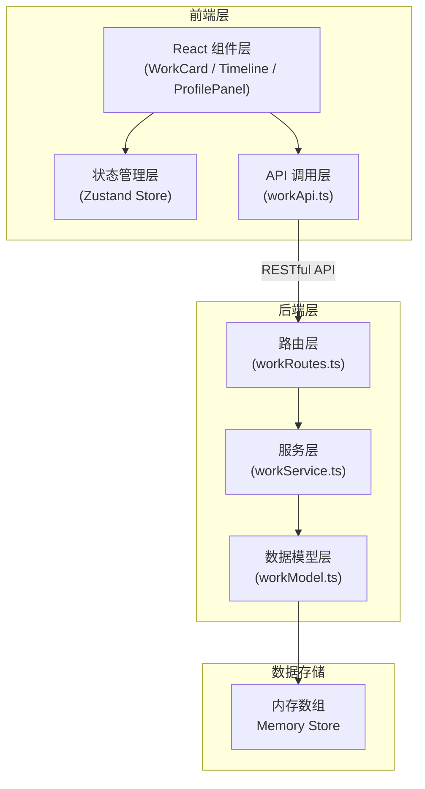
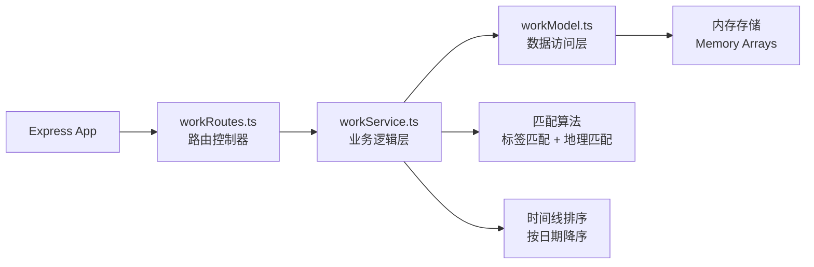
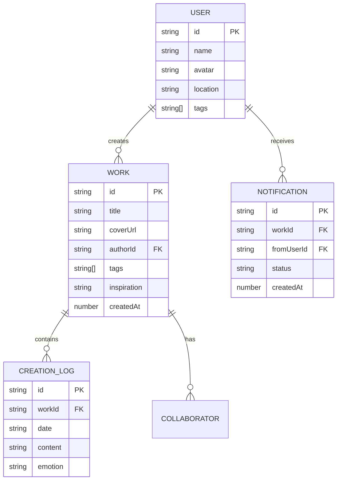

## 1. 架构设计



## 2. 技术描述

- **前端框架**：React 18 + TypeScript + Vite
- **初始化工具**：Vite (react-express-ts 模板)
- **后端框架**：Express 4 + TypeScript
- **状态管理**：Zustand
- **路由**：React Router DOM
- **样式方案**：Tailwind CSS 3 + 自定义 CSS 动画
- **图标库**：Lucide React
- **数据存储**：后端内存数组（模拟数据库）
- **跨域**：CORS 中间件 + Vite 代理
- **唯一ID**：UUID

## 3. 路由定义

| 前端路由 | 用途 |
|---------|------|
| / | 首页/作品库 |
| /works/:id | 作品详情页 |
| /profile | 个人中心页 |

| 后端 API 路由 | 用途 |
|--------------|------|
| GET /api/works | 获取作品列表 |
| POST /api/works | 创建新作品 |
| PUT /api/works/:id | 更新作品 |
| DELETE /api/works/:id | 删除作品 |
| POST /api/works/:id/logs | 添加创作日志 |
| POST /api/works/:id/collaborate | 获取合作推荐 + 发送邀请 |
| GET /api/notifications | 获取通知列表 |
| PUT /api/notifications/:id | 更新邀请状态 |

## 4. API 定义

```typescript
// 作品类型
interface Work {
  id: string;
  title: string;
  coverUrl: string;
  authorId: string;
  authorName: string;
  authorAvatar: string;
  authorLocation: string;
  tags: string[];
  inspiration: string;
  createdAt: number;
  logs: CreationLog[];
  collaborators: string[];
}

// 创作日志类型
interface CreationLog {
  id: string;
  date: string;
  content: string;
  emotion?: 'happy' | 'melancholy' | 'energetic' | 'calm' | 'angry';
}

// 合作者类型
interface Collaborator {
  id: string;
  name: string;
  avatar: string;
  location: string;
  tags: string[];
  matchScore: number;
}

// 通知类型
interface Notification {
  id: string;
  workId: string;
  workTitle: string;
  fromUserId: string;
  fromUserName: string;
  fromUserAvatar: string;
  status: 'pending' | 'accepted' | 'rejected';
  createdAt: number;
}
```

## 5. 服务端架构图



## 6. 数据模型

### 6.1 数据模型定义



### 6.2 模拟数据说明

- 预置 20 条作品模拟数据
- 预置 10 位音乐人用户数据
- 每条作品 3-5 条创作日志
- 预置 5 条合作邀请通知
