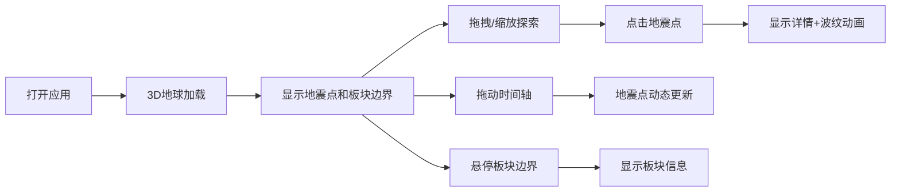

## 1. 产品概述

全球地震活动3D可视化系统是一个基于Web的交互式地震数据探索平台，通过3D地球直观展示全球实时地震活动与板块边界的空间分布和地质关联性，解决传统地震数据表格难以直观呈现的问题。

- 主要用途：帮助用户在3D地球上探索全球地震活动分布，理解地震与板块边界的关联
- 目标用户：地质研究者、教育工作者、地震爱好者
- 核心价值：将抽象的地震数据转化为直观的3D可视化，提升数据探索效率

## 2. 核心功能

### 2.1 功能模块

1. **3D地球渲染模块**：球体渲染、地震点可视化、鼠标交互、平滑惯性旋转

2. **地震详情交互**：点击交互、信息弹窗、波纹动画、震中影响范围展示

3. **时间轴播放控制**：日期滑块、动态过滤、统计面板、动画效果

4. **板块边界叠加**：板块边界线、发光效果、悬停信息、关联高亮

### 2.3 页面详情

| 页面名称 | 模块名称 | 功能描述 |
|---------|---------|---------|
| 主页面 | 3D地球渲染 | 球体以真实经纬度渲染地震点，大小表示震级，颜色表示深度，支持拖拽旋转、滚轮缩放、平滑惯性 |
| 主页面 | 地震详情交互 | 点击地震点弹出信息窗（位置、时间、震级、深度），波纹扩散动画显示震中影响范围 |
| 主页面 | 时间轴控制 | 底部时间滑块按天步进，地震点随日期动态出现/消失，爆发闪烁动画，左侧统计面板更新 |
| 主页面 | 板块边界叠加 | 3D地球表面叠加全球主要板块边界线，发光细线呈现，悬停显示板块名称和运动方向 |

## 3. 核心流程

用户打开应用 → 3D地球加载完成，显示默认时间范围内的地震点和板块边界 → 用户拖拽旋转地球、滚轮缩放探索 → 点击地震点查看详情，波纹动画展示影响范围 → 拖动时间轴滑块，地震点动态更新 → 悬停板块边界查看板块信息

## 4. 用户界面设计

### 4.1 设计风格

- **主色调**：深空蓝紫色渐变背景（#0a0a1a → #1a1a3a），模拟星空效果
- **地球配色**：环保绿色海洋（#2d5a27）与棕色陆地（#8b6914）
- **UI控件**：毛玻璃半透明效果（白色半透明面板，背景模糊）
- **地震点配色**：浅色（#fff5e6 表示浅层，深色（#8b0000 表示深层）
- **板块边界**：发光细线（#00ffff）
- **按钮/交互色**：青色强调色（#00d4ff）

- **字体**：现代无衬线字体，清晰易读
- **卡片**：圆角设计，轻微阴影
- **动画**：平滑缩放、透明度渐变、波纹外扩渐隐

### 4.2 页面设计概述

| 页面名称 | 模块名称 | UI元素 |
|---------|---------|--------|
| 主页面 | 3D地球场景 | 居中3D球体、星空背景、环境光+方向光、聚焦地球为视觉中心 |
| 主页面 | 左侧统计面板 | 毛玻璃半透明面板、地震次数统计、最大震级显示、平滑弹出动画 |
| 主页面 | 底部时间轴 | 毛玻璃半透明滑块、日期显示、播放/暂停按钮、拖拽顺滑手感 |
| 主页面 | 地震信息窗 | 圆角卡片、位置/时间/震级/深度信息、关闭按钮、平滑缩放 |
| 主页面 | 板块悬停提示 | 半透明背景、板块名称、运动方向箭头 |

### 4.3 响应式

- **桌面端（≥1280px）：完整3D场景，左侧统计面板
- **平板端（768-1280px）：左侧统计面板改为底部可折叠面板
- **移动端（<768px）：优化触摸交互，简化UI

### 4.4 3D场景指导

- **环境**：深空蓝紫色渐变背景，星点粒子效果模拟星空
- **光照**：环境光（0.4强度）+ 方向光（模拟太阳光，0.8强度）
- **相机**：PerspectiveCamera，初始距离3.5倍地球半径
- **相机运动**：鼠标拖拽OrbitControls，带阻尼惯性效果
- **后处理**：轻微抗锯齿，板块边界发光效果
- **性能**：单次渲染地震点≤500个时60FPS稳定运行
