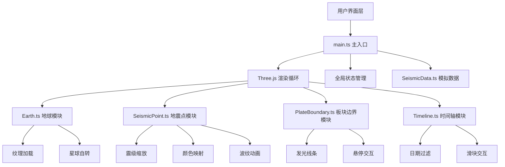

## 1. 架构设计



## 2. 技术描述

- **前端**：TypeScript + Three.js + Vite
- **3D库**：three@0.160.0
- **类型定义**：@types/three@0.160.0
- **构建工具**：Vite@5
- **语言**：TypeScript@5（严格模式）
- **初始化工具**：vite-init
- **后端**：无（纯前端，使用模拟数据）
- **数据**：300条模拟地震记录，内置板块边界坐标

## 3. 目录结构

```
d:\Pro\tasks\auto26\
├── package.json
├── vite.config.ts
├── tsconfig.json
├── index.html
└── src/
    ├── main.ts
    ├── core/
    │   ├── Earth.ts
    │   ├── SeismicPoint.ts
    │   ├── Timeline.ts
    │   └── PlateBoundary.ts
    └── data/
        └── SeismicData.ts
```

## 4. 数据模型

### 4.1 地震数据模型

```typescript
interface SeismicRecord {
  id: string;
  time: Date;
  latitude: number;
  longitude: number;
  magnitude: number;
  depth: number;
  location: string;
}

interface PlateBoundary {
  name: string;
  coordinates: Array<{ lat: number; lng: number }>;
  movementDirection: string;
  color: string;
}

interface GlobalState {
  currentDate: Date;
  selectedEarthquake: SeismicRecord | null;
  visibleEarthquakes: SeismicRecord[];
  stats: {
    count: number;
    maxMagnitude: number;
  };
}
```

### 4.2 数据流向

1. **SeismicData.ts** → 提供300条模拟地震数据和板块边界数据
2. **main.ts** → 初始化场景，管理全局状态，协调各模块
3. **Earth.ts** → 接收地震点数据和板块数据 → 渲染到球面
4. **SeismicPoint.ts** → 接收经纬度和属性 → 在地球表面生成标记
5. **PlateBoundary.ts** → 接收边界坐标数组 → 在地球表面生成线条
6. **Timeline.ts** → 监听滑块变化 → 通知main.ts更新可见地震点

## 5. 核心模块设计

### 5.1 Earth 类
- 职责：创建3D地球，管理球体、纹理、自转
- 方法：createEarth()、addSeismicPoints()、addPlateBoundaries()、update()
- 依赖：SeismicPoint、PlateBoundary

### 5.2 SeismicPoint 类
- 职责：管理单个地震点
- 方法：createMarker()、updateScale()、updateColor()、showRipple()、hideRipple()
- 特性：震级缩放、深度颜色映射、波纹动画

### 5.3 PlateBoundary 类
- 职责：绘制板块边界线
- 方法：createBoundary()、createGlowEffect()、onHover()
- 特性：发光效果、悬停信息、关联高亮

### 5.4 Timeline 类
- 职责：管理时间轴滑块
- 方法：createSlider()、onDateChange()、filterByDate()
- 特性：按天步进、动态过滤

## 6. 性能优化

- 地震点采用InstancedMesh优化批量渲染
- 视锥体剔除
- LOD（层次细节）
- 单次渲染地震点限制≤500个
- requestAnimationFrame动画循环
- 事件节流处理
