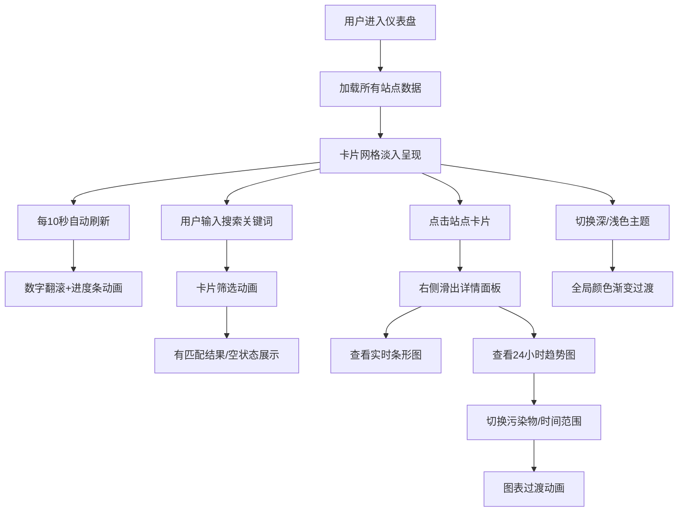

## 1. 产品概述

城市空气质量可视化仪表板是一个实时空气质量数据展示平台，用于直观呈现多个城市监测站点的空气污染指标（PM2.5、PM10、O3、NO2、CO、SO2），支持历史趋势分析和污染等级预警，帮助用户快速了解空气质量状况。

### 产品核心价值
- **实时监测**：每10秒自动刷新数据，实时掌握空气质量变化
- **多维度展示**：站点卡片、趋势图表、详情面板多层次呈现数据
- **智能预警**：颜色编码AQI等级，直观识别污染程度
- **历史追溯**：支持24小时、7天、30天历史趋势分析

## 2. 核心功能

### 2.1 用户角色
| 角色 | 注册方式 | 核心权限 |
|------|----------|----------|
| 普通用户 | 无需注册 | 浏览空气质量数据、筛选站点、查看历史趋势 |

### 2.2 功能模块
1. **仪表盘主界面**：站点卡片网格、全局搜索栏、主题切换、数据刷新状态
2. **站点详情面板**：六项污染物实时条形图、24小时趋势折线图、站点基本信息
3. **历史趋势图表**：多时间范围切换、多污染物对比、图例交互、缩放动画
4. **全局搜索**：城市/站名模糊搜索、卡片动态筛选、空状态展示

### 2.3 页面详情
| 页面名称 | 模块名称 | 功能描述 |
|-----------|-------------|---------------------|
| 仪表盘主页 | 顶部导航栏 | Logo、搜索框、主题切换按钮 |
| 仪表盘主页 | 站点卡片网格 | 自适应布局卡片、AQI颜色编码、刷新进度条、数字翻滚动画 |
| 站点详情面板 | 实时数据展示 | 六项污染物条形图、主要污染物标识、更新时间 |
| 站点详情面板 | 趋势图表 | 24小时变化曲线、污染物切换、时间范围选择 |
| 全局搜索 | 搜索功能 | 实时筛选、动画过渡、空状态插画 |

## 3. 核心流程

### 主流程描述
用户进入仪表板 → 系统自动加载所有监测站点数据 → 站点卡片以淡入动画依次呈现 → 每10秒自动刷新数据（数字翻滚+进度条提示）→ 用户可搜索筛选站点 → 点击站点卡片从右侧滑出详情面板 → 详情面板展示实时条形图和趋势图 → 用户可切换污染物类型和时间范围查看趋势

## 4. 用户界面设计

### 4.1 设计风格
- **主色调**：蓝绿色系（#0A4B4B → #1CB5B5 渐变）
- **辅助色**：AQI等级色（优绿、良黄、轻度污染橙、中度污染红、重度污染紫、严重污染褐）
- **设计风格**：毛玻璃玻璃态（Glassmorphism）、半透明背景、模糊效果、柔和阴影、微光边框
- **字体**：现代无衬线字体，清晰易读
- **动画**：所有交互300ms ease-in-out过渡，数字翻滚、卡片淡入上浮、面板滑入、图表曲线动画

### 4.2 页面设计概述
| 页面名称 | 模块名称 | UI元素 |
|-----------|-------------|-------------|
| 仪表盘主页 | 顶部导航 | 渐变背景、搜索框玻璃态、主题切换按钮微光效果 |
| 仪表盘主页 | 站点卡片 | 圆角16px、内边距24px、玻璃态背景、白边微光、悬停上浮 |
| 站点详情 | 详情面板 | 右侧滑入、半透明遮罩、条形图动画、趋势图填充区域 |
| 空状态 | 搜索无结果 | 插画淡入、友好提示文字 |

### 4.3 响应式设计
- **桌面端**（≥1024px）：卡片3列布局
- **平板端**（768px-1023px）：卡片2列布局
- **移动端**（<768px）：卡片1列布局
- 所有交互支持触摸操作

### 4.4 动效设计
- **入场动画**：卡片错落淡入上浮（staggered fade-in-up）
- **数据更新**：数字翻滚动画、背景色渐变过渡
- **搜索筛选**：卡片缩放消失/出现动画
- **详情面板**：右侧滑入+遮罩淡入
- **主题切换**：全局颜色0.5秒渐变过渡
- **图表切换**：水平扩展/收缩、线条淡入淡出
