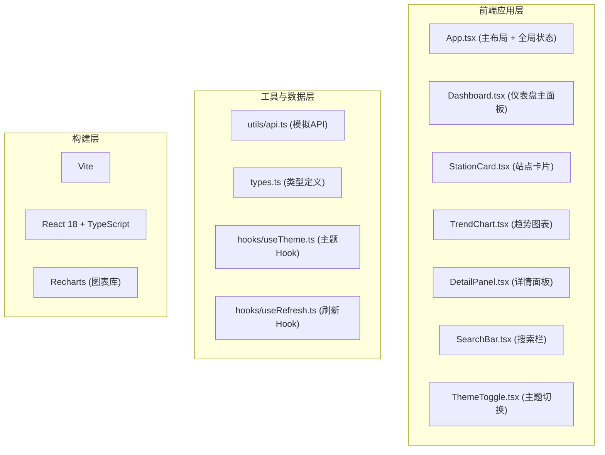

## 1. 架构设计



## 2. 技术描述
- **前端框架**：React 18 + TypeScript
- **构建工具**：Vite 5 + @vitejs/plugin-react
- **图表库**：Recharts 2
- **样式方案**：CSS Modules / 原生CSS + CSS变量（主题切换）
- **状态管理**：React useState/useContext（轻量级，无需额外库）
- **数据来源**：前端模拟数据（utils/api.ts）

## 3. 文件结构
```
auto27/
├── index.html
├── package.json
├── vite.config.ts
├── tsconfig.json
└── src/
    ├── main.tsx          # 应用入口
    ├── App.tsx           # 主布局 + 全局状态 + 路由
    ├── types.ts          # TypeScript类型定义
    ├── components/
    │   ├── Dashboard.tsx    # 仪表盘主面板
    │   ├── StationCard.tsx  # 站点卡片
    │   ├── TrendChart.tsx   # 趋势图表
    │   ├── DetailPanel.tsx  # 详情侧面板
    │   ├── SearchBar.tsx    # 搜索栏
    │   └── ThemeToggle.tsx  # 主题切换按钮
    ├── hooks/
    │   ├── useTheme.ts      # 主题管理Hook
    │   └── useStations.ts   # 站点数据管理Hook
    ├── utils/
    │   └── api.ts           # 模拟API
    └── styles/
        └── index.css        # 全局样式 + CSS变量
```

## 4. 核心类型定义

```typescript
// 污染物类型
type PollutantType = 'PM2.5' | 'PM10' | 'O3' | 'NO2' | 'CO' | 'SO2';

// AQI等级
type AqiLevel = 'excellent' | 'good' | 'light' | 'moderate' | 'heavy' | 'severe';

// 监测站数据
interface Station {
  id: string;
  name: string;
  city: string;
  aqi: number;
  level: AqiLevel;
  primaryPollutant: PollutantType;
  pollutants: Record<PollutantType, number>;
  updateTime: string;
}

// 历史数据点
interface HistoryDataPoint {
  time: string;
  value: number;
}

// 历史数据
type HistoryData = Record<PollutantType, HistoryDataPoint[]>;

// 时间范围
type TimeRange = '24h' | '7d' | '30d';

// 主题类型
type Theme = 'light' | 'dark';
```

## 5. API 定义（模拟）

```typescript
// 获取所有站点数据
function getAllStations(): Promise<Station[]>

// 获取单个站点详情
function getStationById(id: string): Promise<Station>

// 获取历史数据
function getHistoryData(stationId: string, range: TimeRange): Promise<HistoryData>
```

## 6. 性能优化策略

### 6.1 代码分割
- 使用 `React.lazy` + `Suspense` 对 Dashboard 组件进行代码分割
- 详情面板延迟加载，仅在点击站点时加载

### 6.2 渲染优化
- 使用 `React.memo` 包裹 StationCard，避免不必要重渲染
- 图表数据使用 `useMemo` 缓存计算结果
- 滚动和动画使用 CSS transform/opacity 保证 60fps

### 6.3 动画性能
- 优先使用 CSS 动画而非 JS 动画
- 使用 `will-change` 提示浏览器优化
- 减少重排重绘，使用 transform 和 opacity 属性

### 6.4 首屏优化
- Vite 构建优化（代码分割、tree-shaking）
- 关键资源预加载
- 骨架屏 / 加载状态提示
