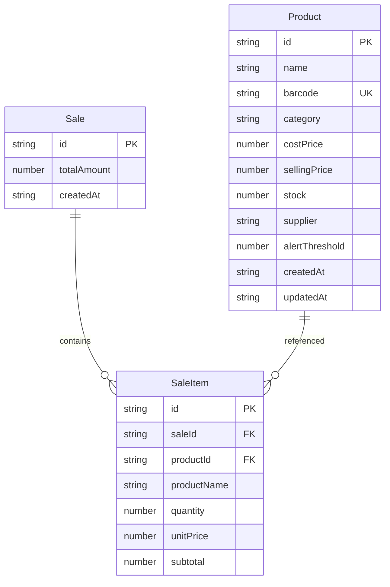

## 1. 架构设计

```mermaid
flowchart TD
    "React前端" --> "API服务层"
    "API服务层" --> "Express后端"
    "Express后端" --> "文件存储"
    subgraph "前端层"
        "App.tsx"
        "InventoryPanel"
        "SalesCounter"
        "SalesReport"
    end
    subgraph "服务层"
        "api.ts"
    end
    subgraph "后端层"
        "Express路由"
        "数据模型"
    end
    subgraph "数据层"
        "products.json"
        "sales.json"
    end
```

## 2. 技术说明
- 前端：React@18 + TypeScript + Vite + Tailwind CSS + Zustand
- 初始化工具：vite-init（react-express-ts模板）
- 后端：Express@4（Node.js，ESM格式，TypeScript）
- 数据库：文件存储（JSON文件），无外部数据库依赖
- 路由：react-router-dom

## 3. 路由定义
| 路由 | 用途 |
|------|------|
| / | 库存管理面板（默认页） |
| /sales | 销售收银面板 |
| /reports | 销售报表面板 |

## 4. API定义

### 商品管理API
```typescript
interface Product {
  id: string;
  name: string;
  barcode: string;
  category: string;
  costPrice: number;
  sellingPrice: number;
  stock: number;
  supplier: string;
  alertThreshold: number;
  createdAt: string;
  updatedAt: string;
}

GET    /api/products          → Product[]
GET    /api/products/:id      → Product
POST   /api/products          → Product（创建）
PUT    /api/products/:id      → Product（更新）
DELETE /api/products/:id      → { success: boolean }
GET    /api/products/alerts   → Product[]（库存预警列表）
```

### 销售记录API
```typescript
interface SaleItem {
  productId: string;
  productName: string;
  quantity: number;
  unitPrice: number;
  subtotal: number;
}

interface Sale {
  id: string;
  items: SaleItem[];
  totalAmount: number;
  createdAt: string;
}

GET    /api/sales             → Sale[]（最近30笔）
POST   /api/sales             → Sale（创建销售记录，同时扣减库存）
DELETE /api/sales/:id         → { success: boolean }（删除记录，恢复库存）
PUT    /api/sales/:id/undo    → Sale（撤销删除）
```

### 请求/响应示例
```typescript
POST /api/sales
Request: {
  items: { productId: string; quantity: number }[]
}
Response: Sale

GET /api/sales?date=2026-06-15&category=饮料
Response: Sale[]
```

## 5. 服务器架构图

```mermaid
flowchart LR
    "Controller" --> "Service"
    "Service" --> "Repository"
    "Repository" --> "JSON文件"
```

- Controller：Express路由处理HTTP请求，参数校验
- Service：业务逻辑（库存扣减、预警判断、条码唯一性校验）
- Repository：文件读写操作，数据持久化

## 6. 数据模型

### 6.1 数据模型定义



### 6.2 数据定义
- products.json：存储商品数组，按ID索引
- sales.json：存储销售记录数组，按时间倒序排列
- 初始数据：预设10条示例商品数据（饮料、零食、日用品各若干），5条示例销售记录
