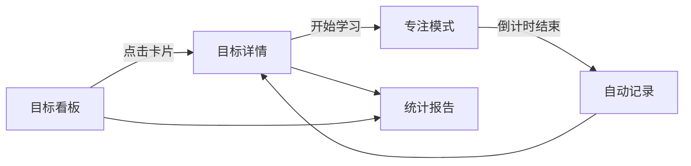

## 1. 产品概述

学途 - 个人学习路径规划与追踪应用，帮助大学生和职场新人规划学习目标、跟踪每日学习时长、生成学习报告，解决学习半途而废、缺乏持续动力和进度反馈的问题。

- 核心价值：通过可视化的进度追踪、专注模式和数据报告，帮助用户建立持续学习的习惯
- 目标用户：大学生、职场新人、自我提升学习者

## 2. 核心功能

### 2.1 用户角色
| 角色 | 注册方式 | 核心权限 |
|------|----------|----------|
| 普通用户 | 无需注册（本地存储） | 创建管理学习目标、打卡记录、查看统计报告 |

### 2.2 功能模块
1. **目标看板页**：学习目标卡片展示、拖拽排序、进度圆环、新建目标
2. **目标详情页**：今日时长环形进度、学习记录时间轴、记录增删改、开始学习入口
3. **专注模式页**：深色背景、大号倒计时、时长选择、提示音与波纹动画、自动记录
4. **统计报告页**：周/月/年维度折线图、分类柱状图、数据悬停提示、分析摘要

### 2.3 页面详情
| 页面名称 | 模块名称 | 功能描述 |
|----------|----------|----------|
| 目标看板页 | 目标卡片网格 | 卡片展示名称、总时长、已累计时长、进度圆环；可拖拽排序带弹性动画 |
| 目标看板页 | 新建目标按钮 | 弹出表单创建新学习目标，设置名称、计划总时长 |
| 目标详情页 | 今日进度环 | 顶部显示今日目标时长完成比例的环形进度 |
| 目标详情页 | 记录时间轴 | 列表展示今日每条学习记录（开始/结束时间、时长、备注） |
| 目标详情页 | 记录操作 | 每条记录支持编辑和删除，删除带缩小淡出动画 |
| 目标详情页 | 开始学习按钮 | 点击触发实时计时浮动面板，可进入专注模式 |
| 专注模式页 | 倒计时显示 | 中央大号倒计时数字，深色背景氛围 |
| 专注模式页 | 时长选择 | 支持25/45/60分钟三种专注时长切换 |
| 专注模式页 | 完成反馈 | 倒计时结束播放柔和提示音，波纹扩散动画，自动生成学习记录 |
| 统计报告页 | 趋势折线图 | 周/月/年维度学习时长变化趋势，悬停显示数值和日期 |
| 统计报告页 | 分类柱状图 | 按目标分类汇总时长占比 |
| 统计报告页 | 分析摘要 | 图表下方文字总结学习情况 |

## 3. 核心流程

用户打开应用 → 在目标看板查看所有学习目标进度 → 点击目标进入详情 → 查看今日记录和完成进度 → 点击"开始学习"进入专注模式 → 设置时长开始倒计时 → 专注结束自动记录学习时长 → 在统计报告页查看学习数据分析

## 4. 用户界面设计

### 4.1 设计风格
- **主题色**：柔和蓝紫渐变（#667eea → #764ba2）
- **视觉效果**：磨砂玻璃卡片（backdrop-blur + 半透明白色）
- **动效风格**：所有交互平滑过渡（transform 0.3s ease），拖拽带弹性动画
- **字体**：现代无衬线字体，数字使用等宽字体增强可读性
- **进度色阶**：进度圆环从红到绿渐变色

### 4.2 页面设计概览
| 页面名称 | 模块名称 | UI元素 |
|----------|----------|--------|
| 目标看板 | 卡片网格 | 磨砂玻璃卡片、渐变进度圆环、弹性拖拽动画 |
| 目标详情 | 环形进度 + 时间轴 | 顶部进度环、时间轴竖线、记录卡片、浮动计时面板 |
| 专注模式 | 全屏倒计时 | 深色背景、大号数字、脉冲动画、波纹扩散效果 |
| 统计报告 | 图表展示 | 折线图、柱状图、悬停tooltip、分析文本 |

### 4.3 响应式
- 桌面端：目标卡片横向网格排列，时间轴正常字号
- 移动端：卡片变竖排单列，时间轴文字缩小，布局自适应
- 触摸优化：增大点击区域，支持触摸滑动操作

### 4.4 性能要求
- 打卡记录列表50条以内渲染时间 ≤ 100ms
- 图表渲染时间 ≤ 500ms
- 动画帧率保持60fps
