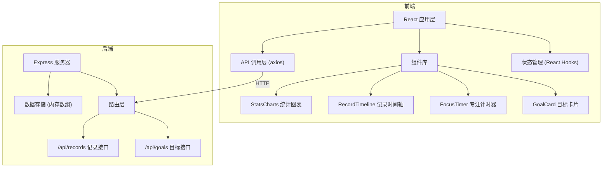
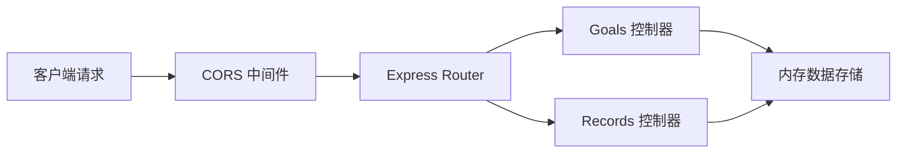
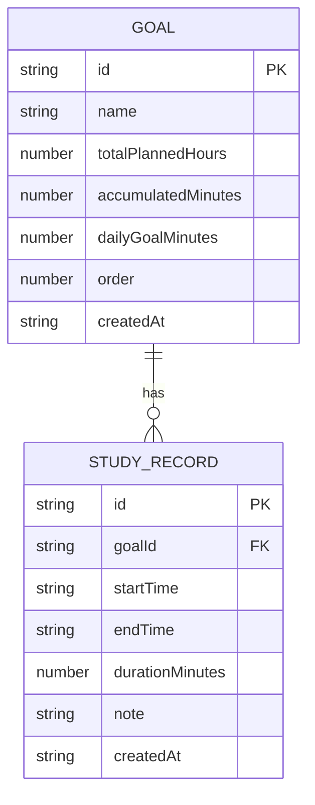

## 1. 架构设计



## 2. 技术描述

- **前端**：React 18 + TypeScript + Vite
- **后端**：Express 4 + TypeScript
- **状态管理**：React useState/useReducer + Context（轻量场景）
- **图表库**：Recharts
- **HTTP客户端**：Axios
- **样式方案**：CSS Modules / 内联样式 + CSS 变量
- **唯一ID**：uuid
- **跨域**：cors 中间件
- **构建工具**：Vite（前端）、ts-node（后端开发）

## 3. 路由定义

| 路由路径 | 页面 | 用途 |
|----------|------|------|
| / | 目标看板页 | 展示所有学习目标卡片 |
| /goal/:id | 目标详情页 | 查看目标详情和今日学习记录 |
| /focus/:id | 专注模式页 | 专注倒计时学习 |
| /stats | 统计报告页 | 学习数据统计与分析 |

## 4. API 定义

### 4.1 类型定义
```typescript
interface Goal {
  id: string;
  name: string;
  totalPlannedHours: number;
  accumulatedMinutes: number;
  dailyGoalMinutes: number;
  color?: string;
  order: number;
  createdAt: string;
}

interface StudyRecord {
  id: string;
  goalId: string;
  startTime: string;
  endTime: string;
  durationMinutes: number;
  note?: string;
  createdAt: string;
}
```

### 4.2 接口列表

| 方法 | 路径 | 描述 | 请求体 | 响应 |
|------|------|------|--------|------|
| GET | /api/goals | 获取所有目标 | - | Goal[] |
| POST | /api/goals | 创建新目标 | { name, totalPlannedHours, dailyGoalMinutes } | Goal |
| PUT | /api/goals/:id | 更新目标 | Partial\<Goal\> | Goal |
| DELETE | /api/goals/:id | 删除目标 | - | { success: true } |
| GET | /api/records | 获取记录列表（支持goalId查询） | query: goalId? | StudyRecord[] |
| POST | /api/records | 创建学习记录 | { goalId, startTime, endTime, durationMinutes, note? } | StudyRecord |
| PUT | /api/records/:id | 更新学习记录 | Partial\<StudyRecord\> | StudyRecord |
| DELETE | /api/records/:id | 删除学习记录 | - | { success: true } |

## 5. 服务器架构图



## 6. 数据模型

### 6.1 数据模型定义



### 6.2 数据存储说明
- 使用内存数组存储数据，服务器重启后数据丢失
- 生产环境可替换为文件系统持久化（JSON文件）或数据库
- 所有ID使用 uuid v4 生成
