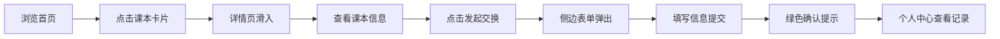

## 1. 产品概述

校园二手课本交换平台，让大学生在学期开始和结束时方便地买卖或交换二手课本，减少教材浪费并节省开支。

- 目标用户：在校大学生，有闲置课本或需要购买/交换二手课本的学生
- 产品价值：降低教材成本、促进资源循环利用、建立校园内书本交换社区

## 2. 核心功能

### 2.1 用户角色

| 角色 | 注册方式 | 核心权限 |
|------|---------|---------|
| 普通用户 | 访客模式（演示版） | 浏览课本、发起交换/购买、管理个人中心 |

### 2.2 功能模块

1. **首页**：导航栏、课本瀑布流卡片列表、筛选与搜索
2. **课本详情页**：图片轮播、课本信息、卖家信息、发起交换表单
3. **个人中心**：发布历史、交换记录、收藏列表、统计卡片

### 2.3 页面详情

| 页面名称 | 模块名称 | 功能描述 |
|---------|---------|---------|
| 首页 | 导航栏 | 桌面端顶部固定，移动端汉堡菜单，支持平滑下拉动画 |
| 首页 | 课本瀑布流 | 卡片从底部淡入上浮，悬停上移并显示交换/购买按钮，响应式布局 |
| 课本详情页 | 图片轮播 | 左右滑动切换实拍照片，支持触摸手势 |
| 课本详情页 | 课本信息区 | 显示新旧程度、原价、期望价格/想交换的课本列表 |
| 课本详情页 | 卖家信息 | 卖家头像、昵称、个人简介、联系方式模板 |
| 课本详情页 | 发起交换 | 侧边表单滑入，输入交换课本信息或报价，提交后绿色确认提示 |
| 个人中心 | 统计卡片 | 总发布数、成功交换数、好评率 |
| 个人中心 | 发布历史 | 列表展示已发布课本，支持下架、删除、标记已完成操作 |
| 个人中心 | 交换记录 | 历史交换记录展示 |
| 个人中心 | 收藏列表 | 已收藏的课本展示 |

## 3. 核心流程

用户浏览首页课本卡片 → 点击卡片进入详情页（右侧滑入动画）→ 查看课本详情与图片 → 点击"发起交换"按钮 → 填写交换表单 → 提交后显示确认提示 → 个人中心查看历史记录

## 4. 用户界面设计

### 4.1 设计风格

- 主色调：米白色（背景）、淡橙色（强调色）、木色（辅助色），暖色调营造温馨亲切的校园氛围
- 按钮风格：圆角矩形，悬停微上浮，点击轻微按压缩放
- 字体：标题使用衬线体增强人文感，正文使用清晰易读的无衬线字体
- 布局风格：卡片式布局，柔和阴影，充足留白
- 图标风格：线性图标，配合暖色调

### 4.2 页面设计概述

| 页面名称 | 模块名称 | UI 元素 |
|---------|---------|--------|
| 首页 | 导航栏 | 暖白背景，淡橙品牌色，桌面端横向导航，移动端汉堡菜单 |
| 首页 | 瀑布流卡片 | 米白卡片，柔和阴影，淡橙悬停边框，底部淡入上浮动画 |
| 课本详情页 | 轮播图 | 全屏宽度，左右箭头指示器，平滑过渡 |
| 课本详情页 | 信息区域 | 木色分隔线，价格突出显示，淡橙标签 |
| 个人中心 | 统计卡片 | 三栏并排，数字大号字体，淡橙渐变背景 |
| 个人中心 | 列表项 | 操作按钮，删除缩小淡出动画，已完成半透明+绿色徽章 |

### 4.3 响应式

- 桌面端（≥1024px）：顶部固定导航，瀑布流多列布局（3-4列）
- 平板端（768-1023px）：瀑布流两列布局
- 移动端（<768px）：汉堡菜单，单列卡片，底部操作栏

### 4.4 动效说明

- 卡片入场：从底部淡入上浮，交错延迟
- 卡片悬停：微微上移 + 阴影加深 + 显示操作按钮
- 详情页：从右侧滑入，半透明遮罩背景
- 表单提交：内容从底部上升 + 绿色闪烁确认
- 删除操作：卡片缩小 + 淡出
- 已完成标记：半透明 + 绿色徽章显现
